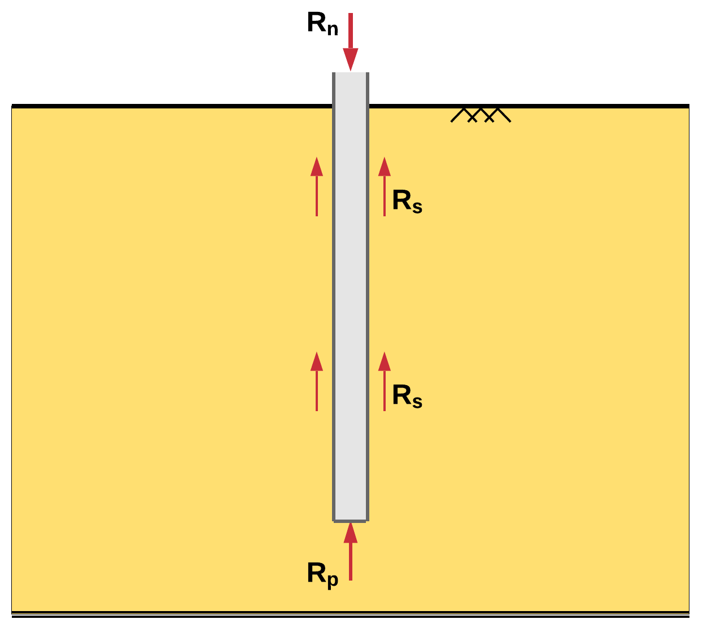
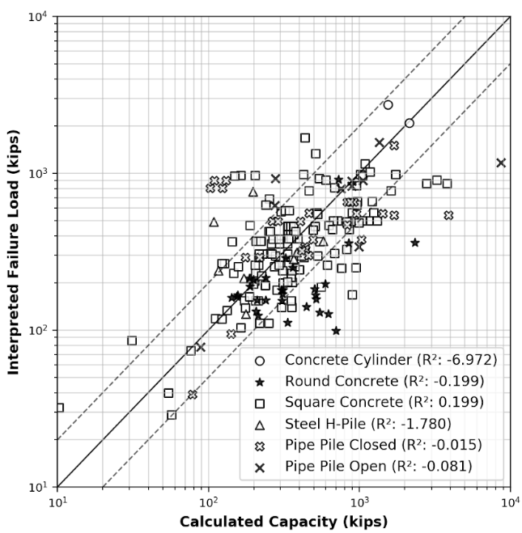

############
Introduction
############

Piles are elongated structural deep foundation members with relatively small diameter compared to their length. They can be driven vertical or slightly angled. The principal function of piles is to transmit the loads of the supporting structure to the subsoil. This is made possible by (a) utilizing the bearing capacity of a stronger soil layer below a weaker soil layer (end bearing), (b) activating side friction along the length of the pile element (friction piles), or (c) a combination of both conditions.

   Nominal resistance (:math:`R_n`), side friction (:math:`R_s`) and end bearing (:math:`R_p`)

Many of the methods in current use for calculating pile capacity are based on databases of interpreted load test data for small diameter piles. For piles in sand, Nordlund (:ref:`1963 <Nordlund1963>`) developed his method of calculating bearing capacity of piles in cohesionless soils from as few as 41 load tests from eight different test sites having diameters ranging between 10 and 20 inches. Similarly for clays, Tomlinson (:ref:`1980 <Tomlinson1980>`) employed 56 small diameter piles to develop his popular alpha method that was based in part on data published by Peck (:ref:`1958 <Peck1958>`).

   Example of scatter between calculated and interpreted pile capacities for different pile types (from :ref:`Machairas et al., 2018 <Machairas2018>`).

Pile foundations are critical structural elements. The methods employed for their design are empirical with many uncertainties that may lead to calculated capacities that are orders of magnitude off of the "real" capacity measured on site via static load testing. This was evident as shown in :numref:`fhwa_paper_fig4_cropped` after a study on that matter by the author. The industry has been addressing the uncertainty in design by incorporating large safety factors and as a result, increasing construction costs. However, a better understanding of the behavior of piles could reduce uncertainties and lead to more efficient pile design without increasing cost.

**********
Background
**********

This research endeavor was inspired by a large part from the vast experience that the author's advisor, Dr. Magued Iskander and his advisor, Dr. Roy Olson, have on the broader field of deep foundations. However the work that had been done in the past (that is, 15 - 20 years ago) was based on technologies and methodologies that provided many valuable insights but left some questions unanswered, particularly about the design and performance of Large Diameter Open Ended Piles (LDOEPs). In fact, LDOEPs were mostly employed in the offshore oil and gas industry for the support of drilling platforms. Their limited use in infrastructure projects restricted research on their performance. However, this is not the case anymore.

Capacity calculations for driven piles can be particularly tedious and error prone when performed manually while commercial design software applications do not offer the flexibility to run multiple analyses on a large number of piles. Data analysis is, of course, an indispensable part of most research projects, although in this case it became quickly obvious that no existing tool would be able to help in producing meaningful and reliable results. The best solution was to develop new tools and design new databases and software.

The data required for this study included site investigation reports, soil lab test results and pile load test results. Publicly available records were scarce and often unreliable. They came mostly from State Departments of Transportation or published research. The Geoprofession at-large is infamous for its poor state of handling data which made the necessary process of data collection and analysis the most difficult part of this study.

*******************
Research Objectives
*******************

The author was charged with the completion of two main objectives with several sub-tasks attached to each one.

1. The assimilation of several publicly available load test databases into a modern relational database power by an easy-to-use interface
2. The development of batch-processing software that would utilize the new database and run analyses in bulk to deliver recommendations based on high-level statistics

The product of the first objective was `Pile Capacity <http://pilecapacity.com>`_, an online application with an HTML/Javascript frontend and a Python & Postgres backend that allows for collaborative analyses for driven piles and easily sharable results. *Pile Capacity* was envisioned to serve as an example of proper and efficient data management for the Geoprofession.

A product of the the second objective was *edafos* (`<https://github.com/nickmachairas/edafos>`_), a Python module developed to run capacity calculations which allowed for batch-processing and analysis of hundreds of pile load test records.

There is no need for any software installations to interact with the software produced as part of this study. The software was developed in the form of a web application and the interested reader is advised to follow the hyperlinks provided above.

Based on these tools, this study was able to evaluate the efficacy of nominal resistance and interpreted capacity methods, under varying conditions, and provide recommendations on which method performs best. This is a departure from the *one-method-fits-all* approach of current practice in the Geoprofession.

******************************
Summary of Research Milestones
******************************

.. rubric:: *Evaluation of the FHWA Pile Design Method Against the FHWA Deep Foundation Load Test Database Version 2.0*

The efficacy of the Federal Highway Administration (FHWA) pile design method was explored using data made possible by the 2017 release of FHWA *Deep Foundation Load Test Database* (DFLTD v.2). Information contained within DFLTD v.2 was leveraged to evaluate the most common pile design methods against failure loads obtained via in situ static load testing procedures. In the process, the authors developed a custom relational database and software to batch process the available information. The scope was limited to impact-driven, un-tapered, steel and concrete piles, loaded in compression, using a static load test. DFLTD v.2 contains 3,116 unique-combination project/exploration/foundation/test cases of which 213 contained sufficient data to permit batch processing of the results in order to compute the axial load capacity and interpret the static failure load, according to the study scope.

Scatter between measured (interpreted) and predicted capacities is significant, where the computed capacity was off by a factor of 2 in many tests. The range in calculated to measured  (i.e. interpreted) capacities (:math:`Q_c/Q_m`) was from 0.12 to 8.88, and the mean :math:`Q_c/Q_m` was 1.48. Preliminary evaluation suggest that the method performs better in clay than in sand, overpredicts the capacities of long and larger diameter piles. This study can permit engineers and state agencies to better understand the efficacy of this most commonly employed design methods, thus resulting in more resilient infrastructure.

.. rubric:: *Evaluation of Pile Design Methods for Large Diameter Open-Ended Piles*

Large-Diameter Open-Ended Piles (LDOEP) are increasingly being used for support of infrastructure projects. Yet many of the methods in current use for calculating pile capacity are based on databases of interpreted load test data for small diameter piles. The scope of this study was limited to impact or vibratory driven un-tapered steel and concrete pipe-piles, larger than 30 inches in diameter, loaded in compression, using a static load test.

The efficacy of four commonly used pile design methods was explored using data made possible by the 2016 release of FHWA Deep Foundation Load Test Database, which was was ported to a cloud-based relational database that permitted batch processing of the available information. An analytical procedure was developed in Python in conjunction with ENSOFT’s *APILE Offshore 2019* to compute the axial capacity of piles using methods proposed by: (1) FHWA (2) The US Army Corps of Engineers, (3) American Petroleum Institute (API) as well as (4) the Lambda method. Interpreted capacity from static load test data was also obtained using the modified Davisson Criterion.

Scatter between measured (interpreted) and predicted capacities was significant, where the computed capacity was off by a factor of two in many tests. Use of a load test for determining the capacity of LDOEP was therefore strongly encouraged. Several plugging conditions were considered. All four methods achieved better predictions for the unplugged condition, suggesting that LDOEPs do not develop significant end bearing, possibly because the deformation required to develop end bearing are not achieved for these piles.

.. rubric:: *Evaluation of Several Interpreted Pile Capacity Criteria for Large Diameter Open-Ended Piles*

The interpretation of field load tests on piles has many important practical
considerations especially with respect to identifying the ultimate load capacity of a pile. A number of interpretation criteria have been used in the past. With the increase in the use of Large-Diameter Open-Ended Piles (LDOEPs) for support of infrastructure projects it is important to ascertain that the interpretation criteria are suitable for LDOEPs. Fourteen of the most commonly used interpretation criteria were chosen for investigation in this study in an effort to determine the best criterion to be used for LDOEPs. These methods were evaluated using a database of 74 load tests conducted on LDOEPs. The applicability of these methods and their correlation with each other and with the pile diameter and length were also examined. The effect of the pile diameter, pile length, and the soil type on the performance of each criterion was also explored. It was concluded that none of these methods was superior to the others, and their performance was somewhat close to each other. However, some were more applicable in more cases than others. It was also concluded that the Standard Davisson Offset method, and the New York City Building Code criteria showed better performance with respect to the other methods as they had the highest accuracy and among the lowest of the standard deviations.

.. rubric:: *An Investigation of Pile Design Utilizing Advanced Data Analytics*

This study explored the use of state-of-the-art data analytics techniques for predicting the axial load capacity of piles. A *Support Vector Machine* algorithm was developed. 213 load tests obtained from FHWA’s Deep Foundation Load Test Database (DFLTD) v.2 were used to evaluate the performance of the developed approach against the FHWA design method. The scope was limited to impact­-driven, un-­tapered, steel and concrete piles, loaded in compression, using a static load test. The results of the predictive analysis show an improvement over the capacities obtained by the FHWA pile design method. Perhaps more remarkably, the predictive model outperformed the FHWA pile design method by relying only on seven readily available features as compared to a laborious and error-prone design methodology. This study demonstrates the potential of machine learning in geotechnical engineering as an alternative to conventional design approaches. The methodology is also demonstrated with an online capacity computation tool.

*************************
Dissertation Organization
*************************

This dissertation was written in the `reStructuredText <https://en.wikipedia.org/wiki/ReStructuredText>`_ file format and was compiled using `Sphinx <http://www.sphinx-doc.org/>`_ (a Python documentation module written by Georg Brandl) producing both a PDF document that was printed and bound as well as an HTML page which can be viewed at `<http://phd.nickmachairas.com/>`_. These two mediums have identical contents since they were compiled from the same source code.

An integral part of the dissertation was a web application named *Pile Capacity*, accessible at `<http://pilecapacity.com>`_, created by the author as part of this study. It was envisioned to continually grow and have its functionality extended beyond the scope if this study. The main parts of the application as well as an overview of the features of *Pile Capacity* are presented in :ref:`Chapter 2 <nyu_pile_capacity>`.

Chapter 2 presents the data ingestion, organization and development of *NYU Pile Capacity*. It also offers an overview of the data sources that were incorporated in the project. Key points from this chapter are the unifying database schema and the online web application which allows for effortless interaction with complex data. Chapter 2 also presents a discussion on case-by-case design of driven piles. This was an insight that was the result of the analytical procedures developed as part of this study and allowed for aggregate calculations on groups of load test records.

Chapter 3 offers a comprehensive overview of multiple methods for interpreting the capacity of driven piles from the results of static load tests and chapter 4 presents a comparison and evaluation of interpreted capacity methods and provides recommendations based on the results of the study.

Chapter 5 offers a comprehensive overview of the most popular methods for calculating the nominal resistance of driven piles. Chapter 6 presents a comparison and evaluation of nominal resistance methods for standard diameter piles while chapter 7 presents a comparison and evaluation of nominal resistance methods for large diameter piles.

In Chapter 8, a Machine Learning method for calculating nominal resistance is developed and tested with the results presented.

Chapter 9 provides concluding remarks, recommendations for future research and the author's experiences with DIGGS (Data Interchange for Geotechnical and Geoenvironmental Specialists) and how this tool can be used for deep foundations.

Appendices A and B are useful references for the soil approximations that were employed in this study as well as important schematics and notations.

Appendix C includes valuable details on the source databases that were combined as part of this study as well as Extract Transform and Load (ETL) procedures and attribute mapping. A reader familiar with the original data sources is advised to refer to this section if identifying an original attribute in *Pile Capacity* becomes troublesome.

