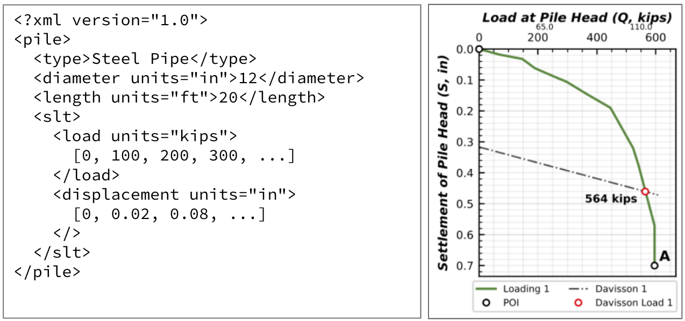

##########
Conclusion
##########

*******
Summary
*******

*(delivered by 12/16/2019)*

***********************************
Recommendations for Future Research
***********************************

*(delivered by 12/16/2019)*

**************************************************************************
Data Interchange for Geotechnical and Geoenvironmental Specialists (DIGGS)
**************************************************************************

The *Data Interchange for Geotechnical and Geoenvironmental Specialists* (DIGGS) is an XML-based data transfer standard that is gaining widespread acceptance in the geotechnical and geoenvironmental communities. Originally developed using funding from the Federal Highway Administration (FHWA) to efficiently capture data related to geotechnical boring logs, cone penetration test (CPT) soundings, and lab testing results, the data transfer protocol is rapidly gaining traction. It has been shown to have beneficial impacts in other allied areas where disparate parties (i.e., consultants, contractors, vendors, etc.) routinely publish/submit data as part of project deliverables. The historic problem is that many of these submissions use paper copies to transmit valuable data for the project data that may extend beyond the "technical" aspects of the project (i.e., equipment operating conditions, construction production rates, project costs, etc.). This data could be used by multiple parties to assess project performance and safety, as well as to track productivity, and more. Currently, in the limited situations when actual data are compiled and transmitted, data is often submitted as an author-specific (and often proprietary) software application and must then be re-entered into other software applications (i.e., analysis software, database, etc.) for use beyond simple data collection. An initiative undertaken by the Geo-Institute (G-I) of the American Society of Civil Engineers (ASCE) focuses on exploiting the full potential of DIGGS to geoprofessionals both within and outside of the transportation community. The deep foundations industry represents one community that could benefit significantly from using DIGGS. Data of interest to DFI members include production records, quality assurance information (i.e., verticality and alignment, concrete strength), and, importantly, load test results. When adopting DIGGS, users need not modify how they capture data, but rather will use DIGGS as a vehicle to transfer data to other applications in a standard format where it can be shared, used, stored, and retrieved. More information on DIGGS is available at `<https://www.geoinstitute.org/special-projects/diggs>`_.

   Schematic of DIGGS Interoperability (after `<diggsml.org>`_ and :ref:`Bachus et al., 2019 <Bachus2019>`)

Since 2017, the author has been actively involved in DIGGS activities, working on extending the DIGGS schema as well as developing tools that allow for data ingestion and conversion. The efforts include presentations to national conferences as well as co-authorship of papers and case studies with other DIGGS professionals (:ref:`Bachus et al., 2018 <Bachus2018>`; :ref:`Bachus et al., 2019 <Bachus2019>`).

At the *44th Annual Conference on Deep Foundations* of the Deep Foundation Institute, the author demonstrated the benefits of adoption DIGGS for pile load test data. For the past 30+ years, engineers and researchers have been independently collecting pile load test and relevant subsurface data while organizing this information into structurally dissimilar repositories. Despite their competent efforts, the overall result is highly fragmented with very little benefit to the greater geotechnical community. Meanwhile, scientists aided by state-of-the-art data analytics have been transforming their respective industries, producing remarkable predictions and insights. The unstructured and decentralized current scheme of this valuable pile load test data is a hindrance to the geotechnical community at large.

Geotechnical engineers working with deep foundations do not have to look further than the current methods commonly used (and still being taught) for designing deep foundations to understand the importance and potential benefits of efficient data management. Many of the methods currently in use for pile design are empirical (or at least semi-empirical), based on small databases of interpreted load test data, with empirical formulas that required gross overgeneralization to develop. Specifically:

- Granular Soils: Nordlund (:ref:`1963 <Nordlund1963>`) developed a method of calculating bearing capacity of driven piles in cohesionless soils from as few as 41 load tests from 8 different test sites. The piles represented by these data range in diameter from 12 to 16 inches in diameter.
- Cohesive Soils: Tomlinson (:ref:`1957 <Tomlinson1957>`) employed a small data set of 56 piles to develop his popular :math:`\alpha`-method. The piles considered by Tomlinson varied from 6 to 30 inches in diameter. And the clays varied from soft to very stiff over-consolidated clays.

Consider that in the age of modern pile driving and a full suite of energy-feedback capabilities and load tests, a conservative estimate is that the profession has designed and installed more than 1,000,000 driven piles. Similarly, it is anticipated that more than 100,000 load tests have been conducted worldwide, yet the most commonly cited design approaches are more than 60 years old and rely on less than 100 load test records. The inherit generalization of these methods could be improved dramatically by allowing contractors, researchers, and other interested parties the ability to analyze the vast number of high-quality load test and production data that pile driving/testing specialists are currently producing. Based on the author's experience, the main hindrance in doing so is finding a convenient way to share deep foundation performance-related information. A standard XML file structure could solve this problem. A pile foundation load test is a project that requires and generates a significant amount of complex data. An engineer working on such a project would have multiple files, of varying formats, spread across several folders in their computer along with pages of notes and other reports. Sharing the relevant geotechnical, pile property, and load test data is far from a straightforward process. DIGGS is an ideal framework for accomplishing facilitating data distribution of this data.

   Data Workflow of Pile Load Test Data Warehouse (after :ref:`Bachus et al., 2019 <Bachus2019>`)

:numref:`diggs_nyu_database` shows a typical work flow that is anticipated if someone were to tackle the problem with developing and managing a pile load test database for widespread public use. Given the diversity and quantity of existing data, experience has shown that collecting, compiling, and simply handling the data comprises approximately 60 to 80 percent of the total effort. This entails extracting relevant information from the original sources and transforming it in a format that is consistent for input into the database. Traditionally, this a mostly a manual process that often requires entering the same data in multiple applications, at different times, by different people. Once the data are available in a consistent format (i.e., once in a consistent and complete database), the remaining approximately 30 percent of total effort is spent extracting the data for analysis. This latter effort is, in fact, the objective of the entire process, but it would take considerable resources to achieve this objective. As shown in :numref:`diggs_nyu_database`, if the data were available in a DIGGS-compliant XML file format, this error-prone and inefficient process of moving data around could be eliminated.

   Expansion of DIGGS to Include Pile and Load Test Data (after :ref:`Bachus et al., 2019 <Bachus2019>`)

Although DIGGS was originally developed for geotechnical and transportation projects, it is envisioned to have a much wider range of applicability. The range includes the deep foundations community where vast amounts of valuable data are generated and could be beneficially utilized by the industry, its practitioners and academicians. All of this information actually qualifies as data that can be appropriately managed and should be available to the owner/operator regardless of the entity that performs/monitors the installation. DIGGS is a logical and ideal protocol for these efforts. Figure 4 shows how DIGGS as it exists today can be relatively easily expanded to pile and load test data. The forms identified in this figure could be completed from an existing paper copy or an Excel spreadsheet. In the future, data could be captured at the source using a field-deployed tablet, and/or a web-enabled form on a tablet or smart phone.

Once the form is populated, a DIGGS file will be automatically generated and can be transferred to a database. In some cases, the inspection may require the collection of data from sensors (i.e., pressure, temperature, flow, etc.). This data, too, can be collected in the field on a form similar to that shown in :numref:`diggs_expansion`. Once data are entered into the forms identified in :numref:`diggs_expansion`, a DIGGS file can be generated and transferred to the database shown in :numref:`diggs_nyu_database`.

In understanding the similarities between databases (formally referenced as *Relational Database Management Systems*, RDBMS, that include Access, SQL Server, SAP, Oracle, etc.) and other data file formats, it is important to understand their respective properties, advantages, and disadvantages. Proper database design follows strict rules that are needed to create a structure (aka *schema*) which can facilitate efficient data storage and retrieval. Information is stored in tables that are *linked* with each other, ensuring data integrity. Although each database system may rely on different schema rules, there is one thing to remember about databases, that is, they result in a complex, yet highly efficient structure. Internally, this represents a significant advantage because once an agency adopts a specific (and usually proprietary) database system, the rules regarding the structure become well-known and can be implemented internally by multiple parties. However, should the agency decide to switch database systems or software programs, or if the agency desires to communicate with others who utilize the same of different systems or software, the complexities of the adopted data structure can pose significant challenges.  Since most agencies and organizations adopt different programs that utilize different schemas, the end result is a complex and fragmented data infrastructure.

   Data Transfer of Static Load Tests Using XML

The problem identified above could be resolved if every organization utilized the same RDBMS. While this may be a noble goal, it does not reflect reality. An alternative to a relational database for storing or transferring data is a hierarchical data format such as the *eXtensible Markup Language* (XML), which defines a set of rules so that information may be stored easily in files. Unlike standard RDBMS, the structure of XML files is not complex and is human-readable. Information is stored in plain text format within tags that are labeled according to the details that are contained between them. For instance, the basic structure of an XML file storing pile properties and load test results is presented in :numref:`diggs_slt_xml`.

As long as two parties agree on the file structure, i.e. that pile diameter will always be stored within tags named ``diameter`` and that pile length will always be stored within tags named ``length``, then information storage and transport can become highly efficient for all parties desiring to share this data. Furthermore, data from XML files can easily be ported to a large-scale RDBMS by matching XML tags to database attributes. The advantage of the XML file transfer concept is that it is agnostic to a specific RDBMS, so it addresses one of the major obstacles regarding the external sharing of data described above. The disadvantage is that someone has to define the schema and tags for the XML files. This is precisely the role and intention that led to the development of DIGGS.

