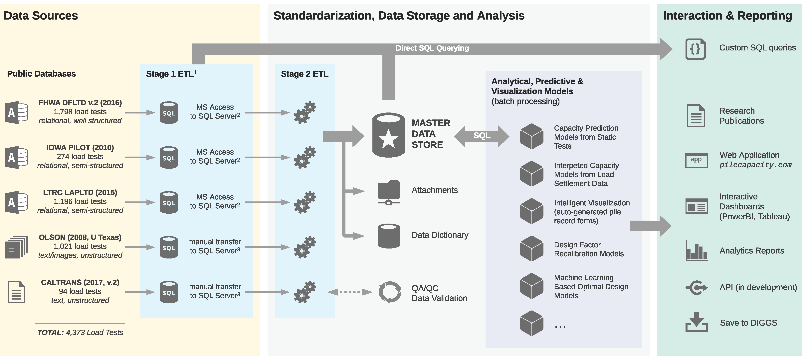
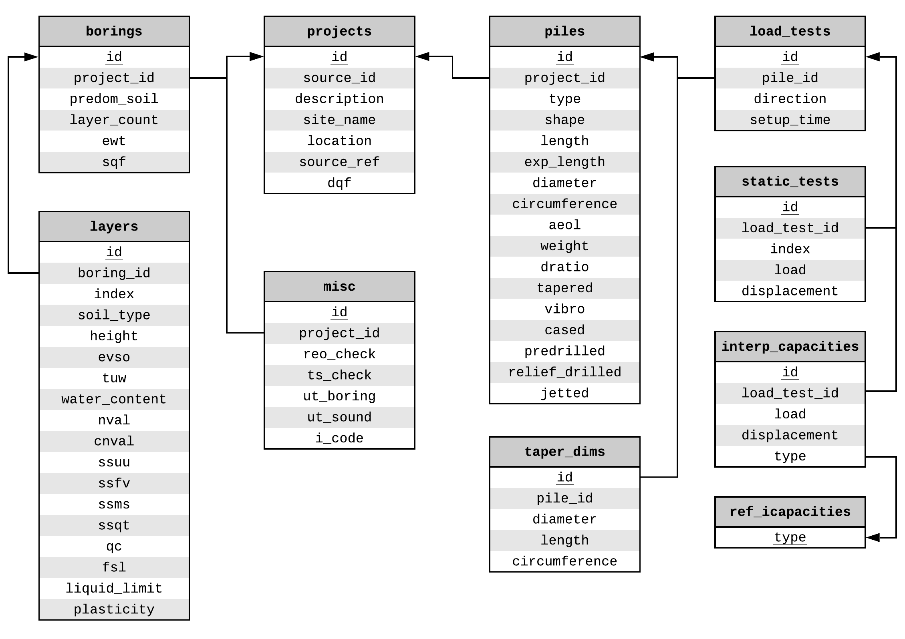
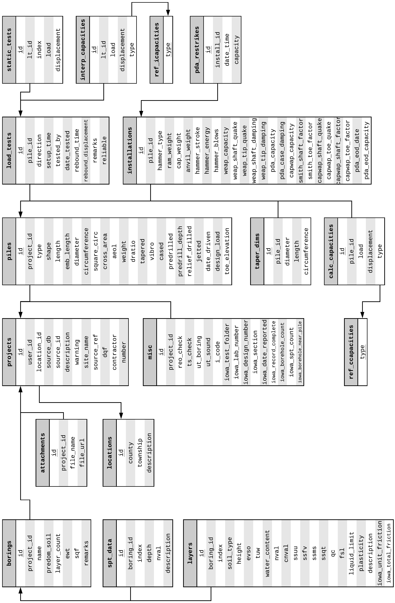
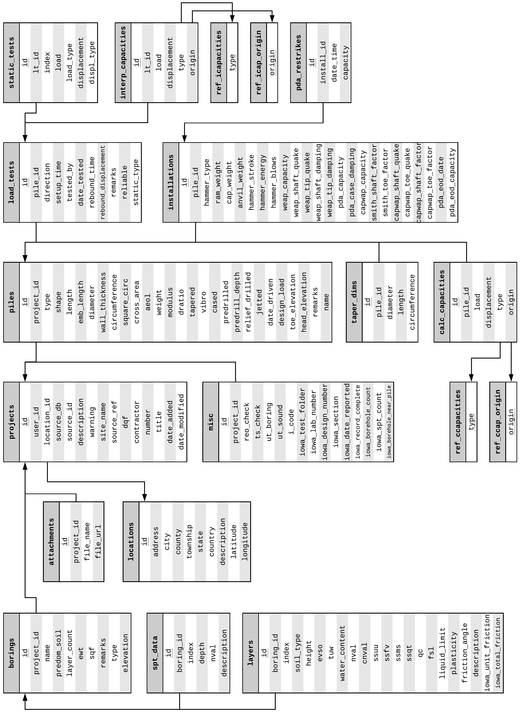
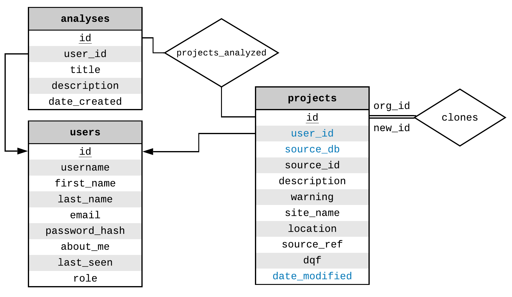

.. _nyu_pile_capacity:

######################################################################################
NYU Pile Capacity: An Interactive Web Application and Unifying Pile Load Test Database
######################################################################################

.. note::

   This chapter will be updated by 12/16/2019 with additional details on the features and background processes of *NYU Pile Capacity* that was recently developed.

   Schematic of a Comprehensive Pile Load Test Data Warehouse [#]_

.. [#] Icons by Microsoft Azure Cloud and Enterprise. Diagram inspired by edX DAT216x *Delivering a Relational Data Warehouse*

*******
History
*******

Many of the methods in current use for pile design are based on small databases of interpreted load test data. For piles in sand, Nordlund (:ref:`1963 <Nordlund1963>`, :ref:`1979 <Nordlund1979>`) developed his method of calculating bearing capacity of piles in cohesionless soils from as few as 41 load tests from eight different test sites. Similarly, for clays, Tomlinson (:ref:`1957 <Tomlinson1957>`, :ref:`1971 <Tomlinson1971>`) employed a small data set of 56 piles to develop his popular Alpha-design method that was based in part on data published by Peck (:ref:`1958 <Peck1958>`). These methods were adopted by several design standards including, The Canadian Manual on Foundation Engineering (:ref:`1975 <Canadian1975>`), The American Petroleum Institute (:ref:`API RP 2A, 1989 <API1989>`), and FHWA (:ref:`Hannigan et al., 2016a <Hannigan2016a>`, :ref:`2016b <Hannigan2016b>`). Due to the dependence of soil behavior upon geography and site-specific circumstances and the use of limited data employed to launch historical foundation design methods, it is possible that many currently practiced methods of pile design, are based on empirical formulas that required gross overgeneralization to develop.

To address this concern, several past geotechnical studies have been undertaken with a focus on the expansion of load test databases in order to improve the methods employed to predict the axial capacity of piles. The first modern effort to organize a database of measured and interpreted pile capacities was performed at the behest of the American Petroleum Institute (API) by Professor Olson and his students at the University of Texas (:ref:`Dennis and Olson, 1983a <Dennis1983a>`, :ref:`1983b <Dennis1983b>`). This effort led to the development of the popular API RP-2A method for capacity of piles in sand (10). Later efforts were made to improve on both the size of the database and on its interpretation (:ref:`Olson and Al-Shafei, 1988 <Olson1988>`; :ref:`Olson, 1990 <Olson1990>`; :ref:`Iskander and Olson, 1992 <Iskander1992>`; :ref:`Olson and Iskander, 1994 <Olson1994>`; :ref:`Olson and Iskander, 1998 <Olson1998>`; :ref:`Olson and Shantz, 2004 <Olson2004>`; :ref:`Olson and Iskander, 2009 <Olson2009>`). Later, FHWA began a parallel effort to develop a Deep Foundation Load Test Database (DFLTD) under the leadership of Carl Ealy (:ref:`Kalavar and Ealy, 2000 <Kalavar2000>`). Likewise, several highway departments developed state databases of interpreted pile capacities including Iowa, Illinois, and Louisiana (:ref:`Roling et al., 2010 <Roling2010>`; :ref:`Roling et al., 2011 <Roling2011>`; :ref:`Tavera et al., 2016 <Tavera2016>`; :ref:`Long and Anderson, 2012 <Long2012>`). Similarly several small databases have been developed at a number of universities and research centers including the Norwegian Geotechnical Institute (NGI), and at Texas A&M (:ref:`Briaud et al., 1987 <Briaud1987>`; :ref:`Lacasse, 1988 <Lacasse1988>`; :ref:`Paikowsky, 2001 <Paikowsky2001>`).

In a 2013 memorandum, Abu-Hejleh describes the DFLTD as being "outdated" to the point of impossibility of database expansion (:ref:`Abu-Hejleh, 2013 <Abu-Hejleh2013>`). Abu-Hejleh et al. (:ref:`2015a <Abu-Hejleh2015a>`) discussed the usefulness of current databases in use in the United States and establishes the suggested minimum data required for load test databases pertaining to Project Data, Subsurface Data at the Load Test Foundation, Test Foundation Data, Load Test Data, and attachment of useful files. The guidelines for developing useful load test databases discussed by Abu-Hejleh et al. were last updated in 2015 (:ref:`Abu-Hejleh et al., 2015b <Abu-Hejleh2015b>`).

*********************
Original Data Sources
*********************

Before discussing database design and data transformations, it is important to describe the original data sources: (1) Dr. Olson's APC Database, (2) the Iowa PILOT Database, (3) the FHWA DFLTD v.2 and (4) LTRC LAPLTD. Despite the author's best efforts to coordinate with project owners and contractors in order to collect data, there was little to no interest from the private sector to share data.

Olson APC Database
==================

.. note::

   "APC" stands for "Axial Pile Capacity". There is some confusion that Dr. Olson's database is called the "API Database". That is not the case.

.. include:: olson_db.inc.rst

Iowa PILOT Database
===================

.. include:: iowa_pilot.inc.rst

FHWA DFLTD v.2
==============

.. include:: fhwa_dfltd.inc.rst

LTRC LAPLTD
===========

.. include:: lapltd.inc.rst

*******************************************
Design and Development of NYU Pile Capacity
*******************************************

A quick observation from the previous section, `Original Data Sources`_, is that all databases were distributed as standalone datasets or software applications that were intended to be be installed on a local computer. Any changes would only be saved locally making it very difficult to share data or collaborate. Also, *Iowa PILOT* and *LTRC LAPLTD* were the only databases with input forms that allowed for entry of new records. Lastly, and perhaps more importantly, with all existing pile load test databases there has been no consideration on useful data export or data *connectors* that would allow for a wide range of analyses on the entire dataset rather than a case-by-case basis. A major goal of *NYU Pile Capacity* was to address these shortcomings.

Unifying Database Schema
========================

Database design is an iterative process. It involves multiple cycles of development and with each cycle the design keeps getting refined to better fit the project needs. The main objective was to combine all four previously described databases in one relational database, transferring all information necessary for capacity calculations. Out of the four source databases, the *Olson APC* database was the most concise and to-the-point collection of relevant data and it served as the basis of the design of *NYU Pile Capacity*'s schema that was then expanded to accommodate data from the other three sources.

   Intermediate E-R Diagram of *NYU Pile Capacity* after defining the database attributes from the *Olson APC* Database raw files

:numref:`OlsonVarsTable` (appendix) summarizes the variables available in the *Olson APC* Database raw data files. The reduction of these variables to a relational schema is presented in :numref:`olson_db_schema`. It is important to note that in this iteration, normalization rules are not strictly enforced. For instance, attributes ``ssuu``, ``ssfv``, ``ssms``, ``ssqt`` are all storing information on shear strength obtained from different tests and it could be argued that they are violating the "non-repeating attribute" rule of the 1st Normal Form (1NF). However, in the context of geotechnical engineering, it is unlikely that a value for shear stregth obtained from a new lab test will needs to be stored. It is also unlikely that multiple values of shear strength from the same lab test will need to be stored for a single layer. As such, it is far more practical to keep these four attributes in the ``layers`` relation than move them in separate relations in order to be strictly compliant with the normalization process.

   Intermediate E-R Diagram of *NYU Pile Capacity* after defining the database attributes from the *Olson APC* Database raw files and mapping the *Iowa PILOT* database attributes

   Final E-R Diagram of *NYU Pile Capacity*

Workflow for Data Handling and Analysis
=======================================

   *NYU Pile Capacity*: Partial E-R Diagram of Logical Workflow

