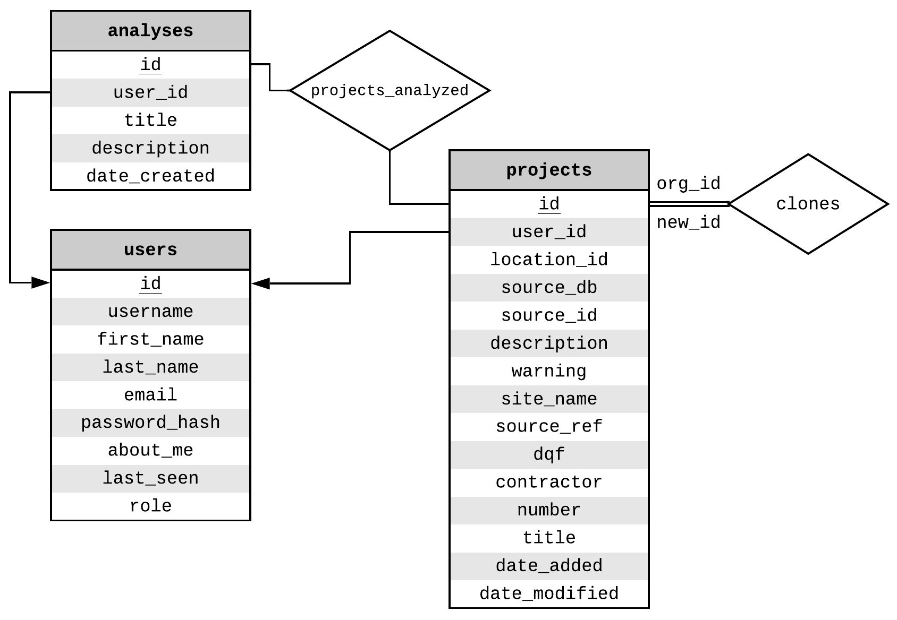

.. _nyu_pile_capacity:

######################################################################################
NYU Pile Capacity: An Interactive Web Application and Unifying Pile Load Test Database
######################################################################################

.. note::

   This chapter will be updated by 12/16/2019 with additional details on the features and background processes of *NYU Pile Capacity* that was recently developed.

.. figure:: figures/plt_warehouse_schematic.png
   :name: plt_warehouse_schematic

   Schematic of a Comprehensive Pile Load Test Data Warehouse [#]_

.. [#] Icons by Microsoft Azure Cloud and Enterprise. Diagram inspired by edX DAT216x *Delivering a Relational Data Warehouse*

*******
History
*******

Many of the methods in current use for pile design are based on small databases of interpreted load test data. For piles in sand, Nordlund (:ref:`1963 <Nordlund1963>`, :ref:`1979 <Nordlund1979>`) developed his method of calculating bearing capacity of piles in cohesionless soils from as few as 41 load tests from eight different test sites. Similarly, for clays, Tomlinson (:ref:`1957 <Tomlinson1957>`, :ref:`1971 <Tomlinson1971>`) employed a small data set of 56 piles to develop his popular Alpha-design method that was based in part on data published by Peck (:ref:`1958 <Peck1958>`). These methods were adopted by several design standards including, The Canadian Manual on Foundation Engineering (:ref:`1975 <Canadian1975>`), The American Petroleum Institute (:ref:`API RP 2A, 1989 <API1989>`), and FHWA (:ref:`Hannigan et al., 2016a <Hannigan2016a>`, :ref:`2016b <Hannigan2016b>`). Due to the dependence of soil behavior upon geography and site-specific circumstances and the use of limited data employed to launch historical foundation design methods, it is possible that many currently practiced methods of pile design, are based on empirical formulas that required gross overgeneralization to develop.

To address this concern, several past geotechnical studies have been undertaken with a focus on the expansion of load test databases in order to improve the methods employed to predict the axial capacity of piles. The first modern effort to organize a database of measured and interpreted pile capacities was performed at the behest of the American Petroleum Institute (API) by Professor Olson and his students at the University of Texas (:ref:`Dennis and Olson, 1983a <Dennis1983a>`, :ref:`1983b <Dennis1983b>`). This effort led to the development of the popular API RP-2A method for capacity of piles in sand (:ref:`API, 1989 <API1989>`). Later efforts were made to improve on both the size of the database and on its interpretation (:ref:`Olson and Al-Shafei, 1988 <Olson1988>`; :ref:`Olson, 1990 <Olson1990>`; :ref:`Iskander and Olson, 1992 <Iskander1992>`; :ref:`Olson and Iskander, 1994 <Olson1994>`, :ref:`1998 <Olson1998>` and :ref:`2009 <Olson2009>`; :ref:`Olson and Shantz, 2004 <Olson2004>`). Later, FHWA began a parallel effort to develop a Deep Foundation Load Test Database (DFLTD) under the leadership of Carl Ealy (:ref:`Kalavar and Ealy, 2000 <Kalavar2000>`). Likewise, several highway departments developed state databases of interpreted pile capacities including Iowa, Illinois, and Louisiana (:ref:`Roling et al., 2010 <Roling2010>` and :ref:`2011 <Roling2011>`; :ref:`Tavera et al., 2016 <Tavera2016>`; :ref:`Long and Anderson, 2012 <Long2012>`). Similarly several small databases have been developed at a number of universities and research centers including the Norwegian Geotechnical Institute (NGI), and at Texas A&M (:ref:`Briaud et al., 1987 <Briaud1987>`; :ref:`Lacasse, 1988 <Lacasse1988>`; :ref:`Paikowsky, 2001 <Paikowsky2001>`).

In a 2013 memorandum, Abu-Hejleh describes the DFLTD as being "outdated" to the point of impossibility of database expansion (:ref:`Abu-Hejleh, 2013 <Abu-Hejleh2013>`). Abu-Hejleh et al. (:ref:`2015a <Abu-Hejleh2015a>`) discussed the usefulness of current databases in use in the United States and establishes the suggested minimum data required for load test databases pertaining to Project Data, Subsurface Data at the Load Test Foundation, Test Foundation Data, Load Test Data, and attachment of useful files. The guidelines for developing useful load test databases discussed by Abu-Hejleh et al. were last updated in 2015 (:ref:`Abu-Hejleh et al., 2015b <Abu-Hejleh2015b>`).

*********************
Original Data Sources
*********************

Before discussing database design and data transformations, it is important to describe the original data sources: (1) Dr. Olson's APC Database, (2) the Iowa PILOT Database, (3) the FHWA DFLTD v.2 and (4) LTRC LAPLTD. Despite the author's best efforts to coordinate with project owners and contractors in order to collect data, there was little to no interest from the private sector to share data.

Olson APC Database
==================

.. note::

   "APC" stands for "Axial Pile Capacity". There is some confusion that Dr. Olson's database is called the "API Database". That is not the case.

.. include:: olson_db.inc.rst

Iowa PILOT Database
===================

.. include:: iowa_pilot.inc.rst

FHWA DFLTD v.2
==============

.. include:: fhwa_dfltd.inc.rst

LTRC LAPLTD
===========

.. include:: lapltd.inc.rst

*******************************************
Design and Development of NYU Pile Capacity
*******************************************

A quick observation from the previous section, `Original Data Sources`_, is that all databases were distributed as standalone datasets or software applications that were intended to be be installed on a local computer. Any changes would only be saved locally making it very difficult to share data or collaborate. Also, *Iowa PILOT* and *LTRC LAPLTD* were the only databases with input forms that allowed for entry of new records. Lastly, and perhaps more importantly, with all existing pile load test databases there has been no consideration on useful data export or data *connectors* that would allow for a wide range of analyses on the entire dataset rather than a case-by-case basis. A major goal of *NYU Pile Capacity* was to address all of these shortcomings and offer features that align with the modern requirements for data analytics. At the same time *NYU Pile Capacity* was designed to be extensible in order to accommodate virtually unlimited data as well as additional methods of analysis.

   Presenting the first two records out of 7,511 in *NYU Pile Capacity*

At launch, *NYU Pile Capacity* stored geotechnical, pile and load test data for 7,511 records and can be accessed at `<http://pilecapacity.com>`_. *NYU Pile Capacity* is a web application built on Python and Flask with a relational database (Postgres).

Unifying Database Schema
========================

Database design is an iterative process. It involves multiple cycles of development and with each cycle the design is usually refined to better fit the project needs. The main objective for *NYU Pile Capacity* was to combine all four previously described databases in one relational database, transferring all information necessary for capacity and other engineering calculations. Out of the four source databases, the *Olson APC* database was the most concise and to-the-point collection of relevant data and it served as the basis for the design of *NYU Pile Capacity*'s schema that was then expanded to accommodate data from the other three sources. The Extract, Transform and Load (ETL) process for each data source was presented in the previous section and all attribute mappings are included in the Appendix.

.. figure:: figures/olson_db_schema.png
   :name: olson_db_schema

   Intermediate E-R Diagram of *NYU Pile Capacity* after defining the database attributes from the *Olson APC* Database raw files

:numref:`OlsonVarsTable` (appendix) summarizes the variables available in the *Olson APC* Database raw data files. The reduction of these variables to a relational schema is presented in :numref:`olson_db_schema`. This resulted in 10 tables and 75 attributes. It is important to note that in this first iteration, normalization rules are not strictly enforced, although the goal was to make the schema adhere to 3rd Normal Form (3NF). For instance, attributes ``ssuu``, ``ssfv``, ``ssms``, ``ssqt`` are all storing information on shear strength obtained from different tests and it could be argued that they are violating the "non-repeating attribute" rule of the 1st Normal Form (1NF). However, in the context of geotechnical engineering, it is unlikely that a value for shear stregth obtained from a new lab test will need to be stored. It is also unlikely that multiple values of shear strength from the same lab test will need to be stored for a single layer. As such, it is far more practical to keep these four attributes in the ``layers`` relation than move them in separate relations in order to be strictly compliant with the normalization process.

.. figure:: figures/olson_iowa_erd_rot.png
   :width: 525 px
   :name: olson_iowa_erd_rot

   Intermediate E-R Diagram of *NYU Pile Capacity* after defining the database attributes from the *Olson APC* Database raw files and mapping the *Iowa PILOT* database attributes

With the *Olson APC* ETL process complete, the next data source to be processed was *Iowa PILOT*. Every attribute from *Iowa PILOT* was mapped and the database for *NYU Pile Capacity* was expanded as shown in :numref:`olson_iowa_erd_rot`. The resulting database included 17 tables and 156 attributes.

The next data source that was processed was *FHWA DFLTD v.2*. This was also the most complex ETL process as evident in :numref:`fhwa_py`. It was important to maintain the simple and straightforward structure of the *NYU Pile Capacity* database. The reason for that was to allow for the unified database to be queried directly from users with SQL code and to enable efficient interactions with interactive reporting solutions such as `Tableau <https://www.tableau.com/>`_ and `Metabase <https://www.metabase.com/>`_. As such, while the E-R diagrams for *NYU Pile Capacity* show one-to-many relationships for all tables, in reality most relationships are intended to be one-to-one. This was enforced on the application and not the database level. Write/alter actions were implemented only via the online user interface. Any direct query operations were and will be read-only with dedicated user accounts. For instance, a project may only have one associated boring record, one pile record and one load test record. However, multiple capacity values can be entered for a pile and a boring record may have multiple soil layers.

   Final E-R Diagram of *NYU Pile Capacity*

The final E-R diagram for *NYU Pile Capacity*, after porting *FHWA DFLTD v.2* and *LTRC LAPLTD* is presented in :numref:`nyu_db_full_rot`. It included 19 tables and 158 attributes. Of particular importance were tables ``calc_capacities`` and ``interp_capacities`` with their corresponding reference tabled (noted with the prefix ``ref_``). The objective in this case was to allow for multiple calculated and interpreted capacity values to be stored along with their type and origin. For example, an calculated capacity based on the API method may have been imported from the original data source but another value based on the same method can be stored if it is the result of hand or programmatic calculations.

Operational Workflow
====================

Drawing from the experience of using past load test databases, along with the inherent difficulties of scientific research, it was important that *NYU Pile Capacity* offers users the flexibility to interact with the load test records, collaborate with peers and share results. All projects (table ``projects``, :numref:`nyu_db_logic`) in the database have an owner (table ``users``, :numref:`nyu_db_logic`). That person can either be the one who imported the record in the database or the one who *cloned* an existing record, essentially making it their own. All users can view all records but owners can edit their own records only. The database keeps track of which records have been cloned with the ``clones`` relationship set, a self-referential, many-to-many table.

*NYU Pile Capacity* allows for analyses (table ``analyses``, :numref:`nyu_db_logic`) on one or more stored projects (aggregate analyses). A user has the option to add one or more projects to an analysis. This is being handled by the ``projects_analyzed`` relationship set which defines a many-to-many relationship between ``projects`` and ``analyses``. As shown in the partial E-R diagram of :numref:`nyu_db_logic`, a user can have multiple projects and multiple analyses, however a project or analysis may only have one user. This partial E-R diagram supplements the final E-R diagram presented in :numref:`nyu_db_full_rot`, note that the ``projects`` table is the same in both figures.

   *NYU Pile Capacity*: Partial E-R Diagram of Logical Workflow

Users may have one of three defined roles, or user-access levels: guest, standard or administrator. Once a new user signs up on *NYU Pile Capacity*, she is automatically assigned the *guest* role. This means that can browse through all records stored in the database and can also create and run new analyses. A guest user cannot import new records in the database. This is possible with the *standard* role. Still, standard users can only edit their own records. A guest user can have their user-access level changed by contacting the admins. Finally, a user with the *administrator* role can edit any record in the database, even ones that have been added by other users. While the database schema was designed to support all these interactions, the rules are enforced at the application level by limiting features to users based on their assigned role.

.. literalinclude:: listings/sample_schema.sql
   :language: sql
   :caption: Postgres DDL for the *projects* and *clones* Tables
   :name: sample_schema_sql

One of the great advantages of storing data in relational databases is making use of the Structured Query Language (SQL) to slice, dice and query data in infinite ways. SQL is also used to define the tables in the database, this part of SQL being referred to as the *Data Definition Language* (DDL). :numref:`sample_schema_sql` shows a sample of the DDL defining the *projects* and *clones* tables of *NYU Pile Capacity*. The remaining tables were similarly defined. DDL sets the table names, attribute names, data types for attributes, as well as all necessary integrity constraints (i.e. primary & foreign keys, checks and NOT NULL).

.. literalinclude:: listings/sample_schema.py
   :language: python
   :caption: Python SQLAlchemy Model for the *projects* and *clones* Tables
   :name: sample_schema_python

SQL is great for direct database interactions. For example, users can pull data with SQL and analyze the data locally on their computers. And with more data added in the database, updating the analysis can be as simple as running the same code again. This functionality exists in *NYU Pile Capacity*, however, ETL and front-end interaction relied on an alternative method using *SQLAlchemy* (:ref:`Bayer, 2012 <Bayer2012>`, `<https://www.sqlalchemy.org/>`_). SQLAlchemy is a Python SQL toolkit and an Object Relational Mapper (ORM).

..
    Interface
    =========

    *******************************************
    A Case for the Experiential Design of Piles
    *******************************************
