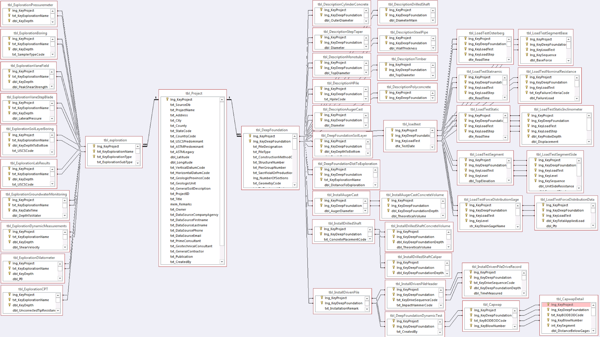

Background
----------

The original version of DFLTD includes methods of search for foundations of specific site and pile characteristics from the more than 1,500 load test results available (:ref:`Kalavar and Ealy, 2000 <Kalavar2000>`). Although DFLTD claimed over 1,500 load tests, the author is not aware of any studies that have been able to employ a substantial portion of these tests in comparing interpreted and computing capacities because most tests lacked crucial information necessary for either interpreting the test, or computing the capacity. This is a problem with all piling databases. For example the Olson database classified tests into five data quality factors, for both soils information and pile load test information. Few tests in the entire Olson database achieved a top tier classification in both categories, and thus nearly all analyses were based on fewer than 100 high quality tests.

FHWA rekindled the effort to gather and distribute load test information on piles, as part of its effort to develop a method for predicting the axial capacity of large diameter open ended pipe piles. This effort resulted in the release of the Deep Foundation Load Test Database v.2 (DFLTD v.2) in February 2017 (:ref:`Petek et al., 2016 <Petek2016>`). This updated version of the DFLTD v.2 was developed as part of the Federal Highway Administration (FHWA) research project *Bearing Resistance of Large Diameter Open-End Piles (2014–2017)*, and provides a collection of deep foundation load test data.

Database Statistics
-------------------

Load test types in the new database include axial static, rapid (Statnamic), and dynamic load tests. Foundation types include open- and closed-end steel pipe piles, concrete cylinder piles, steel H-piles, pre-stressed concrete piles, drilled shafts, augercast piles, micropiles, timber piles, and others. Deep foundation load test data from the existing FHWA Deep Foundations Load Test Database (DFLTD, Version 1.0) was transferred to DFLTD v.2.

*Data included in the database was obtained from a large number of sources. These sources primarily included conference proceedings, journal articles, and engineering reports. Native digital data for the various in situ and load tests was generally not available for these sources. Therefore, the LDOEP data including subsurface explorations, dynamic testing, and load test data (force, displacement, force distribution, and load transfer) is digitized from these publications. There may be some slight variation between the original publication and the digitized values included in the database.*

*The database uses the broad soil type classifications of cohesive, non-cohesive, intermediate geomaterial, rock, and variable. The soil type is classified as uniform condition if at least 70 percent of the soil along the pile side or base consists of the specified material type. Variable sites consist of a combination of soil types where combined layers for each soil type are less than 70 percent of the total.*

*Native digital data for the various in situ tests was generally not available during data collection of the LDOEP study. The plots of SPT blow count are based on the numerical values shown in the Exploration Details tab. The LDOEP study CPT data was primarily digitized from plots in publications. There may be slight variation between the original publication and the digitized CPT Test values included in the database. The source of the DFLTD data is unknown.*

*Native digital data for the static and Statnamic load tests was generally not available during data collection of the LDOEP study. The load displacement, load transfer, and force distribution data was digitized from plots in the available publications. There may be some slight variation between the original publication and the digitized values included in the database.*

Data Format
-----------

DFLTD v.2 was developed in Microsoft Access 2013. The graphics utility *Advanced Software Engineering’s Chartdirector* was employed to design the forms, queries, and auxiliary tables required for
data inquiry, viewing, and export. This utility allows users to access data, but not to make any changes.

*The database sign convention is positive for compressive loads and upward displacement. Tension loads and downward displacement are negative. The sign convention is used for the LDOEP study data. The majority of the previous DFLTD data follow this sign convention with a few exceptions.*

   DFLTD v.2 Database Organization (after :ref:`Petek et al., 2016 <Petek2016>`)

:numref:`DFLTD_v2_general_diagram` shows the general structure of DFLTD v.2. The full ER diagram is presented in :numref:`DFLTD_v2_ER_Diagram`.

   DFLTD v.2 Entity Relationship Diagram (exported from MS Access)

*The key takeaway is that the list of projects will conform to the desired query criteria; however, the projects may contain additional explorations, deep foundations, and load tests that were not included in the query criteria.*

