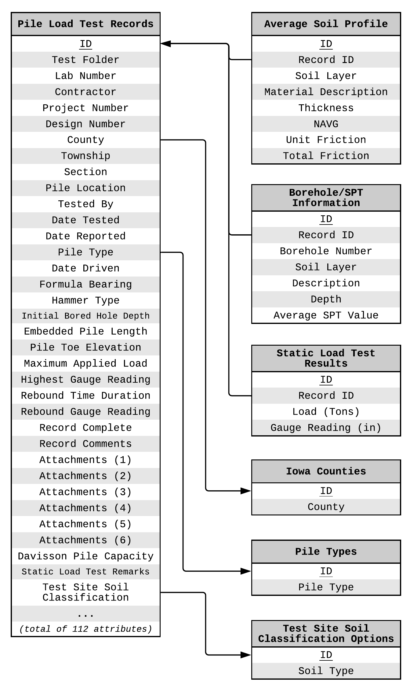

Background
----------

The Pile-Load Tests (PILOT) database is the result of a funded research project by the Iowa Department of Transportation carried out at the Institute for Transportation of the Iowa State University (:ref:`Roling et al., 2010 <Roling2010>`; :ref:`Roling et al., 2011 <Roling2010>`). While most publicly available load test databases suffer from poor data quality, records in the PILOT database were first analyzed for reliability and then used for the establishment of LRFD resistance factors for design and construction control of driven pile foundations in Iowa. PILOT is an amalgamated, electronic source of information consisting of both static and dynamic data for pile load tests conducted in the State of Iowa and includes historical data on pile load tests dating from 1966 to 1989. It is therefore considered a reliable source of data for future studies.

Additional information on this research project is available at `<http://srg.cce.iastate.edu/lrfd/>`_.

Currently providing an electronically organized assimilation of geotechnical and pile load test data for 274 piles of various types (e.g., steel H-shaped, timber, pipe, Monotube, and concrete), PILOT (http://srg.cce.iastate.edu/lrfd/) is on par with such familiar national databases used in the calibration of LRFD resistance factors for pile foundations  as  the  FHWA’s Deep  Foundation  Load  Test  Database. By  narrowing  geographical  boundaries  while  maintaining  a  high number of pile load tests, PILOT exemplifies a model for effective regional LRFD calibration procedures.

Database Statistics
-------------------

PILOT contains geotechnical and pile load test data for 274 piles of various types (i.e., steel H-shaped, timber, pipe, monotube, and concrete). The majority of the piles are steel H-piles (164 count) followed by timber (75 count) and steel pipe piles (16 count). Of particular importance are 10 steel H-piles that are accompanied by a plethora of information.

In addition to driving and statically load testing these piles to failure, most of the test piles were instrumented with strain gauges and dynamically monitored during driving and restrikes using the Pile Driving Analyzer (PDA) device. Moreover, the subsurface conditions at the location of each of the test piles were characterized using various laboratory tests (i.e., moisture content, grain-size distribution, Atterberg limits, consolidation, and Triaxial Consolidated-Undrained compression tests) and in-situ tests (e.g., Standard Penetration Test (SPT), Cone Penetration Test (CPT), and Borehole Shear Test (BST)). In some cases, ground instrumentation (i.e., push-in pressure cells) was used to capture horizontal stress and porewater pressure data near the test pile during driving and static load testing.

In contrast to the *Olson APC Database*, the distribution of soil types that the piles in PILOT were driven into is equally spread between sandy, clayey and mixed.

Data Format
-----------

PILOT was designed in and distributed as a Microsoft Access database. It was designed to perform efficient filtering, sorting, and querying procedures on the amassed dataset. The developers of PILOT did a great job in delivering a user-friendly environment, however, the inherit limitations of Microsoft Access are hard to overcome.

Information in the PILOT database is organized in four tables, *Pile Load Test Records* (main table with 112 attributes, :numref:`IowaAttrTable1` in the appendix), *Average Soil Profile* (eight attributes, :numref:`IowaAttrTable2` in the appendix), *Borehole/SPT Information* (seven attributes, :numref:`IowaAttrTable3` in the appendix), and *Static Load Test Results* (four attributes, :numref:`IowaAttrTable4` in the appendix). There are three additional reference tables for Iowa counties, pile types and soil classification options.

The format of the PILOT database is relational but not normalized and with no apparent formal design implementation other than the logical clustering of related blocks of data. The E-R diagram of the database is presented in :numref:`iowa_schema`.

   E-R Diagram of the Iowa PILOT Database

While the quality of the data in the PILOT database is not questioned, noticeably absent is data on soil unit weight which hinders reliable effective stress and capacity calculations. Moreover, ground water table is recorded as an elevation without additional data on the elevation of the ground level in order to infer ground water table depth. Luckily, there is information on pile toe elevation for most records and combined with pile embedded depth, it is possible to infer water table depth for some records. Lastly, data for Cone Penetration Tests (CPT) and Borehole Shear Tests (BST) are referenced via relative linkt to local files but are not included.

.. TODO: update this part on porting the data

All data from the PILOT database was ported to the NYU database. There were two options to accomplish this task. The first was to use standard Microsoft tools that can transfer a MS Access database to a temporary database on MS SQL Server maintaining all metadata from the MS Access database. Then, the temporary database on MS SQL Server could be queried and the data transferred to the NYU database.

The second option was to export all tables from MS Access as .csv files and write a Python program to process these files. This was the option implemented due to the fact that it did not require temporary infrastructure and the ETL process could then be more streamlined and reproducible.

:numref:`IowaAttrTable1`, :numref:`IowaAttrTable2`, :numref:`IowaAttrTable3` and :numref:`IowaAttrTable4` in the appendix detail how the original PILOT database attributes were mapped to the NYU database attributes.

``ref_ccapacities`` **values:**
   - Iowa DOT Modified ENR
   - Iowa Theoretical End Bearing
   - Iowa Theoretical Capacity
   - Iowa Blue Book Method
   - Meyerhof
   - API 1984
   - Beta Burland 1973
   - Nordlund
   - WEAP

``ref_icapacities`` **values:**
   - Maximum Load
   - Standard Davisson

