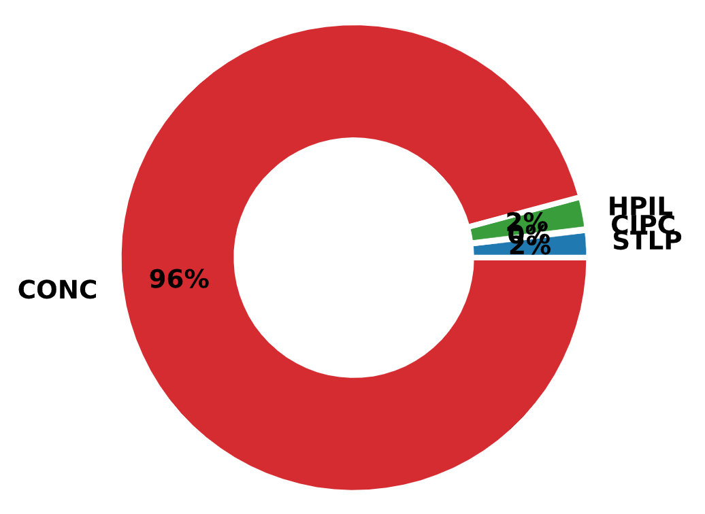
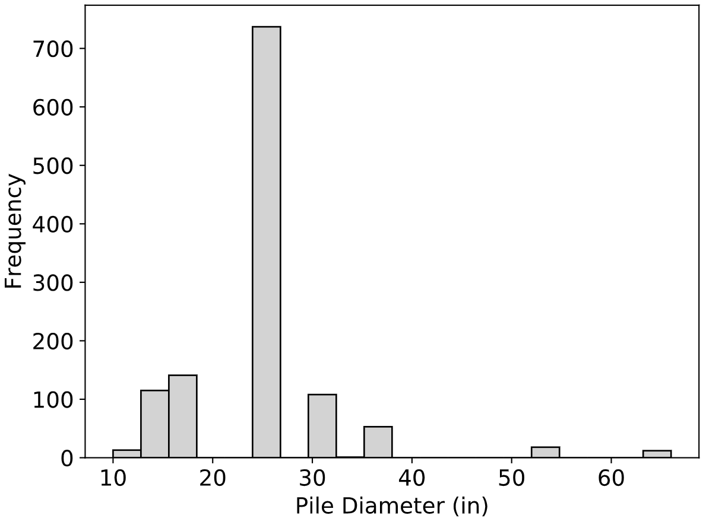
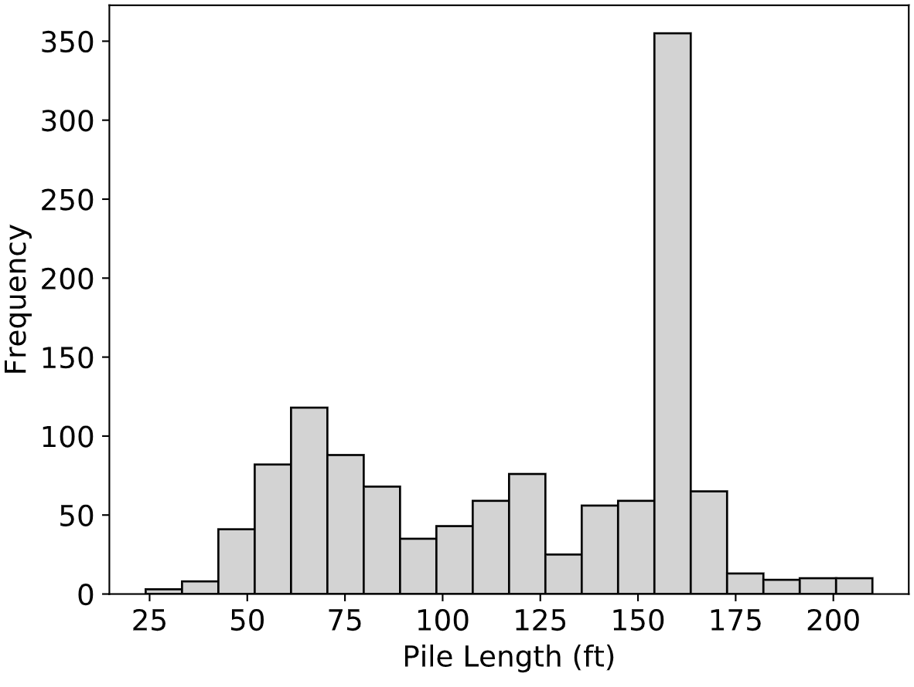
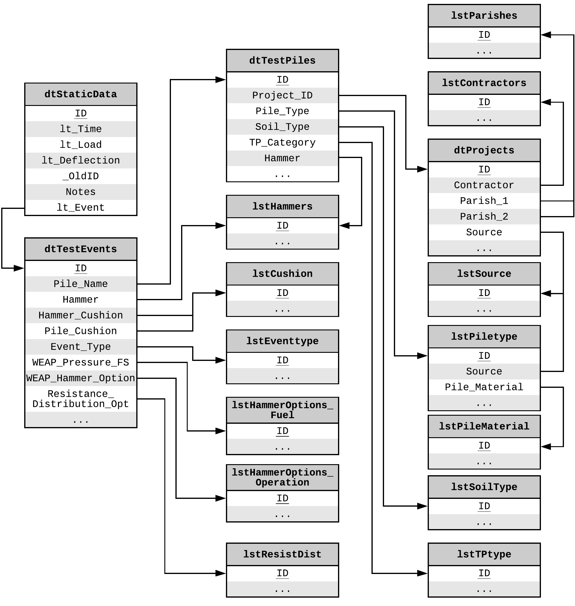

Background
----------

This database was developed as part of a study on the calibration of the Gates pile driving formula (:ref:`Tavera et. al, 2016 <Tavera2016>`) by the Louisiana Transportation Research Center (LTRC). The database was called *the LADOTD Pile Load Test Database (LAPLTD)* and it contains records from the state of Louisiana only.

Design of the *LTRC LAPLTD* was based on the Louisiana Department of Transportation and Development (DOTD) Test Pile database that was developed by the DOTD Pavement and Geotechnical Design Section. *LTRC LAPLTD* contains data obtained only from DOTD pile load test case histories from the following three sources:

- DOTD Test Pile Database - 863 records
- FHWA Deep Foundation Load Test Database (DFLTD v.1) (Louisiana case histories only) - 198 records
- LTRC 14-1GT Research Project - 146 records

Significant modifications were made to *LTRC LAPLTD* by adding new information fields, reorganizing data, and implementing data management controls to reduce the chances of data corruption.

A major limitation though, was that *LTRC LAPLTD* contained no information on geotechnical data and site investigations other than a label for the predominant soil at the pile location and the names of nearest borings or CPT soundings per pile. *LTRC LAPLTD* was however successful in assisting to provide reasonable recommendations on the improvement of pile driving formulas as well as revised resistance factors for LRFD.

.. table:: Summary of *LTRC LAPLTD* general statistics (from :ref:`Tavera et. al, 2016 <Tavera2016>`)
   :widths: auto
   :align: center
   :name: lapltd_stats_table

   +---------------------------------------+-----------+
   | Description                           | Quantity  |
   +=======================================+===========+
   | Projects                              | 194       |
   +---------------------------------------+-----------+
   | Piles Tested                          | 804       |
   +---------------------------------------+-----------+
   | Static Load Tests                     | **252**   |
   +---------------------------------------+-----------+
   | EOID Dynamic Load Tests (with CAPWAP) | 183       |
   +---------------------------------------+-----------+
   | BOR Dynamic Load Tests (with CAPWAP)  | 751       |
   +---------------------------------------+-----------+
   | Total Dynamic Load Tests              | **934**   |
   +---------------------------------------+-----------+
   | **Total Static & Dynamic Load Tests** | **1,186** |
   +---------------------------------------+-----------+

Finally, it must be noted that one of the data sources of *LTRC LAPLTD*, the DOTD Test Pile Database, contributed 269 pile load tests to the original version of the FHWA DFLTD (:ref:`Kalavar and Ealy, 2000 <Kalavar2000>`). The DOTD data was collected and documented in an LTRC report (:ref:`Tumay and Titi, 1998 <Tumay1998>`). The DFLTD database released to all state DOTs and FHWA offices in 2014 indicates that 245 load tests were included in the final version of the DFLTD (:ref:`Tavera et. al, 2016 <Tavera2016>`).

Database Statistics
-------------------

As per the corresponding LTRC Report 561 (:ref:`Tavera et. al, 2016 <Tavera2016>`), a significant amount of effort was expended collecting pile load test data, performing QA reviews of the data, cleansing the data, and standardizing the data. These efforts were made to facilitate the collection of quality load test data for use in conducting the research on the calibration of the pile driving formulas as well as facilitating future research projects.

   Distribution of Pile Types in *LTRC LAPLTD*

:numref:`lapltd_stats_table` presents a summary of the number of records in *LTRC LAPLTD*. It is clear that the dynamic outnumber the static test records (934 vs. 252) for a total of 1,186 combined test records. It must be noted that during the ETL process of porting the *LTRC LAPLTD* records in *NYU Pile Capacity*, the total number was 1,223 and not 1,186.

85% of the piles load tested were in southern Louisiana. The largest concentration of load tested piles were in the Lafourche parish (57% of the piles). East Baton Rouge (4%), Orleans (3%), and St. Mary (4%) are the parishes with the next highest number of load tests while the remainder of the parishes had 2% or less per parish.

   Distribution of Pile Diameters in *LTRC LAPLTD*

There is no information on soil conditions within the dataset other than soil classification. LTRC Report 561 (:ref:`Tavera et. al, 2016 <Tavera2016>`) mentioned that approximately 94% (1,112 load tests) of the database piles that were load tested were located in Quaternary soil deposits.

   Distribution of Pile Lengths in *LTRC LAPLTD*

LTRC Report 561 also noted that *LTRC LAPLTD* contained a total of 780 concrete piles and 23 steel piles, which translated to about 96% of all of the piles being Square Precast Pre-tensioned Concrete (PPC) Piles. This fact was verified when the data was ported in *NYU Pile Capacity* as shown in :numref:`lapltd_pile_type_distribution`. The distribution of pile diameters from the records in *LTRC LAPLTD* is presented in :numref:`lapltd_pile_diameter_distribution` and the distribution of pile lengths is presented in :numref:`lapltd_pile_length_distribution`. It is evident that the majority of the piles were 24-inch, 160-ft concrete piles.

Data Format and ETL
-------------------

*LTRC LAPLTD* was implemented in Microsoft Access 2013. The author received a single MS Access file from Mr. Tavera, who was eager to describe the project and offer insights. The file did not contain any data on soil conditions and was also missing a table named *dtWEAPModel* for which the DDL code was defined. Data was organized in 17 tables. Tables with the prefix *dt* appeared to store the bulk of the information while tables with the prefix *lst* stored reference data that was not intended to be updated. Based on the DDL code extracted from the MS Access file, the ER diagram was constructed and is presented in :numref:`lapltd_schema`. The design of the database did not appear to follow standard normalization rules.

   E-R Diagram of *LTRC LAPLTD*

All tables were exported from the MS Access database in tabular format, specifically comma separated value (CSV) files. The ETL process was executed in Python by loading all CSV files and matching the columns of the tables to the attributes of the *NYU Pile Capacity* relational database. An object relational mapping (ORM) module was used to load the data into the database. The process was straightforward, without major unit conversions and was based on the table *dtTestEvents* which appeared to be the main table of *LTRC LAPLTD*. The code for this ETL process is presented in :numref:`lapltd_py`. Description of the original attributes as well as mapping to the new attributes is detailed in section :ref:`LAPLTD Tables and Attributes <lapltd_attributes>` in the Appendix.

.. literalinclude:: listings/lapltd.py
   :language: python
   :caption: Program that Extracted Data from *LTRC LAPLTD*
   :name: lapltd_py

