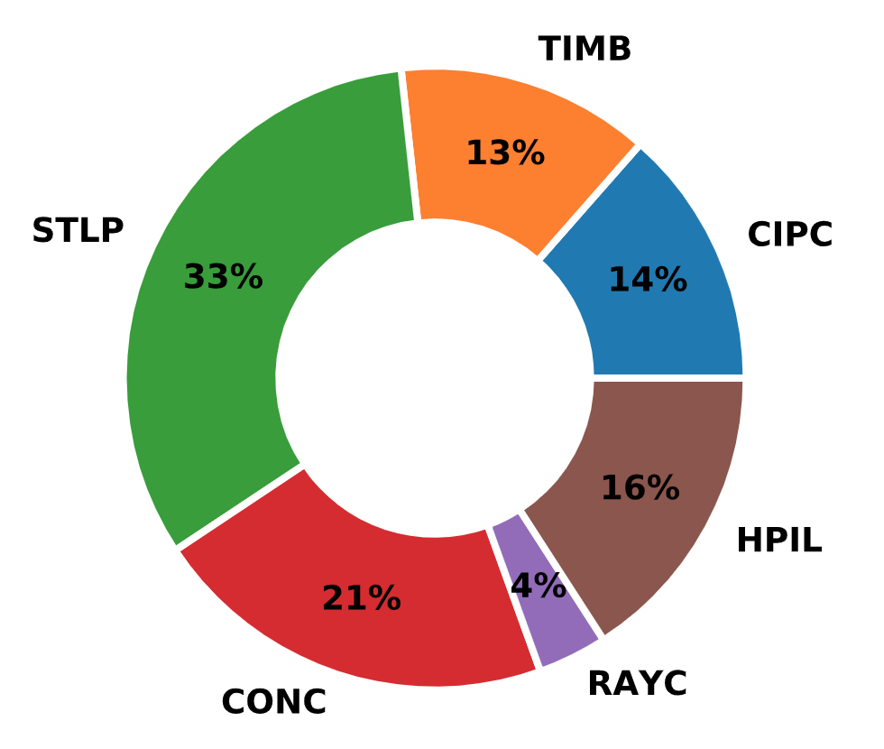
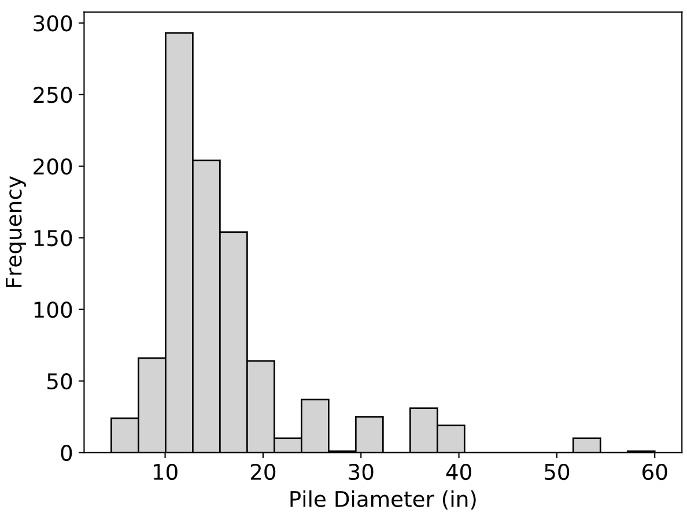
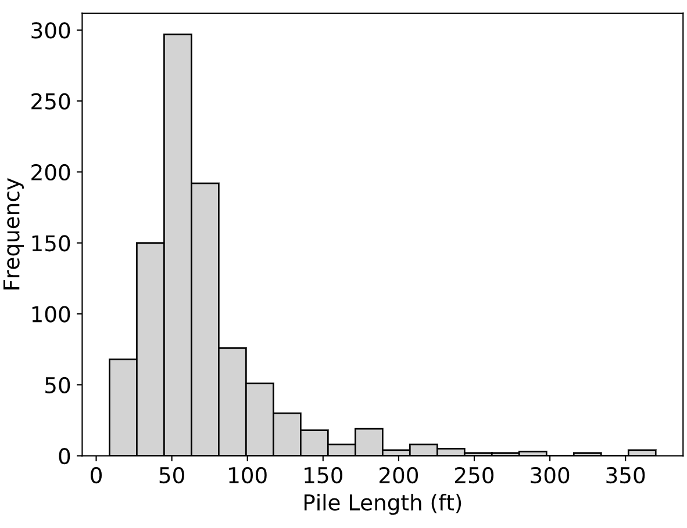
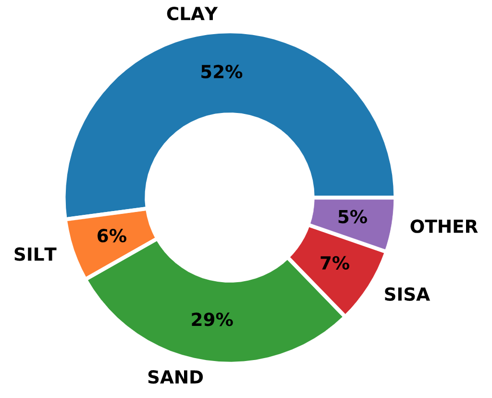

Background
----------

Dr. Roy E. Olson (UT Austin), began development on a pile load test database in 1980, as part of a research project with the American Petroleum Institute (API). API was interested in determining how well their recommended practice design method of the time (API RP-2A, 1980) would compare with actual pile load tests. Significant contributions were made by Norm Dennis who did his Ph.D. dissertation on this project (:ref:`Dennis, 1982 <Dennis1982>`) with the final report submitted to API that year.

Work on the then "API Database" continued between 1984 and 1993 with support from small grants from API, Exxon and Aramco but primarily due to Dr. Olson's personal involvement and contributions. There were several questions, including, (1) how well different methods of soil strength measurement compared with each other in affecting capacity, (2) predictions of pile settlement under axial load, (3) capacities of steel pipe piles in sand and clay, (4) use of the T-Z method to try to predict pile movements under cyclic axial loading. Answering these questions led to M.S. theses written by the students working on them (:ref:`Aschenbrenner, 1984 <Aschenbrenner1984>`; :ref:`Alyahyai, 1987 <Alyahyai1987>`; :ref:`Al-Shafei, 1987 <Al-Shafei1987>`; :ref:`Van Go, 1990 <Go1990>`; :ref:`Chiu, 1993 <Chiu1993>`).

In 1998, Dr. Olson started working on a major research project from the California Department of Transportation (CalTrans). The goal was to develop a new, separate database for CalTrans. The purpose of the CalTrans projects was to conduct soil borings next to existing load tested piles and use this better data to predict pile capacities. It is not clear if the APC database eventually included data from CalTrans.

The original project with API was meant to focus on open-ended steel pipe piles frequently used for offshore structures. However, Dr. Olson expanded the scope to include all pile types and capacity ranges. Information on piles, subsurface conditions and load tests was collected from the literature, DOTs and the Army Corps of Engineers. However, collection was never straightforward. Several governmental agencies, consulting firms and oil companies did not cooperate.

Norm Dennis and Dr. Olson looked at data for about 7,000 load tests but could use data for only about 1,000 of them. The lost data were almost always because: (1) the test was not carried even close to failure, or (2) no soil data were available. Of the 1,000 "usable" cases, there was still a lot of information that needed to be corrected. Indicative of the complexity of the problem of producing reliable data for analysis is the fact that Dr. Olson and his students went through each case four or five times and would always find errors or areas to improve. A list of issues identified by Dr. Olson is presented in :ref:`Appendix A.1 <olson_notes>`. It is surprising, on several levels, that the challenges Dr. Olson faced when developing the pile load test database almost 40 years ago, are still prevalent today.

Database Statistics
-------------------

The *Olson APC Database* contained 939 distinct load test records of primarily driven and also some cast-in-place concrete and raymond piles. Other pile types were steel pipe, timber, H-Pile, and concrete piles. Distribution of pile types is shown in :numref:`olson_pile_type_distribution`. The majority of the tests were in compression (829 count).

   Distribution of Pile Types in the *Olson APC* Database

The average diameter was 16.3 inches with a range from 4.5 to 60 inches. :numref:`olson_pile_diameter_distribution` presents a histogram of pile diameters in the *Olson APC Database*. In terms of pile length, the average value was 72 feet with a range from 8.8 to 370 feet. :numref:`olson_pile_length_distribution` presents a histogram of pile lengths.

   Distribution of Pile Diameters in the *Olson APC* Database

   Distribution of Pile Lengths in the *Olson APC* Database

The majority of the piles were constructed in clayey and silty soils, as can be seen in :numref:`olson_soil_type_distribution`.

   Distribution of Soil Types in the *Olson APC* Database

Data Format and ETL
-------------------

The *Olson APC Database* is referred to as a "database" but it was in neither hierarchical nor relational format and it could not be queried in a standard way. Instead, all information was contained within a single text file and a collection of pdf files with load test curves. :numref:`OlsonRawSample` presents the details of two records from the database, LTN 11 and LTN 13. Data for every record is organized in blocks with each block starting with the words "LTN Blank". Starting from there, it was possible to break down each line and decode the values within.

.. literalinclude:: other/APCNew_sample.dat
   :lines: 1-40
   :linenos:
   :caption: *Olson APC Database* raw sample data (``APC.dat``)
   :name: OlsonRawSample

Focusing on LTN 11, :numref:`OlsonDecode` expands the lines and adds variable names (in parentheses) for each value. These lines are highlighted in blue color. :numref:`OlsonVarsTable` (in the appendix) offers details on the variables defined in the raw data file of the *Olson APC Database*. Variables are described in the order presented in :numref:`OlsonDecode`. It is clear that information was stored in a systematic manner with varying data lines for varying number of layers in the associated soil profiles. In fact, the *Olson APC Database* was not a standard "database" but rather a FORTRAN program that could carry out filtering and analytical operations. FORTRAN was identified as the best option at the time although Dr. Olson in his notes does mention that porting the data to a relational database would be beneficial.

.. literalinclude:: other/APCNew_sample.dat
   :lines: 45-76
   :emphasize-lines: 2, 6, 9, 12, 18, 21, 31
   :linenos:
   :caption: Decoding raw data in the *Olson APC* Database
   :name: OlsonDecode

Part of the original FORTRAN code of the *Olson APC Database* was made available to the author but it was lacking documentation and was impossible to compile, possibly due to missing script files. It would have been great to get Dr. Olson's code to work again but given the overarching goal of modernizing data processing and analysis of pile load tests, a Python algorithm was developed to extract all data from the APC data file. This algorithm is presented in :numref:`olson_extract_py`.

.. literalinclude:: listings/olson_extract.py
   :language: python
   :caption: Program that Extracted Data from the *Olson APC* Database
   :name: olson_extract_py

The output of the data extraction algorithm is a Python dictionary which was then used to port all data to the relational database presented in the next section.

The *Olson APC Database* consisted of a large data file (:numref:`OlsonRawSample`) containing project data. A few load test interpretations were stored, i.e. Davisson capacity (``QMDT``), peak load (``QMP``), capacity at 0.5-inch pile head settlement (``QCT``, aka. *CalTrans Capacity*), etc. However, load test data points were not stored in the data file. Instead, original load test curves in .pdf format from the source projects were used (see :numref:`olson_ltn013_qs` for LTN 13). Dr. Olson provided figures for 487 records out of the total 939. It was crucial to include the load test data points in the *NYU Pile Load Test Data Warehouse*, therefore, all figures were digitized using the tool :ref:`WebPlotDigitizer <WebPlotDigitizer>`.

.. figure:: figures/olson_ltn013_qs.jpg
   :scale: 30%
   :name: olson_ltn013_qs

   Load/Settlement plot for *Olson APC* Database LTN 13

..
    Digitizing the load test curves allowed the author to algorithmically process the load test data points and produce new plots and additional capacity interpretations as shown in :numref:`olson_ltn013_qs_new`.
    .. figure:: figures/olson_ltn013_qs_new.png
       :scale: 58%
       :name: olson_ltn013_qs_new

       Load/Settlement plot with capacity interpretations for *Olson APC* Database LTN 13

