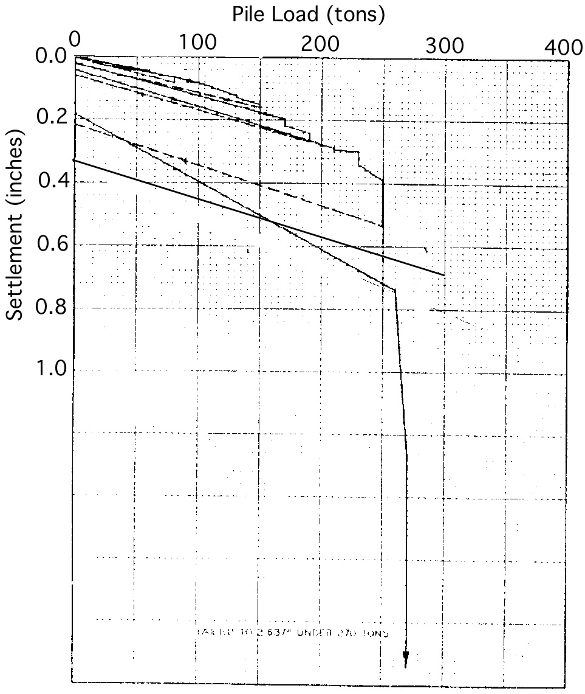
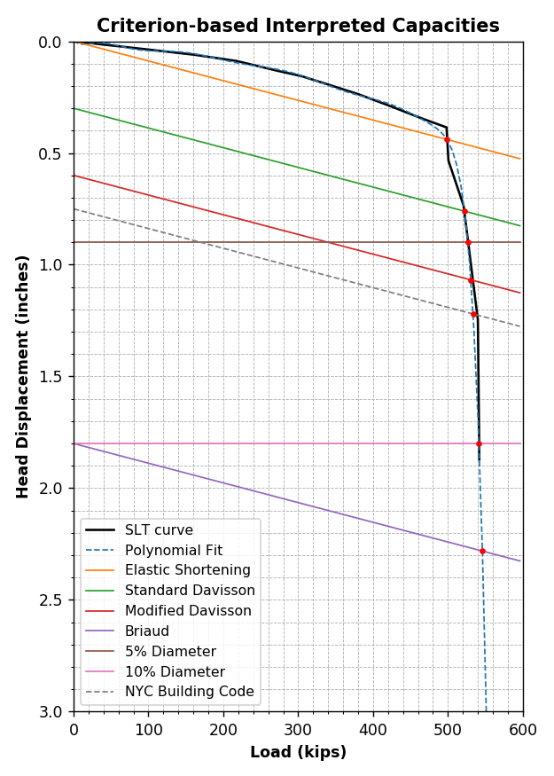

******************
Olson APC Database
******************

.. note::

   "APC" stands for "Axial Pile Capacity". There is some confusion that Dr. Olson's database is the "API Database". That is not the case.

History
=======

Dr. Roy E. Olson (UT Austin), began development on a pile load test database in 1980, as part of a research project with the American Petroleum Institute (API). API was interested in determining how well their recommended practice design method of the time (API RP-2A, 1980) would compare with actual pile load tests. Significant contributions were made by Norm Dennis who did his Ph.D. dissertation on this project (:ref:`Dennis, 1982 <Dennis1982>`) with the final report submitted to API that year.

Work on the then "API Database" continued between 1984 and 1993 with support from small grants from API, Exxon and Aramco but primarily due to Dr. Olson's personal involvement and contributions. There were several questions, namely, on how well different methods of strength measurement compared with each other, predictions of pile settlement under axial load, capacities of steel pipe piles in sand and clay, use of the T-Z method to try to predict pile movements under cyclic axial loading. Answering these questions led to M.S. theses written by the students working on them (:ref:`Aschenbrenner, 1984 <Aschenbrenner1984>`; :ref:`Alyahyai, 1987 <Alyahyai1987>`; :ref:`Al-Shafei, 1987 <Al-Shafei1987>`; :ref:`Van Go, 1990 <Go1990>`; :ref:`Chiu, 1993 <Chiu1993>`).

In 1998, Dr. Olson started working on a major research project from the California Department of Transportation (CalTrans). The goal was to develop a new, separate database for CalTrans. It is not clear if the APC database eventually included data from CalTrans.

The original project with API was meant to focus on open-ended steel pipe piles frequently used for offshore structures. However, Dr. Olson expanded the scope to include all pile types and capacity ranges. Information on piles, subsurface conditions and load tests was collected from the literature, DOTs and the Army Corps of Engineers. However, collection was never straightforward. Several governmental agencies, consulting firms and oil companies did not cooperate.

Norm Dennis and Dr. Olson looked at data for about 7,000 load tests but could use data for only about 1,000 of them. The lost data were almost always because: (1) the test was not carried even close to failure, or (2) no soil data were available. Of the 1,000 "usable" cases, there was still a lot of information that needed to be corrected. Indicative of the complexity of the problem of producing reliable data for analysis is the fact that Dr. Olson and his students went through each case four or five times and would always find errors or areas to improve. The following is a list of issues identified by Dr. Olson. It is surprising, on several levels, that the challenges Dr. Olson faced when developing the pile load test database almost 40 years ago, are still prevalent today.

#. *A pile capacity was reported in tons but was entered in the data base in kips but without changing the number.*
#. *A pile capacity was reported in “tonnes” with depth in meters and the capacity was interpreted as 2000-pound tons rather than the metric ton of 2205 pounds.*
#. *For steel pipe piles, sources often did not indicate whether the pile was open-ended or closed-ended.*
#. *For closed-ended pipe piles, authors often did not indicate whether the pile was full of concrete, or water, or was empty.*
#. *For closed-ended steel pipe piles, authors rarely indicated whether the base plate had the same diameter as the pile or was oversized.*
#. *For open-ended steel pipe piles, authors did not indicate whether or not a driving shoe was used.*
#. *For open-ended piles, the authors did not indicate the height of soil plug.*
#. *When data from soil borings were presented, it was often difficult to determine which boring was closest to a given pile.*
#. *In several cases, soil borings were made and the results reported. However, the pile penetrations made no sense in that the pile tip stopped in soft clay just above a good supporting layer. It was subsequently figured out that they had removed up to thirty feet of soil from the site after soil exploration but prior to pile driving.*
#. *We were non-uniform in defining what "plunging capacity" meant. Sometimes it was the peak load and other times it was the load at large settlement. They differed by up to 40% in some cases. I have decided to standardize on the peak load. We may want to add a new entry for the "ultimate" load.*
#. *In a number of cases, the authors called the foundation a "pile" but careful reading of the case history led to the conclusion that it was either a "pier" or it could have been a pier. We discarded such data.*
#. *The depth to the water table was often not provided. For sands, this was a fatal problem although sometimes we decided to estimate the location of the water table and just demote our rating of data quality. We are now trying to specify effective stresses in clays but we rarely have water tables for clays.*
#. *Sand densities were rarely specified so we have assumed values. Different people sometimes assumed substantially different values of total unit weight. We need to figure out some standard unit weight, perhaps as functions of N values and any information provided on gradation, but we have not done so yet and it will require a lot of time.*
#. *Japanese N values seem to be considerably different from ours because they have used a hammer of higher efficiency. Norm Dennis worked out a correlation but it is of highly questionable accuracy and this problem needs to be reconsidered.*
#. *We had a number of Japanese pile load tests on large diameter (usually 30") steel pipe piles in sand. Unfortunately, the text is in Japanese. We were able to guess soil profiles based on hatchings used in boring logs and we could read the Arabic numerals to get depths and N values. Subsequently, Tung was able to translate some of the data and he concluded we had made major errors. His corrected data are in other files and will be substituted for data in the database when time permits.*

Raw Data
========

.. literalinclude:: other/APCNew_sample.dat
   :lines: 1-40
   :linenos:
   :caption: *Olson APC Database* raw sample data (``APC.dat``)
   :name: OlsonRawSample

.. literalinclude:: other/APCNew_sample.dat
   :lines: 45-76
   :emphasize-lines: 2, 6, 9, 12, 18, 21, 31
   :linenos:
   :caption: Decoding raw data in the *Olson APC Database*
   :name: OlsonDecode

:numref:`OlsonVarsTable` offers details on the variables used in the raw data file of the *Olson APC Database*. Variables are described in the order presented in :numref:`OlsonDecode`.

.. csv-table:: *Olson APC Database* Variables
   :file: tables/olson_variables.csv
   :header-rows: 1
   :widths: 20, 50, 30
   :name: OlsonVarsTable

Notes
-----

From Dr. Olson's notes on the APC database:

   *Most of the values of total unit weight* (:math:`\gamma_t`) are assumed. If water contents (:math:`w`) are shown then they were used to calculate :math:`\gamma_t`. I used cases in which water contents were measured to calculate total unit weights for all soils and then did a correlation of those values of :math:`\gamma_t` with whatever other properties were available, meaning cohesion (:math:`s_u`) for cohesive soils, and SPT-N values for all soils, and used these other properties to estimate :math:`\gamma_t` for cases in which water contents were not defined. The correlations were often bad but at least they gave a consistent basis for estimating :math:`\gamma_t`. The correlations are presented below in `Total Unit Weight Correlations`_.

   *The elevation of the water table was usually unknown for profiles of all clay.  If I thought a reasonable value could be assumed, I did so and there are typically no notes indicating EWT was assumed (I added notes later when I thought of it). If EWT is to be left undefined, then EWT=+1, which is code that EWT is unknown.*

   *In all soils, I assumed the pore water pressure above the water table was zero. This value is nonsense but it is typically irrelevant in cohesionless soils (they may not even be saturated). In clays, the pore water pressure is relevant but can't be calculated so I discourage use of effective stress methods for clays.*

   *The wall thickness of steel pipe piles was often an assumed value. The wall thickness is used in calculating pile weight, W, and the pile compressibility, AEOL, but the correction for W is small so the error is even smaller, and AEOL is only used with Davisson's method, and I usually didn't use it as a failure criterion.*

   *The tip condition for steel pipe piles was often unknown. Sometimes, I could infer it from discussion in the text or from discussions with engineers who were more familiar with local practice. For closed-ended pipes, I rarely knew the diameter or thickness of the cover plate. Sometimes I could magnify a drawing to estimate whether the cover plate had a larger diameter than the pile or not but that was often not possible. I used a displacement ratio exceeding 1.00 to indicate the presence of an oversized cover plate.*

   *Originally we made data quality factors range from 0 to 5, then we discarded the 0's, and finally used only DQF=3-5. However, the DQF cannot be used except in the crudest manner. In the common case, we use N to estimate QS. If we have only N values at a clay site the case might warrant a DQF of 5, whereas if we try to use an effective stress method and we know neither EWT nor TUW (common) then the test might be a 1. As work evolved, we started using only data with DQF of 3-5 so I've altered DQFs to be at least 3 if the test was good enough to be used.*

   *Originally, working under very adverse conditions (horrible computer problems, need to generate quick results for API for a very crude analytical method, inexperience, etc.) Dave Winter generated a lot of data. Norm Dennis then came in and altered most of the data sets Dave had set up. Subsequently, other MS students Tim Aschenbrenner, Khalil Al Shafie, Kuan Chu, Magued Iskander, etc.) generated some new data.  Most of the data so generated had obvious errors due to inexperience. I went through many of the tests and modified all of them. The variable ``REOChk`` was added and made true if I had examined the data. Subsequently, I changed many tests I had done. The result is that all of the data are in question. The main problem is that source documents did not contain critical information, or we did not understand what was critical and get it recorded. In some cases, a single case was reported in several papers with different results, or we talked with someone who knew the case, e.g., Bob Semple regarding West Sole and Kontich, and we were informed that the published data contained errors, but revised data were not available.*

   *The source data forms, and format of the computer database have changed massively over the years. Originally, the entire digital database had to fit on one 360KB 5-1/4" floppy disk, the source forms were written in pencil on typed forms. As the forms evolved, we often, but not always, noted material as notes, and then later rewrote the form to include the needed information, but we never had time to go back to the source documents to extract the new data. The paper documentation now is digital and exceeds 1 GB, and this digital database exceeds 11,000 lines and occupies more than 600 KB. Because of limits on storage (PC's were limited to 640 KB in RAM), the original data were much compressed, e.g., we might have reported only a single layer of clay being penetrated by the pile whereas there were, in fact, a number of layers.*

   *The cone data are very deficient, mainly because of lack of use in the U.S. at the time of these cases.*

   *Interpretation of the output from the analytical program is difficult unless the user can memorize data for all of the tests, which seems possible only for small subsets of data. To remind users of problems, the data base can have one field of up to 30 columns, starting with an ``*`` and that field is output in the Excel output, typically warning the user of problems. In addition, lines starting with ``!`` are comment lines in the database and are not processed in the analysis. The ``*`` and ``!`` lines come after the LTN BLANK line (needed in order to use the same code with Caltrans data) and before alphanumeric data.*

   *This database has not been updated significantly since 1982 and there have been a lot of results published or provided from company files since then.*

   *The APC database has been partially converted to a format used on a different project but there are a few remnants of material that were relevant to an earlier format so do not anticipate that every item in this database has a use currently.*

   *I followed the LTN BLANK line with an ``*`` to indicate that I had checked this data base against the printed summary form.*

   *We added the field for set-up time much later. I went back to find values for tests but I'm not currently clear (March 2004) as to the code used to indicate that the value is unknown. I suspect that both 0 and -1 were used to indicate lack of information. I will gradually try to convert to -1 for unknown but I lack time to recheck all such cases so I'll put a note in the data set when I made such a change.*

   *The original N values are quite uncertain because of the lack of data on hammer efficiency and the vague statements in some papers that N was the "standard penetration resistance" but there was no indication that it was the ASTM standard. For example, I suspect that "standard" may have been a local standard, e.g., from a highway department or a consulting firm.*

   *The corrected N values here exceed the uncorrected values but I don't remember how the correction was made. I suspect I assumed a hammer efficiency less than 60%.*

   *I changed some CONC piles to RayC piles and changed some values of EVSO after looking at source data forms. Most of the piles had D=54 inches.*

   *Defined failure occurs when Davisson's criterion is satisfied, i.e., when S=+ 0.15" + 0.01Db. Generally, we used 29,000 ksi for the E of steel, 3000 ksi for unreinforced concrete, 4500 ksi for reinforced concrete, and 1700 ksi for timber. For tension tests we should ignore the tip term but it appears that in most cases we did not ignore that term.  The ultimate load is the largest load that the pile sustained in the test. For piles in sand, the ultimate load was usually just the final load because plunging failure does not occur. There are some known inconsistencies in the ways we interpreted some data. For example, for a constant rate of penetration (CRP) test in clay, I reported the peak load as both the ultimate and defined failure loads whereas some of the students appear to have used Davisson's criterion directly (it would come after "failure") and defined ultimate as the final plunging load (less than the peak). Similarly, if a pile was loaded to failure, unloaded, and reloaded to a larger load than it could sustain the first time, I used the first loading only whereas some of my students may have used the second loading. For piles with a great length above the ground surface, e.g., offshore, we assumed that reported loads were butt loads and we increased the loads by the weight of the pile above the ground surface.*

Total Unit Weight Correlations
------------------------------

**Cohesive soils:**

Choose :math:`s_u` in priorities :math:`s_{u.QT}` (triaxial) > :math:`s_{u.UU}` (unconfined) > :math:`s_{u.MS}` (misc) > :math:`s_{u.FV}` (field vane) but adjust according to :eq:`olson_ss_cases`.

.. math::
   :label: olson_ss_cases

   s_u =
   \begin{cases}
      s_{u.QT} \\
      1.2 \times s_{u.UU} \\
      1.2 \times s_{u.MS} \\
      0.7 \times s_{u.FV}
   \end{cases}

Correlations were adjusted depending on the specific type of the cohesive soil. Different equations were produced for clays (CLAY) and silty clays (SICL), clayey silts (CLSI) and sandy clays (SACL). All cases are summarized in :eq:`olson_tuw_clay_cases` [#]_. :math:`s_u` must be provided in ksf, :math:`\gamma_t` is returned in pcf.

.. math::
   :label: olson_tuw_clay_cases

   \gamma_t =
   \begin{cases}
      \textrm{for} \quad \textrm{CLAY:} & \begin{cases}
         113.9 + 9.276 \ln(s_u) & \textrm{ if } \quad s_u > 0 \\
         107.5 + 5.116 \ln(N) & \textrm{ otherwise }
      \end{cases} \\ \\
      \textrm{for} \quad \textrm{SICL, CLSI, SACL:} & \begin{cases}
         113 + 22 \times s_u & \textrm{ if } \quad 0.5 < s_u < 1.5 \\
         113 + 9.276 \ln(N) & \textrm{ if } \quad N > 0
      \end{cases}
   \end{cases}

.. [#] If both SS and N were undefined, set TUW=0 as code that values of EVSO cannot be defined.

**Cohesionless soil:**

Correlations for cohesionless soils depended on the soil type. :eq:`olson_tuw_sand_cases` summarises cases for sands (SAND), silty sands (SISA), sandy silts (SASI), silts (SILT), cobbles/gravels (CBGV), gravels (GRAV), sandy gravels (SAGV), gravely sands (GVSA), cobbles (COBB).

.. math::
   :label: olson_tuw_sand_cases

   \gamma_t =
   \begin{cases}
      126 \textrm{ pcf} & \textrm{for} \quad \textrm{SAND} \\
      125 + 0.15 \times N & \textrm{for} \quad \textrm{SISA, SASI, SILT} \\
      132 \textrm{ pcf} & \textrm{for} \quad \textrm{CBGV, GRAV, SAGV, GVSA, COBB}
   \end{cases}

Load Test Data Points
---------------------

Olson's *APC Database* consisted of a large data file (:numref:`OlsonRawSample`) containing project raw data. A few load test interpretations were stored, i.e. Davisson capacity (``QMDT``), peak load (``QMP``), capacity at 0.5-inch butt settlement (``QCT``), etc. Load test data points were not stored in the data file. Instead, original figures from the source projects were used (see :numref:`olson_ltn013_qs` for LTN 13). Dr. Olson provided figures for _____ records of the total _____. It was crucial to include the load test data points in our *NYU Pile Load Test Data Warehouse*, therefore, all figures were digitized using the tool :ref:`WebPlotDigitizer <WebPlotDigitizer>`.

.. TODO: find total number of records in raw file and total number of QS figures and update text above

   Load/Settlement plot for *Olson APC Database* LTN 13

Digitizing the load test curves allowed us to algorithmically process the load test data points and produce new plots and additional capacity interpretations as shown in :numref:`olson_ltn013_qs_new`.

   Load/Settlement plot with capacity interpretations for *Olson APC Database* LTN 13

Calculation of AE/L
-------------------

LTN 11 from the *APC Database* that was referenced before, involves a cast-in-place concrete tapered pile. Criterion-based capacity interpretations (REF EQUATION)

