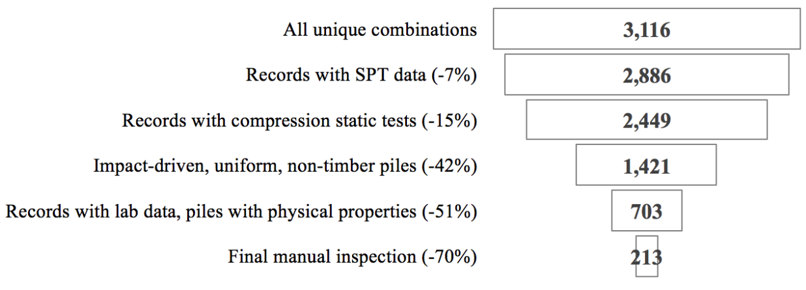
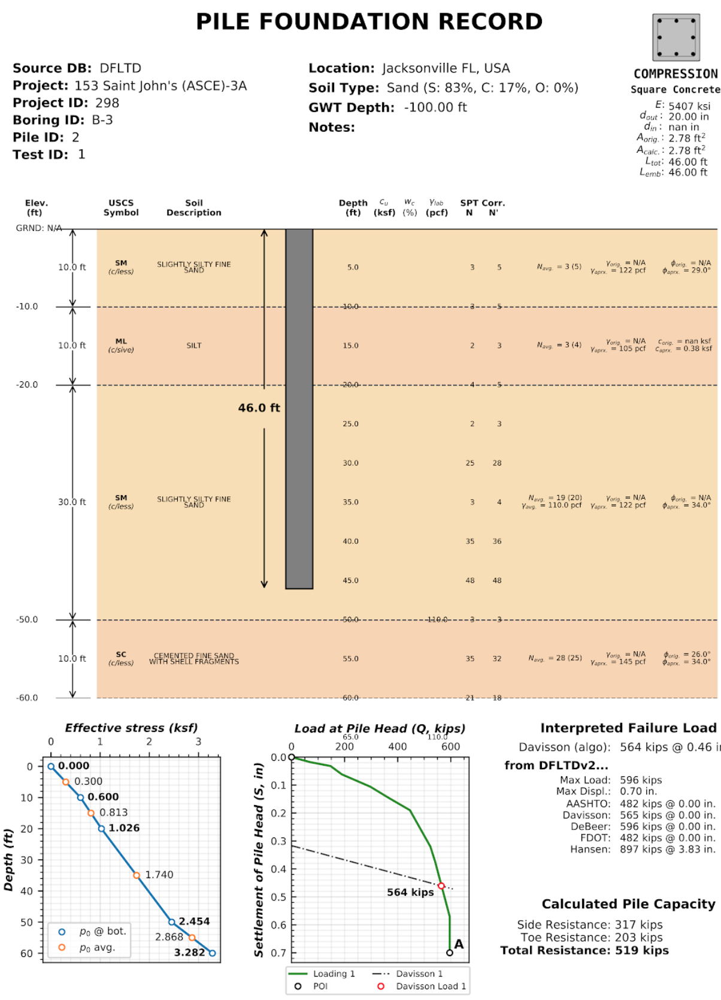
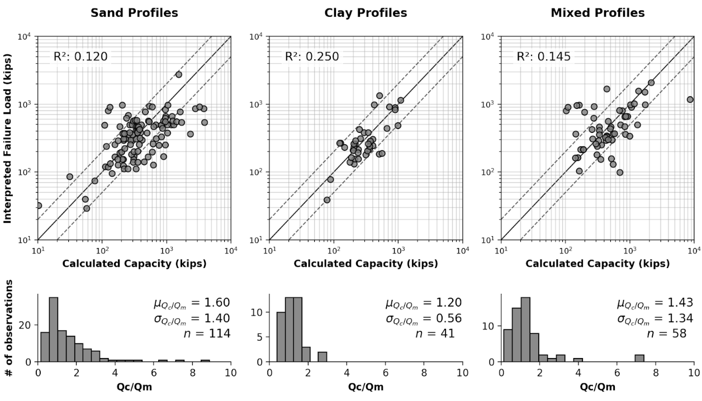
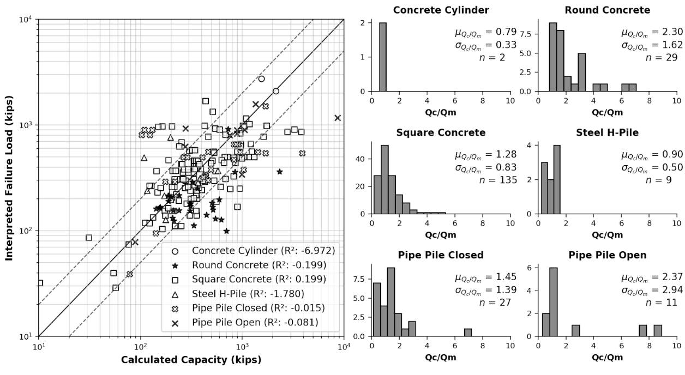
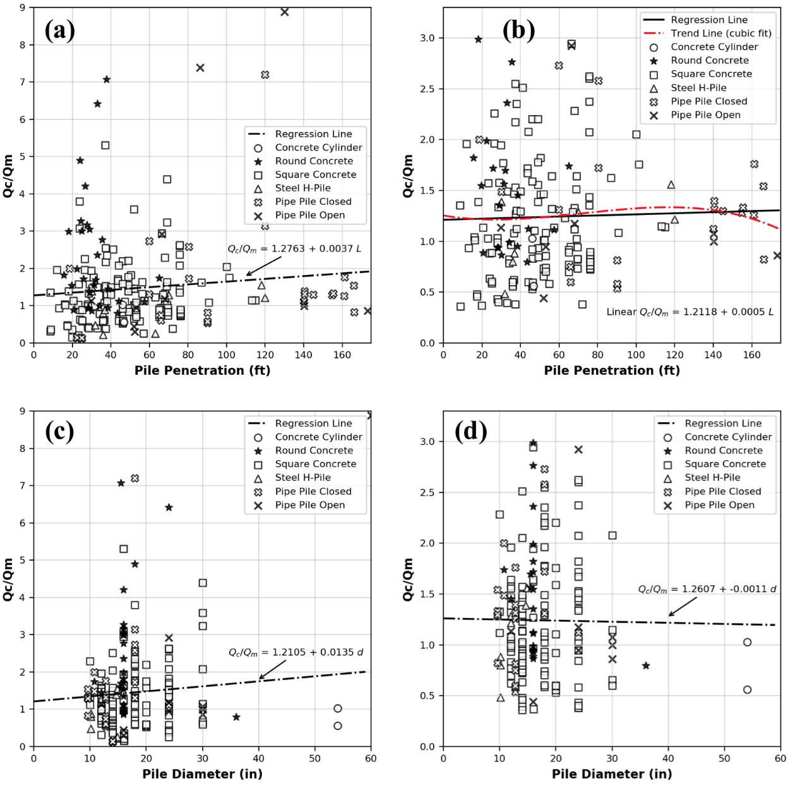

For Standard Diameter Piles
===========================

The efficacy of the Federal Highway Administration (FHWA) pile design method was explored using data made possible by the 2017 release of FHWA *Deep Foundation Load Test Database* (DFLTD v.2). Information contained within DFLTD v.2 was leveraged to evaluate the most common pile design methods against failure loads obtained via in situ static load testing procedures. In the process, the authors developed a custom relational database and software to batch process the available information. The scope was limited to impact-driven, un-tapered, steel and concrete piles, loaded in compression, using a static load test. DFLTD v.2 contains 3,116 unique-combination project/exploration/foundation/test cases of which 213 contained sufficient data to permit batch processing of the results in order to compute the axial load capacity and interpret the static failure load, according to the study scope.

Scatter between measured (interpreted) and predicted capacities is significant, where the computed capacity was off by a factor of 2 in many tests. The range in calculated to measured  (i.e. interpreted) capacities (Qc/Qm) was from 0.12 to 8.88, and the mean Qc/Qm was 1.48. Preliminary evaluation suggest that the method performs better in clay than in sand, overpredicts the capacities of long and larger diameter piles. The authors trust that this study will permits engineers and state agencies to better understand the efficacy of the most commonly employed design methods, thus resulting in more resilient infrastructure.

Introduction
------------

The accuracy and precision of empirically produced observations is positively affected by the sample size and reliability of the data used in the study. In sciences wherein experimentation for data creation is expensive, time consuming, or otherwise problematic, the field of study in general relies upon sharing of raw data to build upon this sample size. Currently accepted design practices for driven piles are mainly empirical or semi-empirical.  However, mass data production from pile load tests is expensive and time-consuming.  Beyond these inherent limitations in empirical pile design analysis, many of the available load tests have insufficient data from which to gather an interpreted ultimate pile capacity.

Single pile design is typically conducted using ultimate capacity determination from either calculated or interpreted methods (or both in combination). Determination of the ultimate capacity of driven piles using calculated methods is conducted by following a series of steps in a design process, starting with data and properties gathered from a geotechnical investigation such as those recommended by Federal Highway Administration (FHWA) (:ref:`Hannigan et al., 2016a <Hannigan2016a>`; :ref:`Hannigan et al., 2016b <Hannigan2016b>`), along with pile selection. Interpreted pile capacity calculations occur using load-settlement curve data generated during an axial static load test of a driven pile. Comparison between calculated and interpreted capacities for large data sets provides insight of suitability of use of current design methods under varying pile and soil conditions.

For this study, a program was developed in Python, which demands certain soil and pile properties as inputs in order to calculate the ultimate pile capacity using the most commonly used and relied upon FHWA recommended design methods (:ref:`Hannigan et al., 2016a <Hannigan2016a>`). Using this tool, data available from the FHWA Deep Foundation Load Test Database Version 2.0 (DFLTD v.2) (:ref:`Petek et al., 2016 <Petek2016>`) could be analyzed on a large scale to compare hundreds of interpreted pile capacities with their corresponding calculated values. This produced data is used to compare performance of interpreted vs. calculated (I/C) capacity in sands, clays, and mixed soils. Additionally, the effect of pile type,  pile length, and the pile diameter on the I/C ratio is explored.

The evaluation is made preliminary due to the fact that the DFLTD v.2 has just been released. The scope was limited to impact driven un-tapered steel and concrete piles loaded in compression, using a static load test.

History and Applications of Pile Load Test Databases
----------------------------------------------------

Many of the methods in current use for pile design are based on small databases of interpreted loadtest data. For piles in sand, ... (text removed) ... Similarly, for clays, Tomlinson (:ref:`Tomlinson, 1957 <Tomlinson1957>`; :ref:`Tomlinson, 1971 <Tomlinson1971>`) employed a small data set of 56 piles to develop his popular Alpha-design method that was based in part on data published by Peck (:ref:`Peck, 1958 <Peck1958>`). These methods were adopted by several design standards including, The Canadian Manual on Foundation Engineering (:ref:`1975 <Canadian1975>`), The American Petroleum Institute (API) (:ref:`API RP 2A, 1989 <API1989>`), and FHWA (:ref:`Nordlund, 1963 <Nordlund1963>`; :ref:`Nordlund, 1979 <Nordlund1979>`). Due to the dependence of soil behavior upon geography and site-specific circumstances and the use of limited data employed to launch historical foundation design methods, it is possible that many currently practiced methods of pile design, are based on empirical formulas that required gross overgeneralization to develop.

To address this concern, several past geotechnical studies have been undertaken with a focus on the expansion of load test databases in order to improve the methods employed to predict the axial capacity of piles. The first modern effort to organize a database of measured and interpreted pile capacities was performed at the behest of the American Petroleum Institute (API) by Professor Olson and his students at the University of Texas (:ref:`Dennis and Olson, 1983a <Dennis1983a>`, :ref:`1983b <Dennis1983b>`). This effort led to the development of the popular API RP2A method for capacity of piles in sand (:ref:`API RP 2A, 1989 <API1989>`). Later efforts were made to improve on both the size of the database and on its interpretation (:ref:`Olson and Al-Shafei, 1988 <Olson1988>`; :ref:`Olson, 1990 <Olson1990>`; :ref:`Iskander and Olson, 1992 <Iskander1992>`; :ref:`Olson and Iskander, 1994 <Olson1994>`; :ref:`Olson and Iskander, 1998 <Olson1998>`; :ref:`Olson and Shantz, 2004 <Olson2004>`; :ref:`Olson and Iskander, 2009 <Olson2009>`). Later FHWA began a parallel effort to develop a Deep Foundation Load Test Database (DFLTD) under the leadership of Carl Ealy (:ref:`Kalavar and Ealy, 2000 <Kalavar2000>`). Likewise, several highway departments developed state databases of interpreted pile capacities including Iowa, Illinois, and Louisiana (:ref:`Roling et al., 2010 <Roling2010>`; :ref:`Roling et al., 2011 <Roling2011>`; :ref:`Tavera et al., 2016 <Tavera2016>`; :ref:`Long and Anderson, 2012 <Long2012>`). Similarly several small databases have been developed at a number of universities and research centers including the Norwegian Geotechnical Institute (NGI), and at Texas A&M (:ref:`Briaud et al., 1987 <Briaud1987>`; :ref:`Lacasse, 1988 <Lacasse1988>`; :ref:`Paikowsky, 2001 <Paikowsky2001>`).

The original version of DFLTD includes methods of search for foundations of specific site and pile characteristics from the more than 1,500 load test results available (:ref:`Kalavar and Ealy, 2000 <Kalavar2000>`). Although DFLTD claimed over 1,500 load tests, the authors are not aware of any studies that have been able to employ a substantial portion of these tests in comparing interpreted and computing capacities because most tests lacked crucial information necessary for either interpreting the test, or computing the capacity. This is a problem with all piling databases. For example the Olson database classified tests into five data quality factors, for both soils information and pile load test information. Few tests in the entire Olson database achieved a top tier classification in both categories, and thus nearly all analyses were based on fewer than 100 high quality  tests.

In a 2013 memorandum, Abu-Hejleh describes the DFLTD as being “outdated” to the point of impossibility of database expansion (:ref:`Abu-Hejleh, 2013 <Abu-Hejleh2013>`). Abu-Hejleh et al. (:ref:`Abu-Hejleh et al., 2015a <Abu-Hejleh2015a>`) discussed the usefulness of current databases in use in the United States and establishes the suggested minimum data required for load test databases pertaining to Project Data, Subsurface Data at the Load Test Foundation, Test Foundation Data, Load Test Data, and attachment of useful files. The guidelines for developing useful load test databases discussed by Abu-Hejleh et al. were last updated in 2015 (:ref:`Abu-Hejleh et al., 2015b <Abu-Hejleh2015b>`).

FHWA rekindled the effort to gather and distribute load test information on piles, as part of its effort to develop a method for predicting the axial capacity of large diameter open ended pipe piles. This effort resulted in the release of the Deep Foundation Load Test Database v.2 (DFLTD v.2) in February 2017 (:ref:`Petek et al., 2016 <Petek2016>`).

Working with the DFLTD v.2
--------------------------

The release of DFLTD v.2 updated the query process, expanding upon the capabilities of the first version (:ref:`Kalavar and Ealy, 2000 <Kalavar2000>`). The graphical user interface within Microsoft Access allows load tests to be filtered based on a predefined set of options to view or export only those containing the desired project, foundation, and soil parameters. There is currently limited functionality to filter test records for data completion, to locate tests with all necessary parameters to carry out design calculations for the pile foundations included in the database. Furthermore, the process of extracting data, while sufficient for a case-by-case investigation, could not accommodate the need of this research endeavor to analyse cases in batch mode. For these main reasons, the authors worked with the backend of DFLTD v.2 and exported all data to a server-based database system.

Database Migration
^^^^^^^^^^^^^^^^^^

One of the most important updates in DFLTD v.2 was organizing data in a relational schema. This was a major limitation of the first version where data retrieval was programmatic and non-relational. While the delivery platform, Microsoft Access, remained the same the relational schema allows for complex search queries expanding the functionality of the provided graphical interface. The industry standard for interaction with Relational Database Management Systems (RDBMS) is the Structured Query Language (SQL). Having a relational backend, DFLTD v.2 can be queried using SQL. Microsoft offers basic functionality to do so within MS Access therefore DFLTD v.2 was migrated to a RDBMS hosted on Microsoft Windows Server 2012. Microsoft SQL Server Migration Assistant v6.0 for Access (:ref:`link <MS_SSMA>`) was used to ensure compatibility across both platforms. Multiple random checks ensured that data transfer was successful.

This structure allows for data retrieval based on any kind of permissible filtering. Perhaps more important than searching for a specific value based on a set of conditions is filtering for cases that are not missing values.

Load Test Selection
^^^^^^^^^^^^^^^^^^^

The ability to run complex SQL queries was crucial in filtering out the load test cases within DFLTD v.2 for which it would be impossible to calculate pile capacity due to missing values. In total, DFLTD v.2 in its graphical interface shows 916 projects with 1798 load tests. What was needed in this study was the unique combination of project/exploration/foundation/test cases of which the total count was 3,116. This count is larger than the load test count because it includes all combinations of explorations per pile for a given project since a project can have multiple associated piles and explorations. Given that there is limited information on the relative position of explorations to pile foundations, a sensible approach is to analyze for all combinations.  Applying a single load test to different soil borings can result in bias in the correlation depending upon site variability. For highly variable sites, the method can artificially introduce a large difference between calculated and measured resistances. The opposite is also true for uniform site condition.

The necessary information to calculate the capacity of a pile foundation using the FHWA method and then compare the capacity to the interpreted failure load is contained within multiple RDBMS tables. All crucial properties to carry out the capacity calculations were mapped out and traced back to the corresponding fields of the DFLTD v.2 database. Ideally, load test records are expected to be complete but it was quickly made obvious that this was not the case. For example, a SQL query on records including depth to water table, a field available in three separate tables, showed that depth to water table was available in only 30% of the total number of unique combinations.

.. table:: Empirical values for :math:`\phi` and :math:`\gamma` based on SPT Blow Counts (after :ref:`Bowles, 1977 <Bowles1977>` and :ref:`Caltrans, 2014 <Caltrans2014>`)
   :widths: auto
   :align: center
   :name: bowles_table1

   +------------------------+------------------+-------------------+------------------+------------------+------------------+
   | :math:`N_1`            | **0 to 4**       | **4 to 10**       | **10 to 30**     | **30 to 50**     | **50+**          |
   +------------------------+-----+------+-----+-----+-------+-----+-----+------+-----+-----+------+-----+-----+------+-----+
   | Ranges                 | min | avg  | max | min | avg   | max | min | avg  | max | min | avg  | max | min | avg  | max |
   +------------------------+-----+------+-----+-----+-------+-----+-----+------+-----+-----+------+-----+-----+------+-----+
   | Approx, :math:`\phi`   | 25  | 27.5 | 30  | 27  | 29.5  | 32  | 30  | 32.5 | 35  | 35  | 37.5 | 40  | 38  | 40.5 | 43  |
   | (degrees) [1]_         |     |      |     |     |       |     |     |      |     |     |      |     |     |      |     |
   +------------------------+-----+------+-----+-----+-------+-----+-----+------+-----+-----+------+-----+-----+------+-----+
   | Approx. :math:`\gamma` | 70  | 85   | 100 | 90  | 102.5 | 115 | 110 | 120  | 130 | 110 | 125  | 140 | 130 | 140  | 150 |
   | (pcf) [2]_             |     |      |     |     |       |     |     |      |     |     |      |     |     |      |     |
   +------------------------+-----+------+-----+-----+-------+-----+-----+------+-----+-----+------+-----+-----+------+-----+

.. table:: Empirical values for :math:`q_u` and :math:`\gamma` based on SPT Blow Counts (after :ref:`Bowles, 1977 <Bowles1977>` and :ref:`Caltrans, 2014 <Caltrans2014>`)
   :widths: auto
   :align: center
   :name: bowles_table2

   +-----------------------------------+------------+------------+------------+-------------+--------------+-----------+
   | :math:`N`                         | **0 to 2** | **2 to 4** | **4 to 8** | **8 to 16** | **16 to 32** | **32+**   |
   +-----------------------------------+------------+------------+------------+-------------+--------------+-----------+
   | Approx. :math:`q_u` (ksf)         | 0 - 0.5    | 0.5 - 1.0  | 1.0 - 2.0  | 2.0 - 4.0   | 4.0 - 8.0    | > 8.0     |
   +-----------------------------------+------------+------------+------------+-------------+--------------+-----------+
   | Approx. :math:`\gamma` (pcf) [2]_ | 100 - 120  | 100 - 120  | 110 - 130  | 120 - 140   | 120 - 140    | 120 - 140 |
   +-----------------------------------+------------+------------+------------+-------------+--------------+-----------+

.. [1] **Caltrans guidance for soil friction angle**: SW: use average :math:`\phi + 1^\circ`, SC: use :math:`\phi`, ML use minimum :math:`\phi + 0.5^\circ`, GM and SP use average :math:`\phi`, GC: use average :math:`\phi - 1^\circ`, GW: use maximum :math:`\phi`.

.. [2] **Caltrans guidance for moist unit weight**: SW, GW: use maximum :math:`\gamma`, SP, GP: use average :math:`\gamma`, ML, SC, SM: use minimum :math:`\gamma`.

Using reasonable engineering judgment to approximate necessary properties can help prevent the number of applicable test records from dropping too low. Information such as the depth to water table can be approximated but physical pile properties such as pile depth/diameter and many geotechnical properties, cannot. For this project, if the value for water table was recorded in the database, it was always used. About 10% of the load tests in the final selection did not have values for water table stored. For these tests, the water table was set at a depth of 6 feet, which may be too conservative, and possibly contribute to scatter for piles in sand and mixed soil profiles.  In the case where other geotechnical properties were missing, the authors only used approximation methods described within the FHWA design manual (:ref:`Hannigan et al., 2016a <Hannigan2016a>`). This applies mainly to missing total unit weight, undrained shear strengths and angles of internal friction for which Bowles (:ref:`Bowles, 1977 <Bowles1977>`) has produced empirical values along with the most recent guidance from Caltrans Geotechnical Manual (:ref:`Caltrans, 2014 <Caltrans2014>`). Minimum, average and maximum of the recommended range for soil friction angle for a given SPT-N value is determined given the corresponding USCS soil type classification (:numref:`bowles_table1`, :numref:`bowles_table2`). The entire process was algorithmically translated to allow for batch calculations. Undrained shear strength is more straightforward to determine from SPT-N values, albeit less reliable. In order to use the approximation methods, each case must have, at a minimum, standard penetration test (SPT) N field values. 7% of the available records were rejected for not having SPT information. Additionally, pile set-up time, an important parameter that may significantly impact the final ultimate capacity, was not recorded for most tests employed in this study and as such, could not be included in the analysis. A summary of the filtering process and its results is presented (:numref:`fhwa_paper_fig1`).

   Filtering of available test records

Applicable test records must have static test data to compare against the calculated capacities. If static test data was missing, specifically compression test data, the record was rejected. This reduced the pool of available records by 15%. Additionally, the scope was reduced to pile foundations that were impact driven, non-tapered, also excluding timber piles but all pile foundations must have a value in the length field. With this query the records were reduced by 42%. Then, the search query was expanded with common table expressions (CTE) in order to check for necessary geotechnical data in several combinations of tables, lab results from different fields, etc. Also, with the physical properties for each pile type residing in separate tables, a CTE checked that each pile foundation selected had information on core diameter, side length, strength, etc. This step eliminated 51% of the available records.

Using complex SQL queries, the unique test record combinations were reduced from 3,116 to 703. However, this process could not guarantee that capacities would be calculated for these 703 records. Data was gathered from several tables making manual inspection exhaustive and error-prone. The authors developed a tool that queried the database, retrieved all relevant field values and organized the information in a format familiar to geotechnical engineers as shown in :numref:`fhwa_paper_fig2`. This custom tool combined information on unit weight, undrained shear strength and angle of internal friction from all tables. If any of these properties was missing, the program would attempt to approximate the values from SPT data. Should the process be successful, an effective stress plot was produced on the lower left part. The program also organized all available static test and interpreted failure load data from DFLTD v.2, using Davisson’s failure criterion (:ref:`Davisson, 1972 <Davisson1972>`). The authors are familiar with concerns about  use of SPT data, at least solely, in the design calculations of pile foundations. In this study though, this was a last-resort option to maintain a reasonable number of ‘workable’ test records. Should the use of SPT data be rejected, the pool of applicable data would only include a dozen or two.

The form shown in :numref:`fhwa_paper_fig2` produced for each record in the last selection of 703 records, made it efficient and intuitive to deduce which records would produce results and which would not. By manual inspection of the produced forms, the final number of applicable test records came down to 213 (:ref:`Machairas et al., 2018 <Machairas2018conf>`).

The evaluation is made preliminary due to the fact that the DFLTD v.2 has just been released. Manual manipulation of the data may result in a larger data set. Similarly, inclusion of dynamic load test data will increase the number of records.

   Example of auto-generated pile record form

FHWA Pile Design Methods
------------------------

In 2016, FHWA published a revised report on the Design and Construction of Driven Pile Foundations (:ref:`Hannigan et al., 2016a <Hannigan2016a>`; :ref:`Hannigan et al., 2016b <Hannigan2016b>`). Within this document, FHWA recommends several empirical and semi-empirical design methods for determining the ultimate capacity of single piles. The FHWA Report categorizes the design methods as follows: Methods of Static Analysis for Piles in Cohesionless Soils and Methods of Static Analysis for Piles in Cohesive Soils. The Report also includes design recommendations for piles driven into mixed soil profiles (i.e. layers of both sand and clay).

Each method recommended within the Report calculates ultimate bearing capacity of single piles as being equal to the summation of the side and tip resistances. Side resistance is calculated as the sum of intervals corresponding to segregated soil layers for each of these methods of design. Therefore, a soil profile based on soil type and SPT N-values and other soil properties must be first determined from boring log information and other laboratory data. The Report suggests that in some cases an acceptable conservative design decision is to disregard the capacity generated at the pile tip altogether, due to lack of movement necessary to generate resistance at the tip. However, in this study the capacity was always computed as the sum of the side and tip resistances. The tip resistance in mixed soils is determined based on the end bearing stratum. Calculations require certain pile properties to be known as well, such as embedded length and pile type.

For Cohesionless soils, FHWA suggests the following methods for single pile design: the Meyerhof method (empirical) (:ref:`Meyerhof, 1976 <Meyerhof1976>`), the Brown method (empirical), the Nordlund method (semi-empirical) (:ref:`Nordlund, 1963 <Nordlund1963>`; :ref:`Nordlund, 1979 <Nordlund1979>`), the Effective Stress method (semi-empirical) (:ref:`Fellenius, 1991 <Fellenius1991>`), and cone penetration test (CPT) methods (empirical) (:ref:`Eslami and Fellenius, 1997 <Eslami1997>`). The Report notes that the methods derived strictly from corrected SPT N-values, Meyerhof and Brown, are less reliable compared with the Nordlund and Effective Stress methods (:ref:`Hannigan et al., 2016a <Hannigan2016a>`). Nordlund method was used in this study for determining capacity in cohesionless soils due to its wide popularity.  The method uses corrected SPT N-values (or, preferably, lab-produced strength parameters) to determine the soil friction angle for each observed soil layer and uses a series of published tables and charts to assume correlations for the coefficient of lateral earth pressure and the soil-pile friction angle. These values are used along with the effective overburden pressure, to determine the side resistance for each defined layer. Pile tip bearing capacity factors are also correlated from the soil friction angle using charts published by Nordlund. Upper limits are placed upon pile toe overburden pressure, :math:`\sigma'_p`, and pile tip resistance, :math:`R_t`, in order to limit the magnitude of the computed unit tip resistance and calculate a safer ultimate pile capacity.

For cohesive soils, FHWA suggests the following methods: the Alpha method (or Tomlinson, empirical) (:ref:`Tomlinson, 1994 <Tomlinson1994>`), the Effective Stress method (semi-empirical) (:ref:`Fellenius, 1991 <Fellenius1991>`), and CPT methods (empirical) (:ref:`Eslami and Fellenius, 1997 <Eslami1997>`). Tomlinson method was selected due to its wide popularity. When dealing with mixed soil profiles, Tomlinson provides for adjustment factors to account for drag-down of weaker soil into stiffer layers, a phenomenon that occurs during pile driving and reduces the side resistance. These factors were accounted for in our calculations.

For steel H and unfilled open end pipe piles, the authors followed FHWA guidance to *"use only steel cross section area at pile toe unless there is reasonable assurance and previous experience that a soil plug will form at the pile toe."* This information was not available for many of the tests employed, so the authors simply calculated end bearing using the rim area of steel piles. For side resistance, :ref:`Hannigan et al., 2016a <Hannigan2016a>` does not require adding the internal side resistance, for pipe piles and requires the use of the rectangular area for H piles.

Analytical Procedure
--------------------

In order to batch process all load tests available in DFLTD v.2 it was necessary to develop a suite of algorithms written in Python that can reproduce the Nordlund and Tomlinson design methods exactly as they are outlined within the FHWA design manual. Note that the software application DrivenPiles by Multidimensional Software Creations (:ref:`MDSC <MDSC2015>`), follows a slightly modified design methodology than the one presented in the FHWA design manual (:ref:`Hannigan et al., 2016a <Hannigan2016a>`), making it unsuitable for this study. The Python program follows the design procedures laid out in the FHWA design manual to evaluate given soil and pile data and output corresponding ultimate capacity values for each soil type (sand, clay, mixed). This code also serves as a platform from which to compare static design results with interpreted design results.

The FHWA suggests one method for interpreting the pile capacity from a static load test: the Davisson failure criterion (:ref:`Davisson, 1972 <Davisson1972>`), which has also been programmatically translated to allow for automatic detection of the interpreted failure load. The algorithm detects all loading/unloading cycles of a given static test and can apply the Davisson criterion on all of them keeping as a final solution the greatest of all interpreted failure loads. For the test records in DFLTD v.2 where the Davisson failure load was included, the authors found that 8 out of 10 times the algorithmically produced failure load would match the stored value in the database. Differing results were manually checked and the authors satisfied themselves that their code computes the correct Davisson failure load.  This gave more confidence for the reliability of the calculated results.

Several pre-solved cases were used to validate the results produced by the algorithms replicating the Nordlund and Tomlinson pile design methods. Namely, Appendix F of the FHWA design manual (:ref:`Hannigan et al., 2016a <Hannigan2016a>`) offers step-by-step example problem calculations covering soil profiles predominantly defined by sand, clay and mixed layers. The design algorithms were tested against these example problems returning capacities that were within 5% of the solutions outlined in the manual. Since the example problems included only a single pile type, the authors tested the algorithms with other problems as well as random spot checks of cases retrieved from DFLTD v.2. In all cases the design capacities produced by the algorithms matched hand calculations.

Qc/Qm Comparison in Sand, Clay and Mixed Soil Profiles
------------------------------------------------------

Analyses were performed for piles in the current database using the FHWA method, to compute the calculated capacity (Qc). Interpreted failure load, as obtained from the Davisson criterion, is frequently referred to as "measured capacity (Qm)". Data is presented for sand, clay, and mixed soil profiles. Sand and clay profiles contained tests where more than 70% of the capacity was derived from the relevant soil. In order to optimize the visual separation of the points, calculated (Qc) and measured (Qm) pile capacities are plotted in a log-log scale (:numref:`fhwa_paper_fig3`). As a reference, 1:½, 1:1 and 1:2 (Qc:Qm) lines were added on the plots. A histogram of the distribution of Qc/Qm is also presented for piles in each profile.

Ideally, Qc/Qm should be close to 1. The scatter between measured and predicted capacities is significant, where the capacity was off by a factor of 2 in many tests. The range in Qc/Qm was from 0.12 to 8.88. The mean Qc/Qm was 1.6 in sand, 1.2 in clay, and 1.43 in mixed profiles. The corresponding standard deviation in Qc/Qm was 1.4 in sand, 0.56 in clay, and 1.34 in mixed soils. The results for mean and standard deviation for the three predominant soil types clearly show a better performance in clay than in sand. The variation observed for the sand profiles could be related to the correlation used for soil friction angle; all SPT correlations are problematic. We only employed the correlation recommended by FHWA, in order to be consistent with its design methodology.

   Distribution of calculated (Qc) v. interpreted – also known as (aka.) measured (Qm) capacity for all soil profiles.

Overall Performance (per pile type)
-----------------------------------

Data is plotted according to pile type as shown in :numref:`fhwa_paper_fig4`. A frequency distribution of Qc/Qm is also presented for piles in each pile type. There are few tests represented for some pile types, so it is difficult to generalize the results. It appears that the design method performed best for square concrete piles. This is not surprising considering that Tomlinson’s database was heavily weighted towards this pile type. On the other hand, round concrete piles and open pipe piles exhibited the highest average (2.30 and 2.37 respectively) and standard deviation values (1.62 and 2.94 respectively) for Qc/Qm. The effect of pile shape in calculated capacity is a point for future exploration.

   Distribution of calculated (Qc) v. interpreted – aka. measured (Qm) capacity for six pile types.

Effect of Pile Penetration Length
---------------------------------

Calculated capacity normalized by measured (interpreted) capacity is plotted against pile length (:numref:`fhwa_paper_fig5`). The regression line shows that the ratio is increasing with pile embedded length. A long standing problem with many design methods for predicting pile capacity is that their use led to underprediction of capacities of short piles and overprediction of the capacity of long piles (25, 16). Data may have been skewed by a few long pipe piles. The number of observations for long piles is small and the quality of the data is generally suspect, but the consistency of the data is cause for concern, especially because long piles are often used to support offshore and bridge structures. The linear function produced by the coefficients of the regression line suggests that the effect is large. The regression trend may have been skewed by the outlier points at 120 and 130 feet penetration lengths with Qc/Qm values > 7, since the remainder of the points for pile penetrations larger than 100 feet have Qc/Qm values in the range of 1.2 to 1.4. Nevertheless, all things being equal, regression suggests that capacity can be overestimated by 50% for a 125 ft. pile, and by 100% for a 250 ft long pile. Sorting out the length effect depending on pile type resulted in conflicting trends depending on pile shape.  The authors believe that the available data may not necessarily produce realistic trend lines for each pile type, and as a result the effort was abandoned.

Overprediction of capacities for long piles does not necessarily indicate problems in the FHWA formulations since the length effect virtually disappears when the analysis is repeated for the 183 piles (85% of total) having 0.33 < Qc/Qm < 3. In fact, a reverse trend, can be observed for piles longer than 100 ft.  This suggests that data quality issues as well as atypical soil properties that would require long piles to be driven, (e.g., presence of volcanic sands) may have contributed to the notion of over-prediction of the capacity of long piles. In any case fewer than 20 tests with lengths > 100 ft are available, having 0.33 < Qc/Qm < 3, which is cause for concern.

   Effect of pile properties on the ratio of calculated (Qc) to interpreted – aka. measured (Qm) capacity for six pile types. (a) Effect of penetration length using all tests (b) Effect of penetration length with outliers removed (c) Effect of pile diameter using all tests, and (d) Effect of pile diameter with outliers removed.

Effect of Pile Diameter
-----------------------

Calculated capacity normalized by measured (interpreted) capacity is also plotted against pile diameter (:numref:`fhwa_paper_fig5`). The regression line shows that the ratio is increasing with pile diameter, suggesting that capacity can be overestimated by 15% for each additional 12 inch increase in pile diameter. However, when the analysis is repeated for the 183 piles (85% of total)  having 0.33 < Qc/Qm < 3, the trend is reversed. In any case, fewer than a dozen tests having diameters > 25 inches are available, which is cause for concern.

Summary and Conclusions
-----------------------

FHWA recommendations have become the accepted industry standard for pile design as demonstrated by its widespread use. In this study the efficacy of the design method was explored using data made possible by the recently released Deep Foundation Load Test Database (DFLTD v.2). The scope was limited to impact driven, un-tapered steel and concrete piles loaded in compression, using a static load test. DFLTD v.2 was ported to a Relational Database Management System (RDBMS) that was queried using Structured Query Language (SQL). DFLTD contains 3,116 unique-combination project/exploration/foundation/test cases of which 213 contained sufficient data to permit batch processing of the results in order to compute the axial load capacity and interpret the static failure load.

In general, scatter between measured (interpreted) and predicted capacities is significant, where the computed capacity was off by a factor of 2 in many tests. The range in Qc/Qm was from 0.12 to 8.88. The mean Qc/Qm was 1.6 in sand, 1.2 in clay, and 1.43 in mixed profiles. A length and diameter effect were evident when all data was used, but both virtually disappears when the analyses were repeated for the 183 piles (85% of total) having 0.33 < Qc/Qm < 3. In any case few long and large diameter piles are available to justify definitive conclusions for large piles. Our preliminary evaluation suggests that the method performs better in clay than in sand, and that the method has a large amount of scatter associated with the predicted capacities. This scatter stems from the fact that the design method does not adequately account for a number of phenomena that occur during pile driving, such as pile shaking, change in soil fabric due to driving, and drag-down of soils from one layer to the next, among others (:ref:`Iskander and Olson, 1992 <Iskander1992>`; :ref:`Randolph, 2003 <Randolph2003>`, :ref:`O’Neill, 2001 <oneill2001>`).

The authors believe that this evaluation permits engineers and state agencies to better understand the efficacy of the most commonly employed design methods, thus resulting in more resilient infrastructure. FHWA pile design methods, are not perfect, yet they have been successfully employed in practice, in large part because many designers factor in local experience to produce reasonable designs. The bias reflected in this study is more likely attributed to data quality issues, rather than the design methodology. The authors also believe that all design methods need to be continuously updated to reflect current knowledge. This study provides justification to regulating bodies to invest in populating pile databases of measured and predicted capacities in order to re-visit pile design guidelines.

