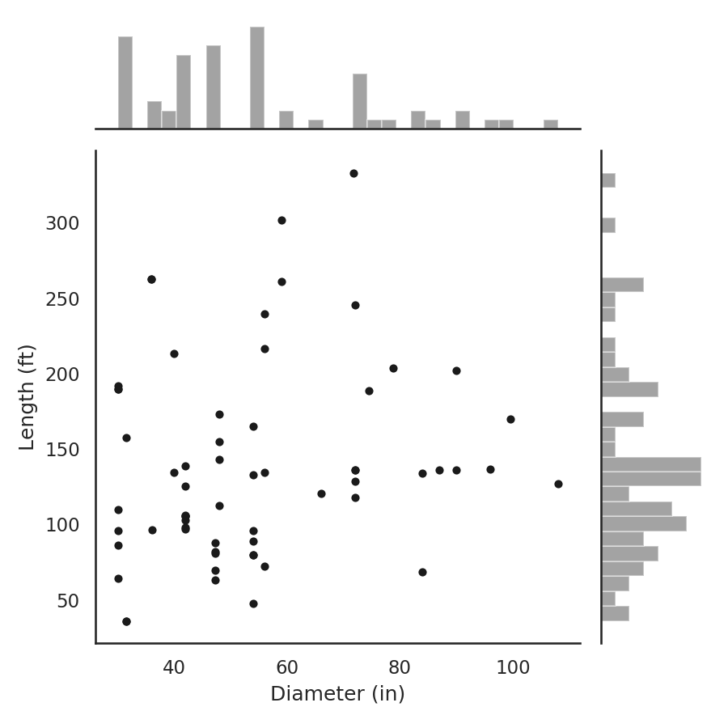
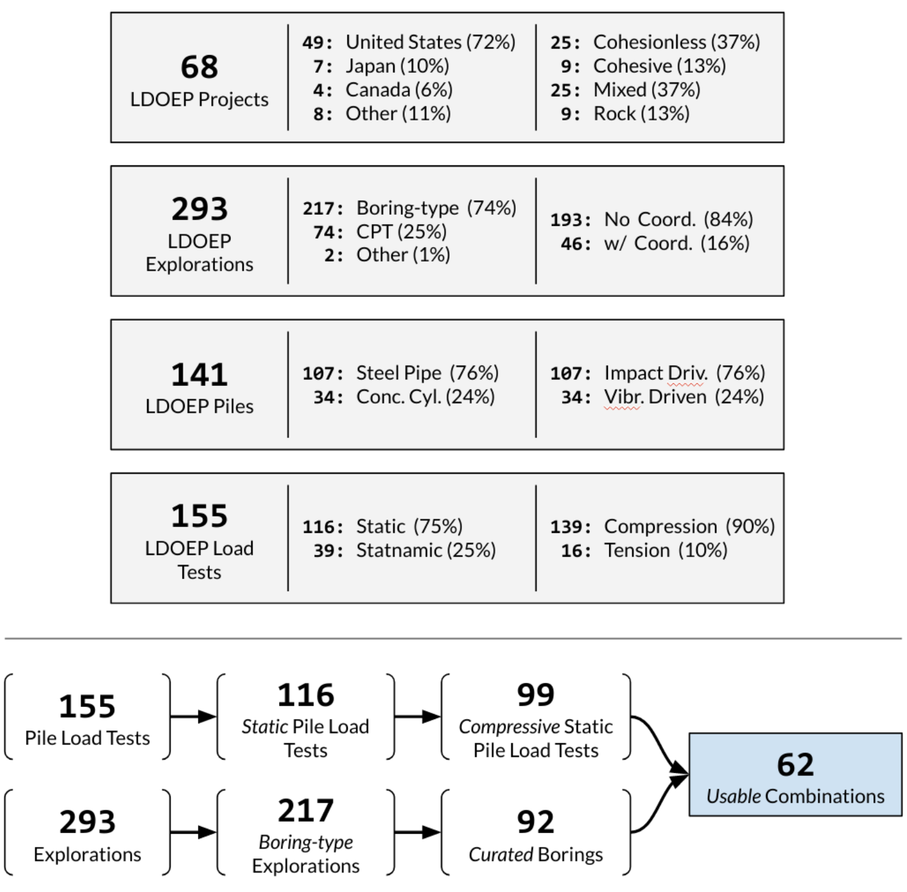
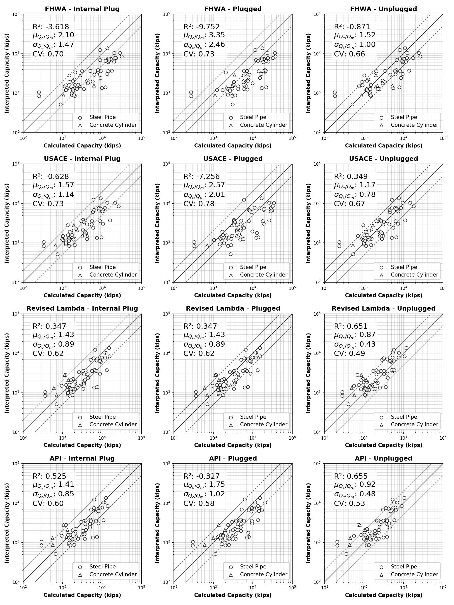
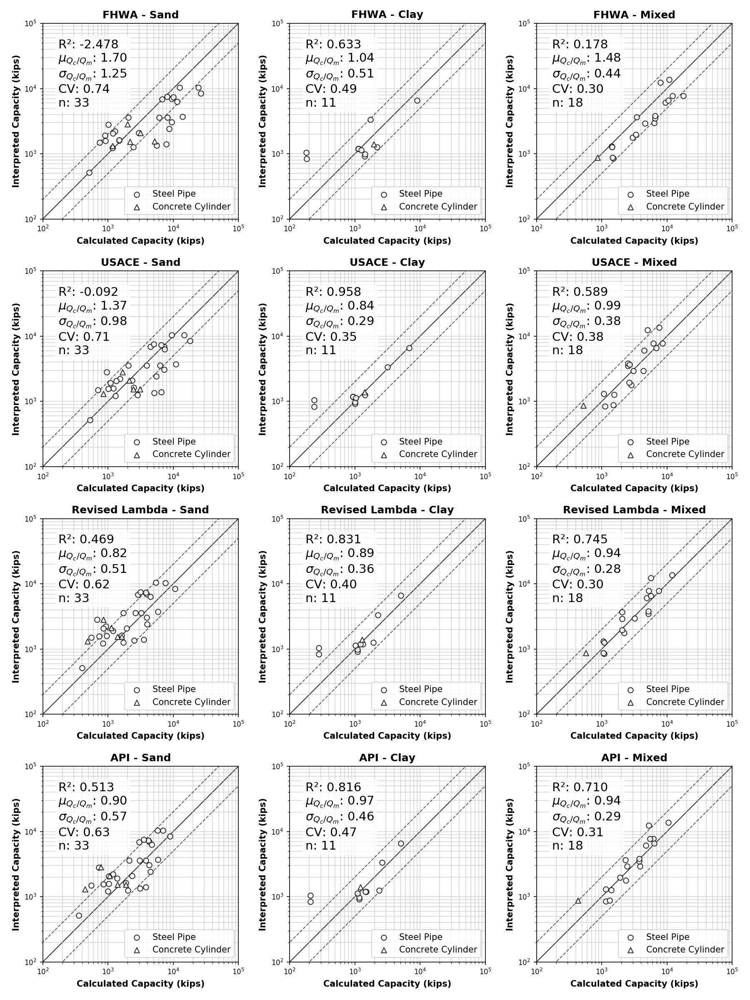
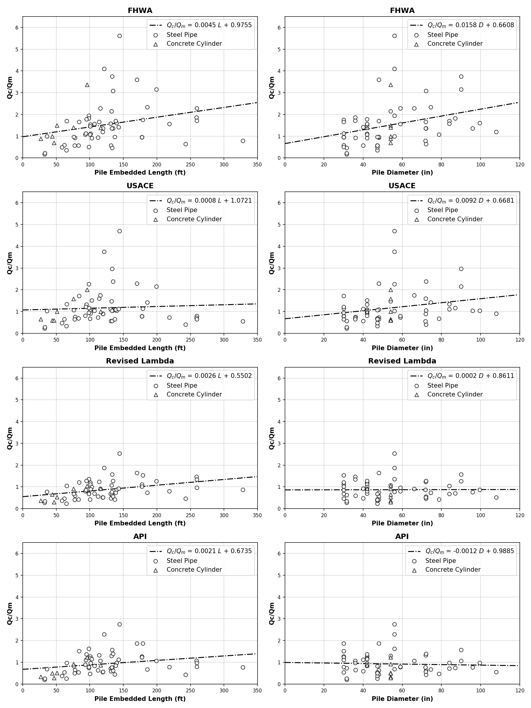
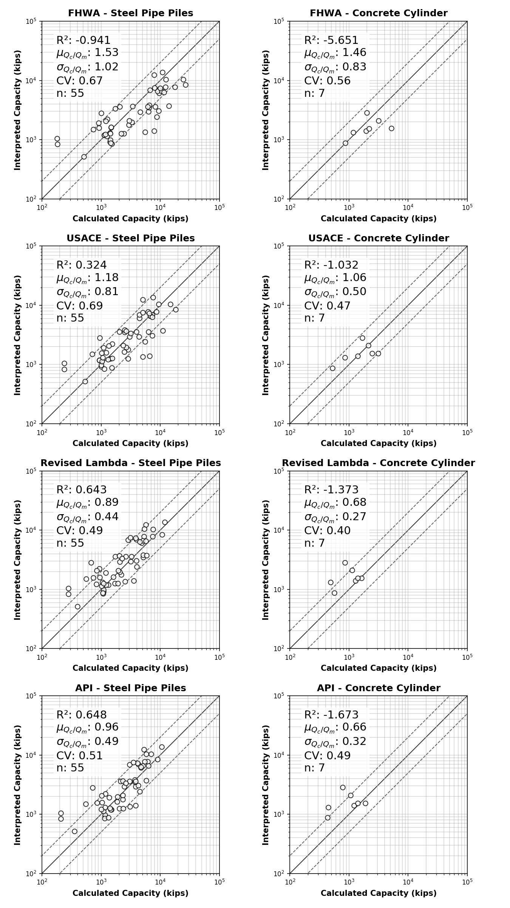

For Large Diameter Open-Ended Piles (LDOEP)
===========================================

Large-Diameter Open-Ended Piles (LDOEP) are increasingly being used for support of infrastructure projects. Yet many of the methods in current use for calculating pile capacity are based on databases of interpreted load test data for small diameter piles. The scope of this study was limited to impact or vibratory driven un-tapered steel and concrete pipe-piles, larger than 30 inches in diameter, loaded in compression, using a static load test.

The efficacy of four commonly used pile design methods was explored using data made possible by the 2016 release of FHWA Deep Foundation Load Test Database, which was was ported to a cloud-based relational database that permitted batch processing of the available information. An analytical procedure was developed in Python in conjunction with ENSOFT’s *APILE Offshore 2019* to compute the axial capacity of piles using methods proposed by: (1) FHWA (2) The US Army Corps of Engineers, (3) American Petroleum Institute (API) as well as (4) the Lambda method. Interpreted capacity from static load test data was also obtained using the modified Davisson Criterion.

Scatter between measured (interpreted) and predicted capacities is significant, where the computed capacity was off by a factor of two in many tests. Use of a load test for determining the capacity of LDOEP is therefore strongly encouraged. Several plugging conditions were considered. All 4 methods achieved better predictions for the unplugged condition, suggesting that LDOEPs do not develop significant end bearing, possibly because the deformation required to develop end bearing are not achieved for these piles.

Introduction
------------

Large Diameter Open-Ended Pipe Piles (LDOEPs) have enjoyed limited use for transportation infrastructure. LDOEPs are ideal for support of heavy axial loads, high lateral forces, and large bending moments. LDOEPs are widely used in the offshore industry where these concerns are paramount. In recent years LDOEPs have also enjoyed considerable use for support of wind energy turbine converters. Use of LDOEPs for support of bridge structures has been increasing, especially where liquefiable layers are encountered, or seismic concerns dominate. However, the rate of adoption has been limited by the lack of design guidance geared towards bridge structures.

LDOEPs are generally more economic than other foundation alternatives, such as drilled shafts, and large pile groups. Driving is typically more efficient than drilling. The ability to specify and inspect the piling dimensions and materials eliminates certain construction risks associated with drilled foundations. Additionally, LDOEPs offer the opportunity to replace large pile groups, thus eliminating the cost of a pile cap and reducing the need for factoring in complex axial and lateral group effects. For foundations under waterways LDOEPs can eliminate the need for costly cofferdams, which are required for drilled shafts and large pile groups. Finally, when complex rock surfaces are encountered, steel pipe piles also offer the possibility of adjusting the pile length, on site, by splicing additional sections as well as eliminating (or torching off) sections.

Single pile design is typically conducted using ultimate capacity determination from either calculated or interpreted methods (or both in combination). Determination of the ultimate capacity of driven piles using calculated methods is conducted by following a series of steps in a design process, starting with data and properties gathered from a geotechnical investigation such as those recommended by the Federal Highway Administration (FHWA) driven pile design manual (:ref:`Hannigan et al., 2016a <Hannigan2016a>`; :ref:`Hannigan et al., 2016b <Hannigan2016b>`), along with pile selection. Interpreted pile capacity calculations are derived from load-settlement curve data generated during an axial load test of a driven pile.

A recent survey of state highway departments of transportation (:ref:`NCHRP, 2015 <NCHRP2015>`) revealed  that when LDOEPs are selected for a project, they are typically designed using methods proposed by FHWA that are based on methods originally proposed by Nordlund (:ref:`1963 <Nordlund1963>`), and Tomlinson (:ref:`1980 <Tomlinson1980>`). Alternate design approaches include methods proposed by the American Petroleum Institute (API) (:ref:`API RP-2A, 1993 <API1993>`), the United States Army Corps of Engineers (:ref:`USACE, 1991 <USACE1991>`), and the Lambda Method (:ref:`Focht and Vijayvergiya, 1972 <Focht1972>`; :ref:`Kraft et al., 1981 <Kraft1981>`).

However, none of these methods was developed using LDOEPs. For example, for piles in sand, Nordlund (:ref:`1963 <Nordlund1963>`) developed his method of calculating bearing capacity of piles in cohesionless soils from as few as 41 load tests from eight different test sites having diameters ranging between 10 and 20 inches. Similarly for clays, Tomlinson (:ref:`1980 <Tomlinson1980>`) employed 56 small diameter piles to develop his popular :math:`\alpha`-design method that was based in part on data published by Peck (:ref:`1958 <Peck1958>`). These methods were adopted by the FHWA Pile Design Manual (:ref:`Hannigan et al., 2016a <Hannigan2016a>`; :ref:`Hannigan et al., 2016b <Hannigan2016b>`), and the methods of choice for many state departments of transportation (DOT).

Recently, FHWA released the Deep Foundation Load Test Database (DFLTD) v.2 (:ref:`Petek et al., 2016 <Petek2016>`). DFLTD v.2 contains a number of load tests on piles having diameters in the 8 to 118 in. range. Comparison between calculated and interpreted capacities for large data sets provides insight of suitability of use of current design methods under varying pile and soil conditions. Thus, these tests can potentially be used to assess the adequacy of current design methods for predicting the axial capacity of LDOEPs.

For this study, several programs were developed in Python, and in conjunction with ENSOFT’s *APILE Offshore 2019* (:ref:`Wang et al., 2019a <Wang2019a>`; :ref:`Wang et al., 2019b <Wang2019b>`), the ultimate pile capacities of 62 LDOEPs were calculated using four driven pile design methods. As such, data available from the DFLTD v.2 could be analyzed on a large scale to compare multiple interpreted pile capacities with their corresponding calculated capacities. The results were summarized, analyzed, plotted and used to compare the performance of calculated vs. interpreted capacity (:math:`Q_c/Q_m`) in sands, clays, and mixed soils. Additionally, the effect of pile length, pile diameter and pile type on the :math:`Q_c/Q_m` ratio was explored.

The scope was limited to impact or vibratory driven un-tapered steel and concrete pipe-piles, larger than 30 inches in diameter, loaded in compression, using a static load test. Although LDOEP are sometimes defined to include piles larger than 36 in. in diameter, in this study, LDOEP was defined to include piles larger than 30 inches in diameter for a number of reasons. First, to increase the size of available load tests for analysis by 15%. Second, because piles in the 30 to 36 inches are among the most commonly used piles sizes for support of infrastructure. Third, the design methods have been developed using piling that was largely smaller than 30 in. in diameter. Finally, the performance of standard diameter piling is provided in the paper, and it fits well with larger diameter piles.

.. removed stuff from here

For a comprehensive comparison, this study adopted four popular pile design methods that were identified in NCHRP 478 (:ref:`2015 <NCHRP2015>`): (a) the Federal Highway Administration (FHWA) method, (b) the United States Army Corps of Engineers (USACE) method, (c) the Revised Lambda method and (d) the Revised American Petroleum Institute (API) method. Details of each design method, and the specific parameters employed are available in Reese et al. (:ref:`2006 <Reese2006>`). Several other methods are sometimes used for LDOEPs including Fugro, NGI, ICP, UWA, however all are CPT based. Although the CPT provides a superior tool for geotechnical investigations, the authors did not include CPT methods in this study, (1) in an effort to reduce the variables affecting the analysis. Also, (2) available CPT data was sufficiently complete to allow capacity calculations for only a dozen records.

.. removed stuff from here

Overview of Pile Load Test Database
-----------------------------------

DFLTD v.2 contains two subsets of data: (i) tests contained in the DFLTD v.1 database (:ref:`Kalavar and Ealy, 2000 <Kalavar2000>`), and (ii) a second subset of newer load tests referred to as the *Large-Diameter Open End Pile (LDOEP) Database*. For this study we only used tests from the LDOEP Database, since (a) fewer than 10 tests in DFLTD v.1 met the aforementioned scope criteria, and (b) widely perceived notion of the inferior nature of tests in DFLTD v.1, in comparison to the LDOEP Database.

   Distribution of pile length and diameter

LDOEP Database Statistics
^^^^^^^^^^^^^^^^^^^^^^^^^

Not all records from the LDOEP database were used in this study due to incomplete or unreliable data. As can be seen in :numref:`ldoep_calc_fig1`, the length of the 62 piles analyzed ranged from 36 to 333 feet with the majority being 100 to 175 feet long (Q1 to Q3 range). The diameter of the piles ranged from 30 to 108 inches with the majority being 40 to 60 inches wide (Q1 to Q3 range).

The LDOEP database included data for 116 static load tests (75%) and 39 statnamic load tests (25%) for a total of 155 tests. Out of the 155 tests, 139 were compressive tests (90%) and 16 were tensile tests. Although dynamic testing is increasingly being relied on due to the very high loads required to conduct static load testing on LDOEPs, the authors opted for using the available static load test so as not to introduce additional variables and provide consistent interpreted capacities for a fair comparison. Furthermore, static load testing is still considered as the reference standard for design verification.

For this study, only compressive static load tests were considered. There was no attempt to factor the effect of setup, at this time, except to exclude tests conducted fewer than four days after pile installation, since most design methods do not explicitly address the role of setup. A summary of LDOEP database statistics, as well as the final dataset is presented in :numref:`ldoep_calc_fig2`.

   Summary of LDOEP statistics

Interacting with the LDOEP Database
-----------------------------------

DFLTD v.2, was organized in a relational schema and delivered as a Microsoft Access product with a standard graphical user interface. The data was provided in multiple tables, that at times contained similar or conflicting information for the same record.  On a previous study of driven pile capacities, Machairas et al. (:ref:`2018 <Machairas2018>`) migrated DFLTD v.2 from Microsoft Access to a cloud-based SQL relational database. The same cloud-based database was used in this paper.

Soil Data Integrity Check, Completion and Curation
^^^^^^^^^^^^^^^^^^^^^^^^^^^^^^^^^^^^^^^^^^^^^^^^^^

The single greatest challenge, when dealing with geotechnical databases has been missing or misinterpreted values for soil properties. When calculating the capacity of a pile using any of the four design methods, for each layer of the stratum there must be at a minimum available values for (A: cohesive soils) total unit weight and undrained shear strength and (B: cohesionless soils) total unit weight and internal friction angle. If any of these values is missing, there are two options: either reject the database record or attempt to infer the missing values from other available information. In cases where data is plentiful, a trade-off analysis can help make the correct decision. However, when it comes to pile load test databases, information is so scarce that approximation of missing data is necessitated.

To put things into perspective, specifically in the LDOEP database, unit weights were assigned to multiple tables. Out of the 2,422 delineated layers from borings only 345 layers (14%) have interpreted total unit weight values. Also, in the ``DeepFoundationSoilLayer`` table out of the 1,374 layers, 367 layers (27%) had interpreted total unit weight values, 143 layers (10%) had interpreted cohesion values and only 34 layers (2%) had interpreted friction angle values.

All soil data in our database were reviewed for completeness by a practicing licensed Professional Engineer including lab data, boring and CPT results, soil type/description, SPT-N values, CPT sounding parameters (:math:`f_s`, :math:`q_c` or :math:`q_t`, friction ratio, and other related data). Unit conversions were performed to standard English Units. The PE generated detailed soil profiles with soil properties either by generating the soil profile using the references and methodology mentioned in this study, or by using the interpreted soil profiles and their properties provided by the database, if in agreement with the exploration logs of the database, as described above.

Where derived profiles were provided or when interpreted soil profiles were given, all soil properties were checked against the explorations in order to verify that the derived profiles matched the exploration log as far as soil description and SPT-N values are concerned. The inspection consisted of an examination on whether the interpreted soil profiles agreed with the exploration logs. A detailed log of inconsistencies was kept. For instance, a cohesion value of 500 psf when N values for a clay layer were on the order of 25 to 30 blows/foot or an internal friction angle of 30 degrees when N values for the sand layer were 10, are clearly unreasonable and generally not in agreement with standard geotechnical engineering practice. In such cases, we overrode interpreted soil profiles as needed based on logs or made a note if or where the interpreted values for the derived soil profiles were used. Where derived profiles were not provided, a design profile was created using existing exploration data. However, in records were various existing exploration data existed with no clear indication which exploration applies to which pile load test, the record was determined inconclusive and was excluded altogether from the study.

Soil Property Approximations
^^^^^^^^^^^^^^^^^^^^^^^^^^^^

Unless laboratory data was recorded in the database, the following approximations were performed using SPT N-values and relevant soil properties.

- Correlation between friction angle, :math:`\phi`, and SPT N-values for cohesionless soils was performed using the relationship from Peck et al. (:ref:`1953 <Peck1953>`). For convenience, :eq:`ldoep_calc_eq20` from Shioi and Fukui (:ref:`1982 <Shioi1982>`) was applied to available SPT N-values which translates the Peck relationship to a mathematical format. A limiting friction angle of 48 degrees was applied for gravelly sands or sandy gravels which were very dense (N > 80).
- Undrained shear strength for cohesive soils was approximated based on the guidelines provided by Naval Facilities Engineering Command (NAVFAC) Design Manual 7.01 (:ref:`1986 <NAVFAC1986>`) and ASCE (1996), as shown in :numref:`ldoep_calc_table1`.
- Total unit weight of soil was approximated based on the values also shown in :numref:`ldoep_calc_table1`.
- Rock was modeled as very dense cohesionless soil, but this was encountered in very few cases.

.. math::
   :label: ldoep_calc_eq20

   \phi = 0.3 N + 27 \leq 48^\circ

.. table:: Approximation of soil properties from SPT data (adapted from Fang et al., :ref:`1991 <Fang1991>` and NAVFAC DM 7.01, ASCE 1996)
   :widths: 10, 25, 10, 25, 30
   :align: center
   :name: ldoep_calc_table1

   +-------+---------------------+---------+-------------------+-----------------+
   | Soil  | Density/            | N       | Total Unit Weight | Undrained Shear |
   |       | Consistency         |         | (pcf)             | Strength (psf)  |
   +=======+=====================+=========+===================+=================+
   |       | Very Loose          | < 4     | 90 - 105          |                 |
   |       +---------------------+---------+-------------------+                 |
   |       | Loose               | 5 - 10  | 95 - 110          |                 |
   |       +---------------------+---------+-------------------+                 |
   | SANDS | Medium Dense        | 11 - 30 | 105 - 120         | n/a             |
   |       +---------------------+---------+-------------------+                 |
   |       | Dense               | 31 - 50 | 115 - 130         |                 |
   |       +---------------------+---------+-------------------+                 |
   |       | Very Dense          | > 50    | 125 - 140         |                 |
   +-------+---------------------+---------+-------------------+-----------------+
   | CLAYS | Very Soft           | 0 - 2   | 90 - 100          | 100 - 250       |
   |       +---------------------+---------+-------------------+-----------------+
   |       | Soft                | 3 - 4   | 100 - 110         | 250 - 500       |
   |       +---------------------+---------+-------------------+-----------------+
   |       | Firm                | 5 - 8   | 105 - 125         | 500 - 1,000     |
   |       +---------------------+---------+-------------------+-----------------+
   |       | Stiff               | 9 - 16  | 115 - 130         | 1,000 - 2,000   |
   |       +---------------------+---------+-------------------+-----------------+
   |       | Very Stiff          | 17 - 32 | 120 - 140         | 2,000 - 4,000   |
   |       +---------------------+---------+-------------------+-----------------+
   |       | Hard                | > 32    | > 130             | > 4,000         |
   +-------+---------------------+---------+-------------------+-----------------+

Analytical Procedure
--------------------

In order to calculate nominal pile capacities, this study employed the four pile design methods described above. For interpreted (also referred to as *measured*) capacity we followed The American Association of State Highway and Transportation Officials (AASHTO) Bridge Design Specifications (:ref:`2012 <AASHTO2012>`) where for piles wider than 36 inches in diameter, the modified Davisson criterion (:eq:`ldoep_calc_eq21`) must be used.

.. math::
   :label: ldoep_calc_eq21

   \Delta = \dfrac{QL}{AE} + \dfrac{b}{30}

where:

.. |Q| replace:: :math:`Q`
.. |L| replace:: :math:`L`

:|Q|: test load
:|L|: total length of pile
:|A|: cross-sectional area
:|E|: material modulus
:|b|: pile diameter/width

Internal Plug, Plugged and Unplugged Conditions
^^^^^^^^^^^^^^^^^^^^^^^^^^^^^^^^^^^^^^^^^^^^^^^

Three design conditions that were considered for each method, as follows:

- **Internal Plug Condition.** Toe resistance is calculated based on :eq:`ldoep_calc_eq2` & :eq:`ldoep_calc_eq3` and is taken as the smaller of (1) the calculated internal friction along the inside walls of the pile inner diameter plus the tip resistance from the pile annulus section, and (2) the full toe area assuming a plugged case (plugged condition). Internal unit skin friction is assumed to be the same as exterior unit skin friction for cohesionless materials, however for cohesive materials :math:`f_{si}` is taken as 0.4 :math:`f_{so}` by specifying a value for remolded shear strength that is 40% the undrained shear strength for cohesive materials.
- **Plugged Condition.** In this case it is assumed that the pile behaves as a full displacement pile (closed-ended). Therefore, the total capacity is the sum of skin friction on the exterior wall plus end bearing of the full toe area (:eq:`ldoep_calc_eq2`).
- **Unplugged (coring) Condition.** It is assumed that the pile cores like a "cookie cutter" through the soil and the capacity is the sum of skin friction on the exterior wall plus end bearing or tip resistance of the pile section only (annulus section). The internal friction along the pile inside diameter is ignored completely (:eq:`ldoep_calc_eq3`).

Batch Processing
^^^^^^^^^^^^^^^^

We employed *APILE Offshore 2019* by ENSOFT Inc. for all 62 pile capacity calculations, however input piles were automatically generated from the database using a custom Python program. In order to expedite the process and further reduce the risk of user-induced errors during data entry and model setup, all necessary APILE input data files (``.ap9d``) were automatically produced using a custom-made Python program. The Python program would query the research team’s cloud-based database for all required LDOEPs and geotechnical properties. The process was repeated for all 62 piles and all plugging conditions producing 186 APILE data files (62 piles x 3 plugging conditions).

Another Python program was developed that automatically extracted all required information from all APILE output files and combined the results in a single data file, ready to be analyzed and plotted as presented in the following sections.

Overall Performance of Design Methods
-------------------------------------

Capacity calculations were performed for all 62 available piles and boring combinations. The corresponding calculated capacities (:math:`Q_c`), were computed using the four design methods presented above: (1) Nordlund and Tomlinson (FHWA), (2) USACE, (3) Revised Lambda and (4) API.  Interpreted failure load, frequently referred to as *measured capacity* (:math:`Q_m`), was also obtained using the modified Davisson criterion (:eq:`ldoep_calc_eq21`). Calculated and measured pile capacities are compared, on log-log plots, in order to optimize the visual separation of the data,  along with reference, 1:½, 1:1 and 1:2 (:math:`Q_c:Q_m`) lines. Three plugging conditions were considered for each design method: (a) internal plug, (b) plugged, and (c) unplugged. Finally, individual data is separated on each of the 12 plots (4 design methods x 3 conditions) into steel pipe piles and concrete cylinder piles. The results are presented in :numref:`ldoep_calc_fig3`.

   Calculated (:math:`Q_c`) vs. interpreted (aka *measured*, :math:`Q_m`) capacities for all plugging conditions (internal plug-L, plugged-M, unplugged-R) based on the four design methods

In general, none of the methods distinguished itself. The scatter between measured and predicted capacities is significant, where the capacity was off by a factor of two or more in many tests. :math:`Q_c/Q_m` should be close to 1, but :math:`Q_c/Q_m` ranged from 0.17 to 15.6. The mean normalized calculated capacity (:math:`\mu_{Q_c/Q_m}`) which is optimally 1.00 ranged between 0.87 and 3.35 (:numref:`ldoep_calc_table2`). Among the four design methods, API was somewhat better than the rest, followed by the Lambda method, but none is ideal. This is not surprising considering that (i) pile design methods suffer from great inaccuracy, and (ii) none of the four design methods was developed for LDOEPs and all four design approaches are being used well beyond their supporting data.

There exists significant uncertainty related to the behavior of the interior soil within the pile during installation and subsequently during static loading. During driving, the interior soil tends to remain stationary due to inertia associated with this large soil mass and as such LDOEPs tend to core through the soil during driving (i.e. they do not plug during installation). This behavior may be different during static loading, as the interior friction resistance may exceed the end bearing resistance at the pile toe so that the pile may behave as a plugged condition since inertial forces do not contribute during static loadings. Among the three plugging conditions, the unplugged condition was consistently better for the unplugged condition with :math:`\mu_{Q_c/Q_m}` = 1.12, in comparison to 1.63 and 2.28 for the internal plug and plugged condition.  The authors believe that this observation suggests that the internal plug does not contribute significantly to the pile capacity even though there is some interior frictional resistance. The displacement required for end bearing to develop if the pile is unquestionably plugged, may indeed be too large for LDOEPs.

.. table:: Summary of statistics for all design methods and conditions
   :widths: auto
   :align: center
   :name: ldoep_calc_table2

   +-------------------------+----+------------------+----------------------------+-------------------------------+----------+
   |                         | n  | R\ :sup:`2` [1]_ | :math:`\mu_{Q_c/Q_m}` [2]_ | :math:`\sigma_{Q_c/Q_m}` [3]_ | CV [4]_  |
   +=========+===============+====+==================+============================+===============================+==========+
   |         | Internal Plug | 62 | -3.618           | 2.10                       | 1.47                          | 0.70     |
   |         +---------------+----+------------------+----------------------------+-------------------------------+----------+
   | FHWA    | Plugged       | 62 | -9.752           | 3.35                       | 2.46                          | 0.73     |
   |         +---------------+----+------------------+----------------------------+-------------------------------+----------+
   |         | Unplugged     | 62 | -0.871           | 1.52                       | 1.00                          | 0.66     |
   +---------+---------------+----+------------------+----------------------------+-------------------------------+----------+
   |         | Internal Plug | 62 | -0.628           | 1.57                       | 1.14                          | 0.73     |
   |         +---------------+----+------------------+----------------------------+-------------------------------+----------+
   | USACE   | Plugged       | 62 | -7.256           | 2.57                       | 2.01                          | 0.78     |
   |         +---------------+----+------------------+----------------------------+-------------------------------+----------+
   |         | Unplugged     | 62 | 0.349            | 1.17                       | 0.78                          | 0.67     |
   +---------+---------------+----+------------------+----------------------------+-------------------------------+----------+
   |         | Internal Plug | 62 | 0.347            | 1.43                       | 0.89                          | 0.62     |
   |         +---------------+----+------------------+----------------------------+-------------------------------+----------+
   | LAMBDA  | Plugged       | 62 | 0.347            | 1.43                       | 0.89                          | 0.62     |
   |         +---------------+----+------------------+----------------------------+-------------------------------+----------+
   |         | Unplugged     | 62 | 0.651            | 0.87                       | **0.43**                      | **0.49** |
   +---------+---------------+----+------------------+----------------------------+-------------------------------+----------+
   |         | Internal Plug | 62 | 0.525            | 1.41                       | 0.85                          | 0.60     |
   |         +---------------+----+------------------+----------------------------+-------------------------------+----------+
   | API     | Plugged       | 62 | -0.327           | 1.75                       | 1.02                          | 0.58     |
   |         +---------------+----+------------------+----------------------------+-------------------------------+----------+
   |         | Unplugged     | 62 | **0.655**        | **0.92**                   | 0.58                          | 0.53     |
   +---------+---------------+----+------------------+----------------------------+-------------------------------+----------+
   | AVERAGE | Internal Plug | 62 | -0.844           | 1.63                       | 1.09                          | 0.66     |
   |         +---------------+----+------------------+----------------------------+-------------------------------+----------+
   |         | Plugged       | 62 | -4.247           | 2.28                       | 1.60                          | 0.68     |
   |         +---------------+----+------------------+----------------------------+-------------------------------+----------+
   |         | Unplugged     | 62 | **0.196**        | **1.12**                   | **0.70**                      | **0.59** |
   +---------+---------------+----+------------------+----------------------------+-------------------------------+----------+

.. note:: Bolded numbers in table cells indicate the best values in the set

.. [1] A coefficient of determination closer to 1.000 is better
.. [2] Mean closer to 1.00 is better
.. [3] Lower standard deviation is better
.. [4] Lower coefficient of variation is better

Effect of Predominant Soil Type
-------------------------------

Pile behavior varies depending on the soil type, hence it is important to confirm that the capacities computed using any design method do not exhibit a bias related to the type of soil where the pile has been installed. The relationship between the soil type was explored as follows. First, the percentage of sand was computed by taking the weighted average of the soil layer heights, containing cohesionless soils, along the depth of the pile.  Data was classified such that load tests with 70–100% of the profile in sand were labeled sands, 31–69%  mixed, and 0–30% in sand labeled clays. This approach did not involve any capacity computations and was therefore independent of the design method employed, which permitted having a consistent set of load tests used across all design methods.

Measured and interpreted capacities grouped by soil type are presented in :numref:`ldoep_calc_fig4` for the unplugged case (overall best performing) and summarized in :numref:`ldoep_calc_table3` for all plugging conditions. The best performance in each method/category is shaded in gray, and the best performance in each category across all methods is bolded and shaded. With two exceptions, capacity computations are consistently better in clays than in other soils for all four design methods and three plugging conditions. Capacities in sand were the most inaccurate (highest :math:`\mu_{Q_c/Q_m}`), and the least precise (largest CV and :math:`\sigma_{Q_c/Q_m}`). The relatively narrower scatter in clays may have been influenced by the smaller number of load tests in clays, however the trend of worsening capacity from clays, to mixed, to sands confirms the hypothesis.

The unplugged condition is explored in more detail in :numref:`ldoep_calc_fig4`. Capacities in sand exhibit more scatter than capacities in clays or mixed soils. Mean :math:`Q_c/Q_m` (:math:`\mu_{Q_c/Q_m}`) for all design methods was 1.20 in sand, 0.94 in clay, and 1.09 in mixed profiles. The corresponding standard deviation (:math:`\sigma_{Q_c/Q_m}`) was 0.83 in sand, 0.41 in clay, and 0.35 in mixed soils. Variation observed for the :math:`Q_c/Q_m` could be related to the correlation used for soil properties with SPT. It also appears that the FHWA method tends to over-predict capacities in sands and mixed soils.

   Calculated (:math:`Q_c`) vs. interpreted (aka *measured*, :math:`Q_m`) capacities for all soil conditions (sand-L, clay-M, mixed-R) based on the four design methods and for unplugged calculations

.. table:: Summary of statistics for all design methods and conditions per soil type
   :widths: 15, 20, 15, 10, 10, 10, 10, 10
   :align: center
   :name: ldoep_calc_table3

   +--------------------------------+----+-------------+-----------------------+--------------------------+----------+
   |                                | n  | R\ :sup:`2` | :math:`\mu_{Q_c/Q_m}` | :math:`\sigma_{Q_c/Q_m}` | CV       |
   +========+===============+=======+====+=============+=======================+==========================+==========+
   |        |               | Sand  | 33 | -7.125      | 2.44                  | 1.83                     | 0.75     |
   |        |               +-------+----+-------------+-----------------------+--------------------------+----------+
   |        | Internal Plug | Clay  | 11 | -1.528      | 1.27                  | 0.64                     | 0.51     |
   |        |               +-------+----+-------------+-----------------------+--------------------------+----------+
   |        |               | Mixed | 18 | -1.285      | 1.99                  | 0.64                     | 0.32     |
   |        +---------------+-------+----+-------------+-----------------------+--------------------------+----------+
   |        |               | Sand  | 33 | -15.98      | 4.03                  | 2.92                     | 0.72     |
   |        |               +-------+----+-------------+-----------------------+--------------------------+----------+
   | FHWA   | Plugged       | Clay  | 11 | -6.574      | 1.63                  | 0.96                     | 0.59     |
   |        |               +-------+----+-------------+-----------------------+--------------------------+----------+
   |        |               | Mixed | 18 | -6.021      | 3.15                  | 1.40                     | 0.44     |
   |        +---------------+-------+----+-------------+-----------------------+--------------------------+----------+
   |        |               | Sand  | 33 | -2.478      | 1.70                  | 1.25                     | 0.74     |
   |        |               +-------+----+-------------+-----------------------+--------------------------+----------+
   |        | Unplugged     | Clay  | 11 | **0.633**   | **1.04**              | 0.51                     | 0.49     |
   |        |               +-------+----+-------------+-----------------------+--------------------------+----------+
   |        |               | Mixed | 18 | 0.178       | 1.48                  | **0.44**                 | **0.30** |
   +--------+---------------+-------+----+-------------+-----------------------+--------------------------+----------+
   |        |               | Sand  | 33 | -2.371      | 1.91                  | 1.42                     | 0.74     |
   |        |               +-------+----+-------------+-----------------------+--------------------------+----------+
   |        | Internal Plug | Clay  | 11 | 0.740       | **1.00**              | 0.34                     | **0.34** |
   |        |               +-------+----+-------------+-----------------------+--------------------------+----------+
   |        |               | Mixed | 18 | 0.618       | 1.30                  | 0.50                     | 0.39     |
   |        +---------------+-------+----+-------------+-----------------------+--------------------------+----------+
   |        |               | Sand  | 33 | -13.07      | 3.18                  | 2.20                     | 0.69     |
   |        |               +-------+----+-------------+-----------------------+--------------------------+----------+
   | USACE  | Plugged       | Clay  | 11 | -18.22      | 1.40                  | 1.12                     | 0.80     |
   |        |               +-------+----+-------------+-----------------------+--------------------------+----------+
   |        |               | Mixed | 18 | -1.801      | 2.18                  | 1.62                     | 0.74     |
   |        +---------------+-------+----+-------------+-----------------------+--------------------------+----------+
   |        |               | Sand  | 33 | -0.092      | 1.37                  | 0.98                     | 0.71     |
   |        |               +-------+----+-------------+-----------------------+--------------------------+----------+
   |        | Unplugged     | Clay  | 11 | **0.958**   | 0.84                  | **0.29**                 | 0.35     |
   |        |               +-------+----+-------------+-----------------------+--------------------------+----------+
   |        |               | Mixed | 18 | 0.589       | 0.99                  | 0.38                     | 0.38     |
   +--------+---------------+-------+----+-------------+-----------------------+--------------------------+----------+
   |        |               | Sand  | 33 | -0.145      | 1.55                  | 1.13                     | 0.73     |
   |        |               +-------+----+-------------+-----------------------+--------------------------+----------+
   |        | Internal Plug | Clay  | 11 | 0.834       | 1.09                  | 0.40                     | 0.37     |
   |        |               +-------+----+-------------+-----------------------+--------------------------+----------+
   |        |               | Mixed | 18 | 0.651       | 1.39                  | 0.39                     | **0.28** |
   |        +---------------+-------+----+-------------+-----------------------+--------------------------+----------+
   |        |               | Sand  | 33 | -0.145      | 1.55                  | 1.13                     | 0.73     |
   |        |               +-------+----+-------------+-----------------------+--------------------------+----------+
   | LAMBDA | Plugged       | Clay  | 11 | 0.834       | 1.09                  | 0.40                     | 0.37     |
   |        |               +-------+----+-------------+-----------------------+--------------------------+----------+
   |        |               | Mixed | 18 | 0.651       | 1.39                  | 0.39                     | **0.28** |
   |        +---------------+-------+----+-------------+-----------------------+--------------------------+----------+
   |        |               | Sand  | 33 | 0.469       | 0.82                  | 0.51                     | 0.62     |
   |        |               +-------+----+-------------+-----------------------+--------------------------+----------+
   |        | Unplugged     | Clay  | 11 | 0.831       | 0.89                  | 0.36                     | 0.40     |
   |        |               +-------+----+-------------+-----------------------+--------------------------+----------+
   |        |               | Mixed | 18 | 0.745       | 0.94                  | **0.28**                 | 0.30     |
   +--------+---------------+-------+----+-------------+-----------------------+--------------------------+----------+
   |        |               | Sand  | 33 | 0.162       | 1.53                  | 1.06                     | 0.70     |
   |        |               +-------+----+-------------+-----------------------+--------------------------+----------+
   |        | Internal Plug | Clay  | 11 | 0.857       | 1.15                  | 0.49                     | 0.43     |
   |        |               +-------+----+-------------+-----------------------+--------------------------+----------+
   |        |               | Mixed | 18 | 0.754       | 1.34                  | 0.43                     | 0.32     |
   |        +---------------+-------+----+-------------+-----------------------+--------------------------+----------+
   |        | Plugged       | Sand  | 33 | -1.010      | 1.90                  | 1.16                     | 0.61     |
   |        |               +-------+----+-------------+-----------------------+--------------------------+----------+
   | API    |               | Clay  | 11 | -2.642      | 1.36                  | 0.68                     | 0.50     |
   |        |               +-------+----+-------------+-----------------------+--------------------------+----------+
   |        |               | Mixed | 18 | 0.369       | 1.72                  | 0.85                     | 0.49     |
   |        +---------------+-------+----+-------------+-----------------------+--------------------------+----------+
   |        | Unplugged     | Sand  | 33 | 0.513       | 0.90                  | 0.57                     | 0.63     |
   |        |               +-------+----+-------------+-----------------------+--------------------------+----------+
   |        |               | Clay  | 11 | **0.816**   | **0.97**              | 0.46                     | 0.47     |
   |        |               +-------+----+-------------+-----------------------+--------------------------+----------+
   |        |               | Mixed | 18 | 0.710       | 0.94                  | **0.29**                 | **0.31** |
   +--------+---------------+-------+----+-------------+-----------------------+--------------------------+----------+

Effect of Pile Diameter and Embedded Length on Qc/Qm
----------------------------------------------------

A long standing problem with many design methods for predicting pile capacity is that their use led to underprediction of capacities of short piles and overprediction of the capacity of long piles. Calculated capacity normalized by measured (interpreted) capacity is plotted against pile length and diameter in :numref:`ldoep_calc_fig5`. The regression line shows that the ratio is increasing with pile embedded length for all methods. The slopes ranged from 0.0008L (USACE) to 0.0045L (FHWA). This suggests that an increase in length of 100 ft, would correspond to over estimation of capacity by 45%, 26%, 21%, and 8% for the FHWA, API, Lamda, and USACE, respectively.

With respect to diameter, slopes ranged from 0.0158D (FHWA) to -0.0012D (API). An increase of 36 inches in diameter would correspond to over estimation of capacity by 57% for FHWA, and 33% for USACE. This is obviously unsatisfactory, especially for LDOEPs. Revised Lambda and API were less influenced by 7% and -4% for an increase of 36 inches in diameter.

   Effect of pile properties on the ratio of calculated (:math:`Q_c`) to interpreted (aka *measured*, :math:`Q_m`) capacities. Effect of penetration length (LHS) and effect of pile diameter (RHS) based on the four design methods and for unplugged calculations

Effect of Pile Type
-------------------

There are significant differences in the frictional behavior of steel pipe pile and prestressed concrete LDOEPs particularly in sandy soils, especially during driving. The potential for sandy soil arching within the void is greater for concrete piles, potentially increasing the interior side resistance at the pile-soil interface within the plug, during static loading. However, the likelihood of pile concrete cylinder piles plugging during driving is believed to be low (:ref:`NCHRP 2015 <NCHRP2015>`).

Most piles included in this analysis were steel pipe piles, but seven piles were concrete cylinder piles. It is difficult to generalize with few data points for concrete piles. Nevertheless, interpreted and calculated capacities for each pile type are compared in :numref:`ldoep_calc_fig6`, for each of the four design methods, for the unplugged design condition only. All methods seem to underpredict the capacity of concrete piles in comparison to steel piles, with :math:`\mu_{Q_c/Q_m.\textrm{steel}}` = 1.14, and :math:`\mu_{Q_c/Q_m.\textrm{concrete}}` = 0.97, on average. The scatter for concrete piles also seems to be less than for steel piles, but that may have resulted from the small number of cases involved.

   Effect of pile properties on the ratio of calculated (:math:`Q_c`) to interpreted (aka *measured*, :math:`Q_m`) capacities. Effect of penetration length (LHS) and effect of pile diameter (RHS) based on the four design methods and for unplugged calculations

Comparison with Smaller Diameter Piles
--------------------------------------

Machairas et al. (:ref:`2018 <Machairas2018>`) investigated the efficacy of FHWA design methods using data made available by the DFLTD v.2. In that study, only two out of 213 piles were larger than 24 in. in diameter. Comparison of the mean :math:`Q_c/Q_m` and its standard deviation of both data sets (:numref:`ldoep_calc_table4`) provides an opportunity to assess the adequacy of extrapolating design procedures in common use for situations that they were not intended for. Comparison of the current FHWA analyses with Machairas et al. (:ref:`2018 <Machairas2018>`) provides for the opportunity for comparison of pile sizes using the same design methods. The comparison suggests that the performance of LDOEPs is equal or inferior to the performance of smaller piles. However, the unplugged assumption is better suited from LDOEPs than for smaller diameter piles.

.. table:: Comparison of :math:`Q_c/Q_m` of LDOEP and Conventional Piles
   :widths: auto
   :align: center
   :name: ldoep_calc_table4

   +-------------------------+----------------+---------------+-------------+--------------------+-------------------------------------+
   |                         | No. of Records | Pile Diameter | Pile Length |                    | :math:`Q_c/Q_m`                     |
   |                         +----------------+---------------+-------------+ Plugging Condition +------+------------------+-----------+
   |                         | #              | (in)          | (ft)        |                    | Mean | Range            | Std. Dev. |
   +=========================+================+===============+=============+====================+======+==================+===========+
   |                         |                |               |             | Internal           | 2.10 | 0.24 - 8.72      | 1.47      |
   | FHWA                    |                |               |             +--------------------+------+------------------+-----------+
   | (LDOEP)                 | 62             | 30 - 108      | 36 - 333    | Plugged            | 3.35 | 0.26 - 15.6      | 2.46      |
   |                         |                |               |             +--------------------+------+------------------+-----------+
   |                         |                |               |             | Unplugged          | 1.52 | 0.17 - 5.61      | 1.00      |
   +-------------------------+----------------+---------------+-------------+--------------------+------+------------------+-----------+
   |                         |                |               |             | Internal           | 1.57 | 0.31 - 6.87      | 1.14      |
   | USACE                   |                |               |             +--------------------+------+------------------+-----------+
   | (LDOEP)                 | 62             | 30 - 108      | 36 - 333    | Plugged            | 2.57 | 0.31 - 9.91      | 2.01      |
   |                         |                |               |             +--------------------+------+------------------+-----------+
   |                         |                |               |             | Unplugged          | 1.17 | 0.23 - 4.71      | 0.78      |
   +-------------------------+----------------+---------------+-------------+--------------------+------+------------------+-----------+
   |                         |                |               |             | Internal           | 1.43 | 0.34 - 5.43      | 0.89      |
   | LAMBDA                  |                |               |             +--------------------+------+------------------+-----------+
   | (LDOEP)                 | 62             | 30 - 108      | 36 - 333    | Plugged            | 1.43 | 0.34 - 5.43      | 0.89      |
   |                         |                |               |             +--------------------+------+------------------+-----------+
   |                         |                |               |             | Unplugged          | 0.87 | 0.24 - 2.54      | 0.43      |
   +-------------------------+----------------+---------------+-------------+--------------------+------+------------------+-----------+
   |                         |                |               |             | Internal           | 1.41 | 0.28 - 5.23      | 0.85      |
   | API                     |                |               |             +--------------------+------+------------------+-----------+
   | (LDOEP)                 | 62             | 30 - 108      | 36 - 333    | Plugged            | 1.75 | 0.29 - 5.63      | 1.02      |
   |                         |                |               |             +--------------------+------+------------------+-----------+
   |                         |                |               |             | Unplugged          | 0.92 | 0.20 - 2.74      | 0.48      |
   +-------------------------+----------------+---------------+-------------+--------------------+------+------------------+-----------+
   | FHWA                    | 213            | 14 - 54       | 31 - 80     | Various            | 1.48 | 0.13 - 2.95 [6]_ | 1.16      |
   | (smaller diameter) [5]_ |                |               |             |                    |      |                  |           |
   +-------------------------+----------------+---------------+-------------+--------------------+------+------------------+-----------+
   | FHWA                    | 11             | 12 - 30       | 30 - 195    | Unplugged          | 2.37 | 0.30 - 8.88      | 2.94      |
   | (open ended) [5]_       |                |               |             |                    |      |                  |           |
   +-------------------------+----------------+---------------+-------------+--------------------+------+------------------+-----------+

.. [5] From :ref:`Machairas et al., 2018 <Machairas2018>`. Steel pipe piles only.
.. [6] After removing outliers (0.13 - 8.88 prior to removing outliers)

Summary, Discussion and Conclusions
-----------------------------------

Large Diameter Open Ended Pipe Piles (LDOEP) are more commonly used now, yet the methods used to predict their static capacities have been generally based on piling smaller than 24 in. in diameter. In this study, the efficacy of four commonly used design methods was explored using data made possible by the recently released Deep Foundation Load Test Database (DFLTD v.2). The scope was limited to impact or vibratory driven, un-tapered steel and concrete pipe piles, loaded in compression, using a static load test. 62 applicable records were analyzed with piles having diameters ranging between 30 and 108 in. DFLTD v.2 was ported to a Relational Database Management System that was queried using Structured Query Language (SQL), to permit batch processing of the data using APILE Offshore 2019.

In general, scatter between measured (interpreted) and predicted capacities is significant, where the computed capacity was off by a factor of two in many tests. The predicted capacity was improved in all four methods for the unplugged condition, suggesting that LDOEPs do not develop significant end bearing, possibly because the deformations required to develop end bearing are not achieved for these piles. This observation warrants further investigation into the physical mechanisms controlling capacity development of LDOEP. Although the range in :math:`Q_c/Q_m` was from 0.17 to 15.6 for all piles, the mean :math:`Q_c/Q_m` for the unplugged design condition was 1.52, 1.17, 0.87, and 0.92 for the FHWA, USACE, Lambda, and API methods. The mean :math:`Q_c/Q_m` for USACE, Lambda, and API is 0.99, suggesting that the average of these three methods is also a reasonable predictive tool, but this certainly requires further research.

All methods performed better in clays than in sands. Available evidence also suggests that all methods may overpredict the capacity of long piles. Additionally FHWA, and USACE may overpredict the capacity of larger diameter piles, which is unsatisfactory for LDOEPs.

It is not clear if the bias in :math:`Q_c/Q_m` reflected in this study is more likely attributed to data quality issues, or the design methodology. Certainly, the size of the database, as well as questions related to the data quality leave room for further interpretation of the data and prohibit definitive conclusions for large diameter piles. At the same time, none of the methods has been developed using data on large diameter piling. The authors therefore suggest that engineers and highway agencies must factor in local experience to produce reasonable designs. In particular, design of LDOEP should be based on actual load testing of indicator piles that are installed using a similar driving system in the same soil formation. Finally, this study provides justification to regulating bodies to invest in populating pile databases of measured and predicted capacities of LDOEPs in order to revisit pile design guidelines for these foundations.

