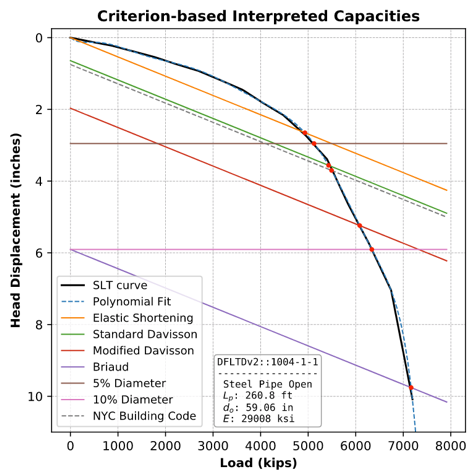
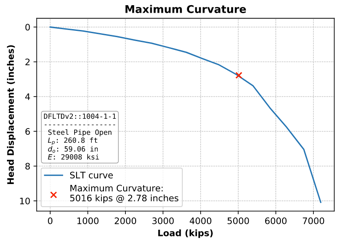
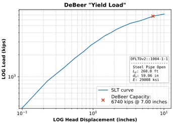
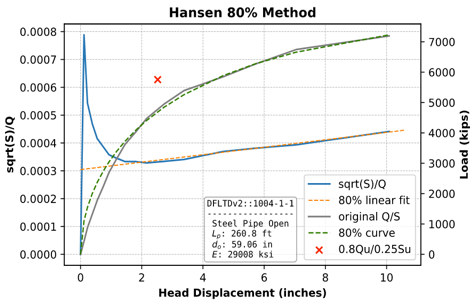
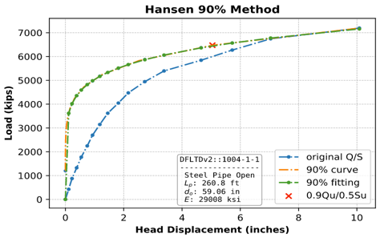
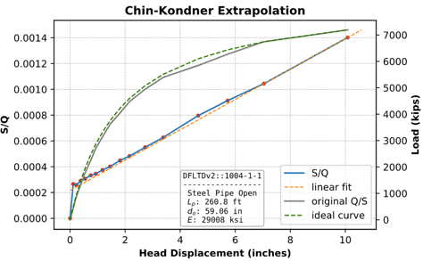
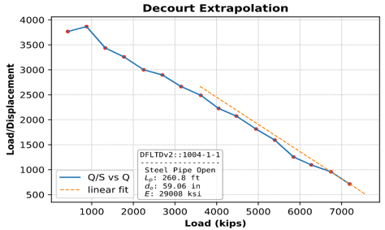

############################################
Presentation of Interpreted Capacity Methods
############################################

A number of criteria have been introduced throughout the years to determine the ultimate capacity of piles from static load test results. These criteria range in complexity, with the simplest interpreting the ultimate capacity as that corresponding to a settlement equal to a given percentile of pile diameter. Others relate the elastic compression of a pile to the load-settlement curve using an offset line. Yet others require further calculations and extrapolation and/or interpretation of the load-settlement curve. Common among all of these criteria is that nearly all have been developed for piles up to 24 inches in diameter.

For LDOEPs, AASHTO's Modified Davisson criterion is one the most popular (:ref:`AASHTO 2014 <AASHTO2014>`). However, the performance of Modified Davisson method has not been evaluated against the performance of other criteria.

.. TODO: revise the paragraph below

Interpretation criteria can be classified into various categories involving different schemas. One test is presented in this paper as an example in an effort to capture the general behavior of the load-settlement curves and interpretation criteria employed in this study. The chosen example is 260 ft. long, open-ended steel pipe pile with an embedment depth of 218.5 ft. and an outer diameter of 59 inches, installed in the Tokyo Port Bay Bridge project.

***********************
Settlement-Type Methods
***********************

One of the earliest recorded attempts to determine an interpreted criterion for a pile's failure load from its load-settlement curve was in 1942 when a committee proposed to define the failure load as *"the load that produces an increase in pile movement disproportional to the increase in the load"* (:ref:`ASCE Committee 1941 <ASCE1941>`). This definition was only concerned with the movement or the settlement of the pile. More importantly, it was ambiguous and subjective, which led Terzaghi to criticize it, and recommend to add the provision *"the failure load is not reached unless the penetration of the pile is at least equal to 10 % of the diameter at the tip (toe) of the pile"* (:ref:`Terzaghi, 1942 <Terzaghi1942>`). This apparently was the basis for the 10% criterion adopted initially by the Canadian Foundation Manual, and later on by other standards (:ref:`Fellenius, 2018 <Fellenius2018>`).

The most prevailing definition of the 10% criterion is the one that proposes that the failure load for a pile is the load that causes a settlement equal to the smaller of 10% of the pile end diameter or a gross settlement of 1.5 inches (:ref:`Reese et al., 2006 <Reese2006>`). The 10% criterion yielded reasonable results for small diameter piles and has been used by geotechnical engineers for decades, since it only requires rudimentary calculations. However, when applied to large diameter piles, the 10% criterion resulted in excessive settlement. This led to the introduction of a criterion where the interpreted capacity corresponds to a settlement equal to 5% of diameter. The 5% criterion was first introduced for drilled shafts and later adopted for driven piles. It is noteworthy that in a few cases the 5% criterion yielded higher capacity than the 10% criterion. This was attributed to the occurrence of strain softening after the application of the peak load.

*******************
Offset-Type Methods
*******************

The famous Davisson (:ref:`1972 <Davisson1972>`) Offset Limit Criterion was introduced in an effort to incorporate the pile and soil properties into the evaluation of interpreted capacity. This equation defines an offset line that intersects the load-settlement curve at the ultimate load. The offset line (:eq:`interp_eq1`) corresponds to a settlement equal to the elastic compression of a free-standing column (:math:`PL/AE`) plus the sum of settlements required to mobilize (i) end bearing (aka. quake = 10% of diameter) and (ii) skin friction (0.15 inch).

.. math::
   :label: interp_eq1

   \dfrac{QL}{AE} + \dfrac{b}{120} + 0.15 \textrm{ in.}

where:

.. |Q| replace:: :math:`Q`
.. |L| replace:: :math:`L`
.. |A| replace:: :math:`A`
.. |E| replace:: :math:`E`
.. |b| replace:: :math:`b`

:|Q|: test load
:|L|: total length of pile
:|A|: cross-sectional area
:|E|: material modulus
:|b|: pile diameter/width (inches)

The criterion was intended for small diameter driven piles and became popular due to its good accuracy and ease of use. Where a large diameter toe contributes significantly to the axial resistance, the displacement required to fully mobilize that toe resistance may be significant. To accommodate larger diameter piles and drilled shafts AASHTO (:ref:`2014 <AASHTO2014>`) recommends the modified Davisson Criterion as shown in :eq:`interp_eq2`.

.. math::
   :label: interp_eq2

   \dfrac{QL}{AE} + \dfrac{b}{30}

Briaud (:ref:`1988 <Briaud1988>`) published his take on the Davisson criterion. He was dissatisfied with the Davisson criterion being an allowable settlement criterion and not an ultimate capacity criterion and hence he modified the quake term and removed completely the buffer term in Davisson's original equation, as shown in :eq:`interp_eq3`.

.. math::
   :label: interp_eq3

   \dfrac{QL}{AE} + \dfrac{b}{10}

Another offset criterion is the one adopted by the New York City Building Code (NYCBC). It suggests that the ultimate capacity is taken as the smaller of (1) 50% of the load corresponding to a settlement equal to the elastic shortening of the pile plus 0.75 inch, :eq:`interp_eq4`, or (2) 50% of the load causing a settlement equal to 0.01 inch/ton. However, from practical experience it is observed that the first option prevails in most of the cases because the second criterion is deemed too conservative and is rarely applied. Hence, the first option was the one applied in this study.

.. math::
   :label: interp_eq4

   \dfrac{QL}{AE} + 0.75 \textrm{ in.}

An example applying all methods mentioned so far is presented in :numref:`interp_fig1`.

   Application of Settlement and Offset-Type Interpreted Capacity Methods

******************
Creep-Type Methods
******************

Creep-type interpretation methods are based on interpolation or extrapolation of the load-settlement curve, neglecting the pile dimensions and properties. For example, Vesic (:ref:`1963 <Vesic1963>`) proposed a criterion based on eye-balling the load-settlement curve. The method assumes that failure occurs when the rate of settlement is maximum which corresponds to the point with the maximum curvature on the load-settlement curve. This point is typically the point where the pile starts plunging. This point is denotes with a red X-mark on :numref:`interp_fig2`.

   Example of Capacity Interpretation by :ref:`Vesic, 1963 <Vesic1963>`

Similarly, DeBeer (:ref:`1968 <DeBeer1968>`) suggested that plotting the load-settlement data on a double logarithmic scale would help identify the failure load at the intersection of two linear trendlines, presumably representing elastic and plastic behavior. An example is shown in :numref:`interp_fig3`. From a practical standpoint, DeBeer’s method works if there is a significant change in slope. In any case, both of these methods are quite subjective, even if automated identification of maximum curvature is employed, because (1) load test data is rarely recorded at equally spaced intervals, and (2) the recorded measurements are typically noisy.

   Example of Capacity Interpretation by :ref:`DeBeer, 1968 <DeBeer1968>`

Hansen (:ref:`1963 <Hansen1963>`) proposed that pile capacity corresponds to the load, :math:`Q_u`, where the measured settlement :math:`\Delta_u` is four times the settlement at 80% of :math:`Q_u`. This criterion is known as *Hansen 80*. Hansen also suggested another criterion, *Hansen 90*, where the measured settlement :math:`\Delta_u` is twice the settlement at 90% of :math:`Q_u`. Traditionally, to obtain the load, settlement is plotted against the square root of :math:`\Delta/Q_u`. After failure, the curve becomes a straight line. The slope (:math:`C_1`) and the y-intercept (:math:`C_2`) of this straight portion are used to calculate the failure load and corresponding settlement. :eq:`interp_eq5` applies to *Hansen 80* and :eq:`interp_eq6` applies to *Hansen 90*. Similarly, :numref:`interp_fig4` presents an example application of *Hansen 80* and :numref:`interp_fig5` that of *Hansen 90*.

.. math::
   :label: interp_eq5

   Q_u = \dfrac{1}{2\sqrt{C_1 C_2}} \quad \textrm{and} \quad \Delta_u = \dfrac{C_2}{C_1}

.. math::
   :label: interp_eq6

   Q = Q_u \left( \dfrac{\delta}{\delta_u} \right) ^{0.152}

   Example of Capacity Interpretation by *Hansen 80*

   Example of Capacity Interpretation by *Hansen 90*

A number of other creep criteria are available, but are not widely used. For example, Housel (:ref:`1956 <Housel1956>`) proposed a creep criterion where static loading is applied in equal increments, at equal time intervals, and the pile head movement at the end of each interval is plotted against the total applied load. The ultimate load is defined as the point of intersection of two linear trend lines plotted on the creep versus load curve. Housel’s method is difficult to apply if the loading increments are not uniform, and for that reason, we were unable to use it in this study. Similarly, Van der Veen (:ref:`1953 <VanderVeen1953>`) noted that maximum curvature is dependent to a degree on the scale of the plot. His proposed criterion for deriving the ultimate capacity from the load-settlement curve employed a semi-logarithmic scale in which :math:`\ln (1-Q/Q_u)` is plotted versus the settlement, where :math:`Q` is the load on the pile toe and :math:`Q_u` is the ultimate resistance of the pile. Van der Veen based this formula on a biological function which describes *"the growth of a living individual as a function of time"*. The ultimate capacity is defined as the value of :math:`Q_u` that creates a straight line in the plot of :math:`\ln (1-Q/Q_u)` versus the settlement. Since the value of the ultimate resistance is not known during the application of the test, an iterative process is carried out to determine :math:`Q_u`.

***********************
Settlement Rate Methods
***********************

Chellis (:ref:`1961 <Chellis1961>`) summarized many of the interpretation criteria employed by a variety of codes at his time to define the ultimate capacity of a pile. These criteria were based on one of two concepts to determine the maximum allowable settlement. The first and most prevalent was that the settlement should not exceed 0.01 inch/ton of the test load. This idea was adopted by California, New York, Ohio, and Chicago states building codes, among others. The second concept was defining a specific settlement value ranging between 0.25 and 0.5 inches that the pile should not exceed; and was adopted by Boston building code, the New York Department of Public Works, the Louisiana Department of Highways, and AASHTO, among others.

   Example of Capacity Interpretation by :ref:`Chin and Kondner, 1971 <Chin1971>`

Settlement rate type criteria that were intended for quick load tests were introduced by Hoy and coworkers. Fuller and Hoy (:ref:`1970 <FullerHoy1970>`) suggested that :math:`Q_u` is associated with a slope of 0.05 inch/ton or greater on the gross load-settlement curve or a slope of 0.03 inch/ton or greater on the plastic load-settlement curve. The plastic load-settlement curve is obtained by removing the load applied to the pile multiple times during incremental loading and recording the rebounds. The method provides a way to determine an ultimate load for the piles that were not tested to failure and hence no actual or clear failure, such as plunging, has occurred. Later Butler and Hoy (:ref:`1976 <ButlerHoy1976>`) proposed a *Double-Tangent* criterion of interpreting the static load tests where the first line starts from the origin and tangent to the first portion of the curve. The second line is tangent to the steep section of the curve with a slope of 0.05 inch/ton for a pile test and 0.01 inch/ton for a drilled shaft test. They suggested that the ultimate load is the intersection point of these two tangent lines.

Chin and Kondner (:ref:`1971 <Chin1971>`) based their criterion on plotting each movement divided by its corresponding load against the movement. The plotted values eventually become a straight line, and the ultimate load is defined as the inverse slope of that line, as shown in :numref:`interp_fig6`. In our experience, the precise straight line does not emerge until the test load has passed the Davisson Offset Limit. Thus Chin-Kondner ultimate load is generally 20% to 40% larger than Davisson’s, with a correspondingly large displacement. Nevertheless, the Chin-Kondner criterion is a good tool in checking the consistency of the testing process as the Chin-Kondner plot would identify an anomaly if a problem occurs during the static load testing process.

   Example of Capacity Interpretation by :ref:`Decourt, 1999 <Decourt1999>`

Similar to Chin-Kondner, Decourt (:ref:`1999 <Decourt1999>`, :ref:`2008 <Decourt2008>`) proposed a criterion based on the extrapolation of the load-movement plot where each movement divided by its corresponding load is plotted against the applied load. The plotted values also become a straight line, and the ultimate load is defined as the intersection of the extension of that line with the x-axis, as shown in :numref:`interp_fig7`. The ultimate load from the Chin-Kondner criterion and the Decourt criteria are quite similar since both are based on the assumption of a hyperbolic load-settlement curve. The Decourt criterion has an advantage over Chin-Kondner as it enables the user to predict the projected ultimate capacity during the static load testing process by plotting the Decourt criterion once a straight-line plot starts to develop.
