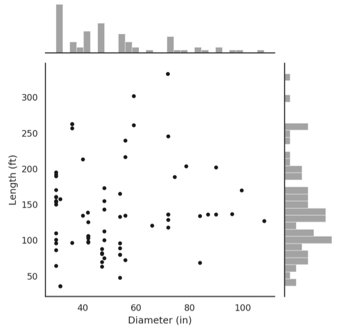
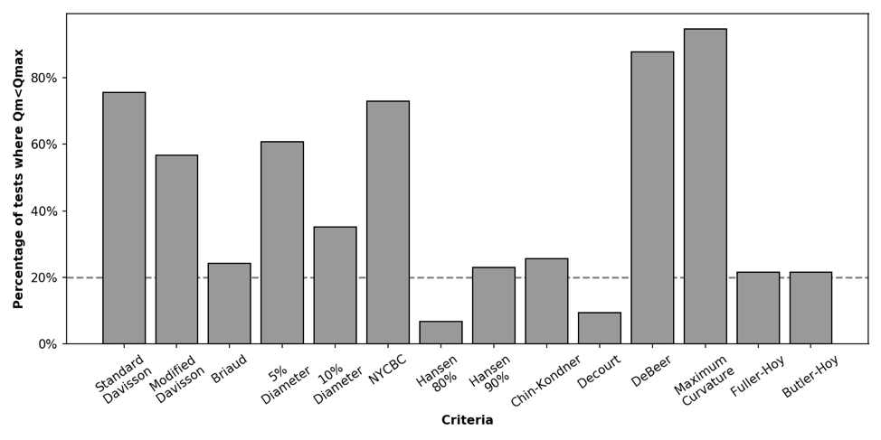
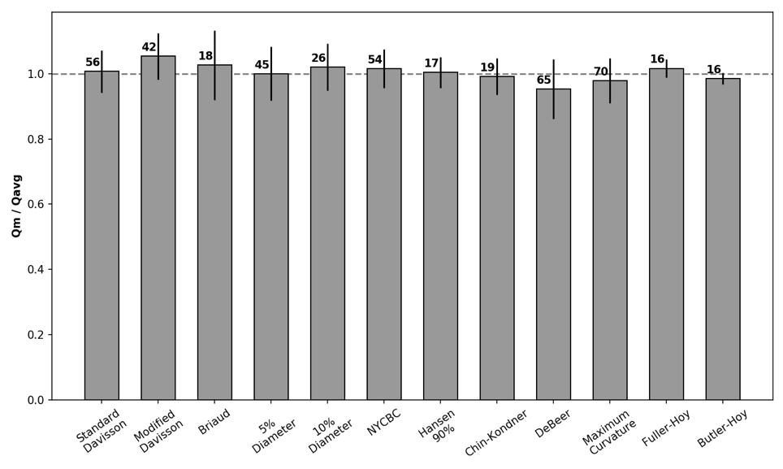
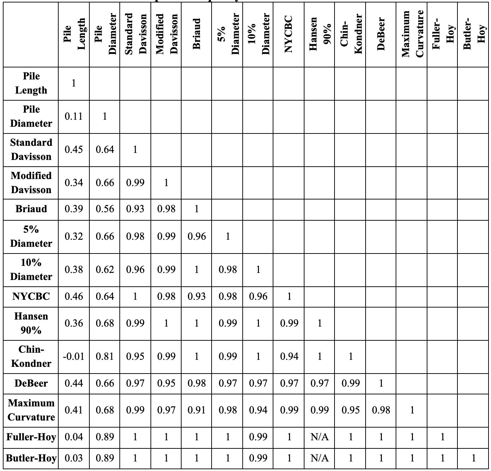
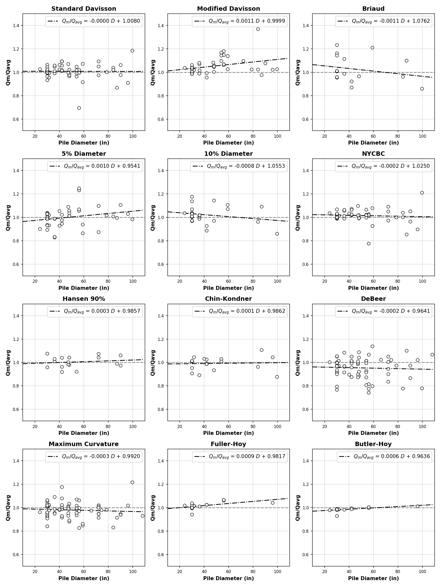
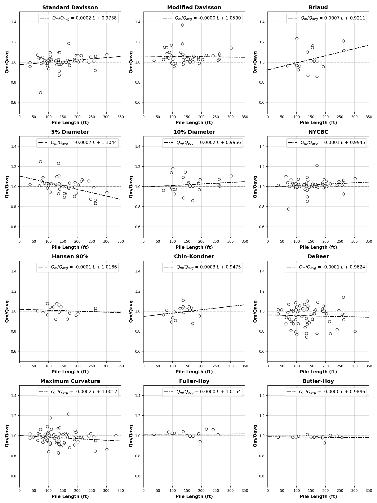
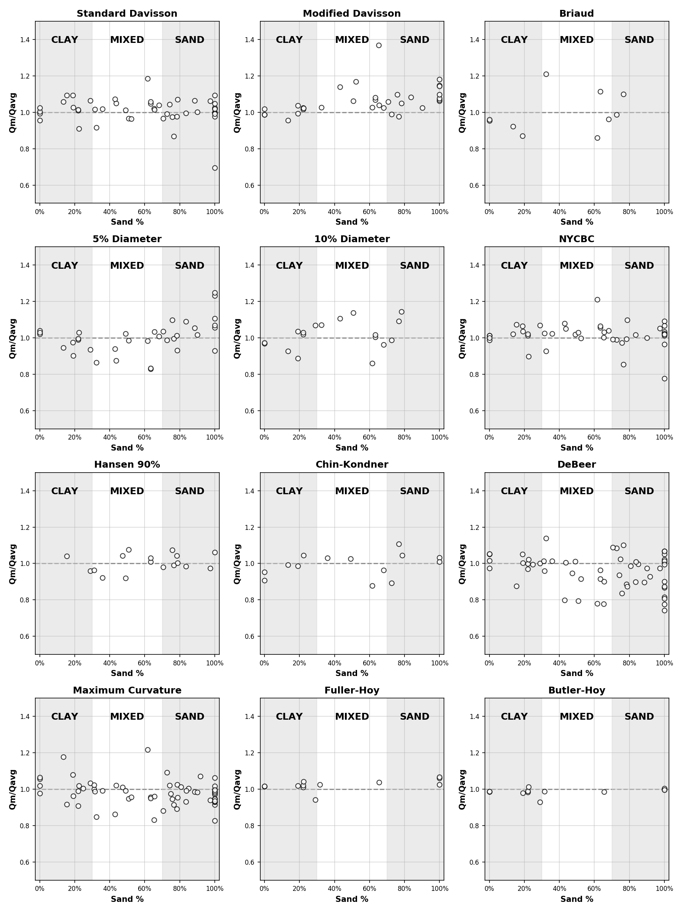

##########################################
Evaluation of Interpreted Capacity Methods
##########################################

The interpretation of field load tests on piles has many important practical considerations especially with respect to identifying the ultimate load capacity of a pile. A number of interpretation criteria have been used in the past. With the increase in the use of Large-Diameter Open-Ended Piles (LDOEPs) for support of infrastructure projects it is important to ascertain that the interpretation criteria are suitable for LDOEPs. Fourteen of the most commonly used interpretation criteria were chosen for investigation in this study in an effort to determine the best criterion to be used for LDOEPs. These methods were evaluated using a database of 74 load tests conducted on LDOEPs. The applicability of these methods and their correlation with each other and with the pile diameter and length were also examined. The effect of the pile diameter, pile length, and the soil type on the performance of each criterion was also explored. It was concluded that none of these methods was superior to the others, and their performance was somewhat close to each other. However, some were more applicable in more cases than others. It was also concluded that the Standard Davisson Offset method, and the New York City Building Code criteria showed better performance with respect to the other methods as they had the highest accuracy and among the lowest of the standard deviations. The scope was limited to load tests on impact or vibratory driven un-tapered steel and concrete pipe-piles loaded in compression, using a static load test. The objective is to assist engineers and highway departments in assessing the adequacy of current interpreted pile criteria for axial capacity of LDOEP.

Large-Diameter Open-Ended Piles (LDOEPs) are increasingly being used for support of infrastructure projects. Because of the importance and high expense of these structures, static load tests are often specified to determine the actual axial ultimate load capacity of LDOEPs. Static load tests permit improving reliability and economy of foundations by employing lower, but more realistic, factors of safety. An important consideration in the identification of the ultimate load capacity of a pile is the criterion employed for interpreting the ultimate load capacity (:ref:`Hannigan et al., 2016 <Hannigan2016a>`).

Because the ultimate load capacity or, ground truth, is unknown, the author has employed a statistical technique where all capacity interpretation criteria are compared to each other and the average is considered the ground truth.

****
Data
****

FHWA’s DFLTD v.2 has been migrated to a Relational Database Management System (:ref:`Machairas et al., 2018 <Machairas2018>`). The database contains a number of load tests on piles having diameters in the 30 to 118 in. range. DFLTD v.2 contained 139 load tests on LDOEPs. However only 74 load tests were static monotonic load tests with sufficient data quality, and these were the ones employed in this study. The distribution of length and diameter of the studied piles is summarized in :numref:`ldoep_interp_fig1`.

   Distribution of pile length and diameter of load tests used in the interpreted capacity study

Although LDOEPs are sometimes defined to include piles larger than 36 inches in diameter, in this study, LDOEP was defined to include piles larger than 30 inches in diameter for a number of reasons. First, to increase the size of available load tests for analysis by 15%. Second, because piles in the 30 to 36 inches are among the most commonly used piles sizes for support of infrastructure. Finally, the design methods have been developed using piling that was largely smaller than 30 inches in diameter.

A number of automated Python and Mathcad scripts were developed to assist in computing the various interpreted capacity criteria explored in this study. However, several methods required some manual manipulation (for example to confirm the point of maximum curvature). Thus, all data points were manually checked by two researchers.

********
Analysis
********

The fitness of available criteria for interpreting the ultimate capacity of LDOEPs was evaluated for the available load tests. The criteria considered in this study were:

1. Davisson offset limit criterion
2. Modified Davisson offset limit criterion
3. Briaud offset limit criterion
4. 10% Diameter settlement criterion
5. 5% Diameter settlement criterion
6. New York City Building Code offset limit criterion
7. Hansen 80% creep criterion
8. Hansen 90% creep criterion
9. Maximum Curvature creep criterion
10. DeBeer creep criterion
11. Chin-Kondner settlement rate criterion
12. Decourt settlement rate criterion
13. Fuller-Hoy settlement rate criterion
14. Butler-Hoy settlement rate criterion

The applicability of any interpretation criterion depends on several factors that relate to the workings of each criterion. The load-settlement curve presented in :numref:`interp_fig1` is a good example of tests that satisfied all criteria (i.e. the curve intersects with all the criteria plotted on it). However, this was not always the case since in many situations the load test was stopped before meeting some criteria. The ultimate load values obtained for various criteria shown in :numref:`interp_fig1` are presented in :numref:`ldoep_interp_table1` for comparison.

One issue that is mostly associated with large diameter piles is that the settlement required to satisfy some criteria is too large, and load tests are stopped before reaching the requisite value. Another issue encountered in available load test data was that the applied load during the test was relatively small in comparison to the pile capacity. This occurred since most tests were conducted on production, rather than sacrificial, piles. Finally, some criteria based on interpolation (e.g. Decourt, Hansen 80%, and Chin-Konder) led to capacities that were different from those obtained from all other methods and at times misleading (e.g. :numref:`ldoep_interp_table1`).

.. table:: Ultimate Capacities of the Example Pile
   :widths: auto
   :align: center
   :name: ldoep_interp_table1

   +------------------------+--------------------+---------------------+
   | Method                 | :math:`Q_u` (tons) | :math:`Q_m/Q_{avg}` |
   +========================+====================+=====================+
   | Maximum Applied Load   | 3597               |                     |
   +------------------------+--------------------+---------------------+
   | 10% Diameter           | 3170               | 1.070               |
   +------------------------+--------------------+---------------------+
   | 5% Diameter            | 2562               | 0.865               |
   +------------------------+--------------------+---------------------+
   | Standard Davisson      | 2715               | 0.917               |
   +------------------------+--------------------+---------------------+
   | Modified Davisson      | 3042               | 1.027               |
   +------------------------+--------------------+---------------------+
   | Briaud                 | 3583               | 1.210               |
   +------------------------+--------------------+---------------------+
   | NYCBC                  | 2746               | 0.927               |
   +------------------------+--------------------+---------------------+
   | Hansen 80%             | n/a                | n/a                 |
   +------------------------+--------------------+---------------------+
   | Hansen 90%             | n/a                | n/a                 |
   +------------------------+--------------------+---------------------+
   | Chin and Kondner       | n/a                | n/a                 |
   +------------------------+--------------------+---------------------+
   | Decourt                | n/a                | n/a                 |
   +------------------------+--------------------+---------------------+
   | DeBeer                 | 3370               | 1.001               |
   +------------------------+--------------------+---------------------+
   | Maximum Curvature      | 2508               | 0.845               |
   +------------------------+--------------------+---------------------+
   | **Average**            | **2962**           | **1.000**           |
   +------------------------+--------------------+---------------------+
   | **Standard Deviation** | **392**            | **0.130**           |
   +------------------------+--------------------+---------------------+

The t-test is a statistical test to determine the confidence level for populations with fewer than 30 data points. It approaches a Gaussian distribution for populations with 30 or more data points. A statistical t-test analysis of the data in :numref:`ldoep_interp_table1`, excluding the points that are higher than the maximum applied load i.e. does not fall on the load-settlement curve, suggests that :math:`Q_{avg}` = 2962 ± 293 tons may be considered the ultimate capacity (or ground truth) with a confidence of 95%. This corresponds to a normalized confidence interval :math:`Q_m/Q_{avg}` = 1 ± 0.11. Confidence depends on (1) the number of criteria that can be used for each load test, as well as the values of the (2) standard deviation and (3) mean. A t-test was performed on all tests, where 5 or more criteria could be applied and yielded :math:`Q_m/Q_{avg}` = 1 ± 0.005–0.55 for a confidence of 95% for all tests under consideration. The mean and standard deviation of the confidence interval for 95% confidence interval that :math:`Q_m/Q_{avg}` = 1 were 0.08 ± 0.09 for these tests, which is cause for confidence.

*****************************
Utility of Available Criteria
*****************************

The ultimate capacity interpreted using 14 different criteria was compared to the maximum applied load during the load test, for all available 74 load tests on LDOEPs. The percentage of tests where the applied load (:math:`Q_{max}`) is larger than the interpreted capacity (:math:`Q_m`) for each criterion is presented in :numref:`ldoep_interp_fig2`. The percentages ranged between 7 and 95%. This metric provides a means of assessing the utility of each criterion for routine geotechnical work. It is evident that some methods are too impractical to use for load testing of LDOEPs, and therefore should not be specified. In this study we excluded Hansen 80% and Decourt criteria from further consideration since they applied to fewer than 20% of available load tests, leaving 12 criteria for further comparison.

   Percentage of tests where :math:`Q_m < Q_u`

*****************************************
Variability of Computed Ultimate Capacity
*****************************************

The ultimate capacity interpreted using each criterion (:math:`Q`) was compared to the average of interpreted capacities calculated using all 12 remaining criteria (:math:`Q_{avg}`). This was done for each load test independently, and the results were averaged for all load tests. It is noteworthy that in many cases the applied load did not permit using some of the criteria, so the reported average (:math:`Q_{avg}`) represents the average of ultimate capacities where the criterion can be applied. The results are presented in :numref:`ldoep_interp_fig3` as a bar chart of the normalized interpreted load for each criterion.

To ensure the integrity of the analysis, we attempted to exclude outlier data points from the analysis. The outliers rule chosen in this study was any data point beyond three standard deviations from the mean. However, it was noticed that this filter only leads to the exclusion of one data point for DeBeer and two data points for the maximum curvature criterion, so it was abandoned.

   Normalized :math:`Q_m` for each method

The normalized ultimate capacities for each criterion presented in :numref:`ldoep_interp_fig3` are useful in assessing the suitability of various interpretation methods for interpreting the ultimate capacity of LDOEPs in practice. The number on top of each column in the bar chart represents the number of load tests employed to compute the average, and the spread of the data is expressed with an error line representing the standard deviation of the :math:`Q_m/Q_{avg}`. The statistics of :math:`Q_m/Q_{avg}` are also presented in :numref:`ldoep_interp_table2` for each method under investigation, along with the percentage of tests where :math:`Q_m` was less than :math:`Q_u`. On average, none of the methods produced ultimate capacity that is above or below the average of all criteria by more than 5%. This may have occurred because all criteria were used in the average and therefore large differences cannot be expected, hence the normalization by the average technique used in this study. It was observed that the ultimate capacities resulting from Modified Davisson, Briaud, the 10% diameter, the NYCBC, and Fuller-Hoy criteria are above the average of all criteria, while the ultimate capacities from the 5% Diameter, Chin-Kondner, DeBeer, and Butler-Hoy criteria are below the average of all criteria. It was also noticed that Fuller-Hoy and Butler-Hoy methods exhibited the smallest standard deviation of :math:`Q_m/Q_{avg}` in the group, but this may have been influenced by the small percentage of cases (22%) were these methods could be applied.

.. table:: Performance statistics of various ultimate capacity interpretation methods normalized by the average of all methods
   :widths: auto
   :align: center
   :name: ldoep_interp_table2

   +-------------------+-------------------------+-----------------------+---------------------------------------------+
   | Method            | % :math:`Q_m > Q_{avg}` | :math:`Q_m > Q_{avg}` | Standard Deviation of :math:`Q_m > Q_{avg}` |
   +===================+=========================+=======================+=============================================+
   | Standard Davisson | 72.68                   | 1.014                 | 0.074                                       |
   +-------------------+-------------------------+-----------------------+---------------------------------------------+
   | Modified Davisson | 56.76                   | 1.062                 | 0.073                                       |
   +-------------------+-------------------------+-----------------------+---------------------------------------------+
   | Briaud            | 24.32                   | 1.045                 | 0.105                                       |
   +-------------------+-------------------------+-----------------------+---------------------------------------------+
   | 5% Diameter       | 60.81                   | 1.009                 | 0.092                                       |
   +-------------------+-------------------------+-----------------------+---------------------------------------------+
   | 10% Diameter      | 35.14                   | 1.034                 | 0.076                                       |
   +-------------------+-------------------------+-----------------------+---------------------------------------------+
   | NYCBC             | 72.97                   | 1.022                 | 0.067                                       |
   +-------------------+-------------------------+-----------------------+---------------------------------------------+
   | Hansen 90%        | 22.97                   | 1.004                 | 0.047                                       |
   +-------------------+-------------------------+-----------------------+---------------------------------------------+
   | Chin-Kondner      | 12.16                   | 0.984                 | 0.087                                       |
   +-------------------+-------------------------+-----------------------+---------------------------------------------+
   | DeBeer            | 87.84                   | 0.958                 | 0.102                                       |
   +-------------------+-------------------------+-----------------------+---------------------------------------------+
   | Maximum Curvature | 94.59                   | 0.985                 | 0.083                                       |
   +-------------------+-------------------------+-----------------------+---------------------------------------------+
   | Fuller-Hoy        | 21.62                   | 1.017                 | 0.028                                       |
   +-------------------+-------------------------+-----------------------+---------------------------------------------+
   | Butler-Hoy        | 21.62                   | 0.986                 | 0.017                                       |
   +-------------------+-------------------------+-----------------------+---------------------------------------------+

***********************************
Usability While Performing the Test
***********************************

The process of applying an interpretation criterion typically happens after finishing the test and collecting the necessary data. Offset and settlement type methods can be applied during the test, to determine when the test should be stopped. However, a few of these criteria can be applied during the testing phase to identify testing anomalies. For example, the Chin-Kondner and Decourt criteria can be used to check the uniformity of the pile response to the test, or more commonly to “eyeball” the failure load of the pile. Chin-Kondner can be used to check the consistency of the pile response to the test and detecting any anomaly in the pile behavior, while Decourt may be used to “eyeball” the failure load once a straight-line plot starts to develop in the load-settlement curve.

**********************************************
Correlation of Various Methods with Each Other
**********************************************

The existence of a correlation among the various criteria and with the pile properties was explored next. Correlation analysis was performed using a standard Python function that creates a correlation matrix based on Pearson's correlation coefficients. These coefficients are used to measure the strength of the linear association between two variables and ranges between -1 to 1. A coefficient of 1 refers to *perfect positive correlation*, meaning that for every positive increase in one variable there is an increase in the second variable equal in magnitude, while -1 refers to *perfect negative correlation*, where for every decrease in one variable there is a decrease in the other variable equal in magnitude. Finally, a correlation coefficient of 0 indicates no relation at all between the two variables under investigation.

Interpretation of the meaning of correlation coefficients depends on the domain of comparison. For this study, we defined a simple interpretation criterion to better understand the meaning of the correlation coefficient, where 0-0.29 indicates negligible correlation, 0.3-0.49 indicates weak positive correlation, 0.50-0.79 indicates moderate positive correlation, and 0.8-0.99 indicates strong positive correlation, and the same goes in the negative direction.

Pearson correlation analysis among pile dimensions and the 12 ultimate capacity criteria under consideration is presented in :numref:`ldoep_interp_fig4`. Two trends are immediately evident. The first is that is that correlation between various methods is strong, with the correlation coefficients among the different criteria ranging between 0.94 and 1. This is perhaps to be expected since all ultimate capacity criteria seek the same goal.

   Correlation of Interpreted Capacity Criteria with Pile Dimensions and Each Other

The second trend is that the correlation between pile diameter with all of the 12 criteria is moderate, ranging from 0.56 to 0.81, while the correlation of length with the 12 criteria is negligible to poor, ranging from -0.01 to 0.45. This is encouraging, since the correlation of any criterion with diameter or length suggests that the interpreted capacity is diameter or length dependent, which is undesirable. In general, the highest level of correlation with length was found between it and the offset methods, which is perhaps not surprising considering that these methods incorporate a length based elastic compression. Good correlation was also observed between Length and methods based on identifying maximum curvature (Maximum Curvature and DeBeer). Correlation with diameter was decidedly better than correlation with length. The highest level of correlation with diameter was found between the diameter and settlement-rate type methods (Fuller-Hoy, Butler-Hoy, and Chin Conder), with correlation coefficients in the 0.81–0.89 range. Offset type and settlement type methods had correlation coefficients of 0.56–0.64 and 0.62–0.66, respectively.

******************
Effect of Diameter
******************

Pile diameter is an important variable in many interpretation criteria for determining the ultimate capacity from the load-settlement curve. It is the basis of the first legitimate code criterion and has been incorporated in most of the criteria afterwards such as the Davisson criterion and its extensions. Henceforth comes the importance of investigating the presence of a relation between the diameter and the behavior of each criterion.

The dependence of the interpreted ultimate capacity using each criterion (:math:`Q_m`) on the pile diameter was explored in :numref:`ldoep_interp_fig5`, where the data was normalized by the average of interpreted capacities calculated using all 12 remaining criteria (:math:`Q_{avg}`). This was done for each load test independently, with the reported average (:math:`Q_{avg}`) representing the average of ultimate capacities where the criterion can be applied for each pile.

A scatter plot of the diameter with respect to the normalized measured ultimate load (:math:`Q_m/Q_{avg}`) obtained using each criterion is plotted in :numref:`ldoep_interp_fig5`. Trendlines were computed and found to range from 0.0011D to -0.0011D. In all cases, the slopes of the trend lines were relatively small. The classical Davisson and the New York City Building Code methods exhibited a negligible slope, which is optimal. A few methods such as Maximum Curvature and 10% diameter exhibited a negative slope, in the trend lines suggesting that as the diameter increases the criterion tends to resulting in ultimate capacity that is below the average of all criteria, in comparison to other criteria. Alternatively, 5%-Diameter, Modified Davisson, and Fuller Hoy exhibited distinct positive slopes, suggesting that as the diameter increases the criterion tends to resulting in ultimate capacity that is above the average of all criteria, in comparison to other criteria. In any case, the slopes were generally very small, for example an increase in diameter from 36 to 72 inches contributes to a change in :math:`Q_m/Q_{avg}` of 0.04 in Modified Davisson, and -0.01 in the Maximum Curvature method.

   Influence of Pile Diameter on Normalized Interpreted Capacity

****************
Effect of Length
****************

The relation between the embedded depth and the normalized measured ultimate load (:math:`Q_m/Q_{avg}`) obtained using each criterion was investigated in :numref:`ldoep_interp_fig6`, in a manner similar to that presented previously for the diameter. Trendlines were computed and found to range from -0.002L to 0.007L. A positive trend line suggests that the method results in ultimate capacity that is above the average of all criteria in comparison to other approaches, and vice versa. The trendlines demonstrate a number of undesirable features in most criteria. First, the most commonly used methods exhibit some trend. Second, Modified Davisson, while exhibiting a negligible trendline, has a positive offset, suggesting that it consistently produce an above average ultimate capacity in comparison to other methods. Third, most criteria exhibited negative slopes in their trendlines, which indicates that as the pile length increases the criterion tended to produce ultimate capacity that is below the average of all criteria. In any case, the slopes were generally small, for example an increase in length of 100 ft contributes to a change in :math:`Q_m/Q_{avg}` of 0.2 in Davisson, and -0.07 in 5% of diameter.

Compared to the diameter, it is evident that pile length plays a more prominent role in affecting various interpreted capacity criteria.

   Influence of Pile Length on Normalized Interpreted Capacity

*******************
Effect of Soil Type
*******************

Pile behavior varies depending on the soil type, hence it is important to confirm that any capacity interpretation criteria is independent of the type of soil where the pile has been installed. The relationship between the soil type was explored as follows. First, the percentage of sand was computed by taking the weighted average of the soil layer heights, containing cohesionless soils, along the depth of the pile. This is obviously less accurate than computing the pile capacities, but since this study did not involve any capacity computations it was deemed a sufficiently practical approach. Next, the relationship between the soil type and the normalized measured ultimate load (:math:`Q_m/Q_{avg}`) for each criterion was explored in :numref:`ldoep_interp_fig7` where a scatterplot for the percentage of capacity from cohesionless soils (% sand) is plotted against the normalized interpreted capacity (:math:`Q_m/Q_{avg}`) for each test. The interpreted capacity (:math:`Q_m`) was normalized by the average of ultimate capacities (:math:`Q_{avg}`) where the criterion can be applied for each load test. Three arbitrary demarcation zones are shown depicting clays (0-30% sand of the capacity from sand), mixed soils (30-70% sand) and sandy soils (70-100%). No pattern of over-prediction or under-prediction of the ultimate capacity was observed in any criterion with the change of the soil type, which means that the behavior of all criteria is not influenced by the increase or decrease of the sand or clay percentages.

   Effect of Soil Type on Normalized Interpreted Capacity

***********
Limitations
***********

During this study, several limitations were encountered that need to be mentioned. The first constraint was the absence of any data about the piling engineering behind the application of the load tests. There was no data regarding the loading step or the duration of the loading for instance. This required us to ignore the effect of the piling engineering on the evaluation of the criteria applied and rely on the statistical analysis only in evaluating all the criteria in this study.

It is important to mention also that the effect of soil plugging was not considered in this study. Soil plugging is associated with the pile diameter and the pile length. As a pile diameter increases, the effect of pile diameter on the axial capacity of the pile will be less correlated with the pile length. Additionally, above a certain diameter coring is very unlikely and the end bearing capacity is directly associated with the capacity mobilized from the inside and outside of the pipe pile. This might explain why the correlation with pile diameter was better than the correlation with the length as mentioned previously. However, the effect of plugging was not accounted for and the analysis was solely based on the results from the static loading tests and the shape of load-settlement curve. Moreover, none of the criteria in this study takes into account the effect of soil plugging in determining the capacity of the piles, and our analysis followed the same trend.

Another critical drawback was the limited information about the soil conditions for the load tests in the database. Ideally the percentage capacity in sand should be captured from the soil properties. However, not all tests had sufficient data to calculate the actual capacity of the piles, in fact, some load tests had no very limited to no information regarding the soil properties for the load tests. Therefore, we opted for using the weighted average of the soil layer heights, and dividing the soils into sand and clay only.

**************************
Discussion and Conclusions
**************************

The performance of 14 ultimate capacity interpretation criteria, in common use, was evaluated using a database of 74 load settlement tests conducted on LDOEPs. The piles ranged in diameter from 30 to 118 inches. None of the criteria exhibit a strong correlation with diameter, pile length, or soil type. However, only six of 14 methods could be applied to over 50% of the tests. As a practical matter, these are the only methods that can be specified with confidence. The six methods are (1) Standard Davisson, (2) Modified Davisson, (3) 5% Diameter, (4) New York City Building Code, (5) Maximum Curvature, and (6) Debeer. The conclusions drawn for these six are presented below:

1. **Standard Davisson** deserves its long standing popularity. It exhibited a small length effect and no correlation with diameter. The method performs with less scatter in clays in comparison to sands.
2. **Modified Davisson** appears to be resulting in an ultimate capacity that is above the average of all criteria, in comparison to other criteria. The distance from the average increases with pile diameter, but does not appear to be influenced by pile length. The scatter in :math:`Q_m/Q_{avg}` increases with the increase of percentage of capacity from sands in the profile.
3. **5% Diameter** appears inferior to both standards and modified Davisson criteria. The method produces interpreted capacities that is above the average of all criteria with diameter, lower than the average of all criteria with pile length, and exhibits significant scatter.
4. **New York City Building Code** performs somewhat similar to the two Davisson methods. It has a lower standard deviation than either method, suggesting that it is more precise.
5. **Maximum Curvature** is applicable to many cases. However, it suffers from several defects. First, the identification of the point of maximum curvature is typically subjective because (1) load test data is rarely recorded at equally spaced intervals, and (2) the recorded measurements are typically noisy. These defects make the approach unsuitable for specifications.
6. **Debeer** is applicable to many cases. However, it suffers from the same defects like the Maximum Curvature method, and is therefore somewhat subjective. So it is not suited for routine work or specifications.

In summary, none of the criteria excelled in consistently identifying the ultimate load, in comparison to the rest. Is it perhaps time for a new criterion? At this time, the authors believe that the traditional Standard Davisson offset limit followed by the New York City building code (NYCBC) are the best available methods for LDOEPs. Although neither criterion was developed for large diameter piles, these two methods have the highest accuracy (:math:`Q_m/Q_{avg}` = 1.014 and 1.022, for Davisson and NYCBC, respectively). They also exhibit the lowest, and third lowest standard deviations among the six criteria applicable to the majority of load tests of 0.074 and 0.067 for Davisson, and NYCBC, respectively, thus suggesting that they are also more precise. In comparison, the modified Davisson which was intended for large diameter piles has :math:`Q_m/Q_{avg}` = 1.062, with a standard deviation of 0.073. So its continued specification for LDOEPs, while not unreasonable, requires further research especially that it requires a larger settlement to develop the capacity that may not be optimal from a serviceability standpoint.

