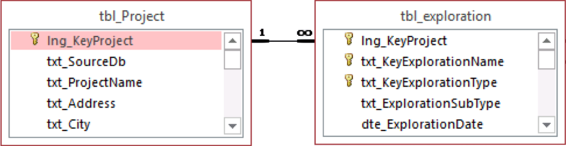

.. note::

   All information in this section comes from :ref:`Petek et al., 2016 <Petek2016>`
   and :ref:`Shannon & Wilson, 2015 <ShannonWilson2015>`.

.. hint::

   The units based on which values were stored in relevant columns had to be
   determined from stored data, there was no mention in existing documentation.

.. figure:: figures/DFLTD_v2_ER_Diagram.png
   :target: figures/DFLTD_v2_ER_Diagram.png
   :align: center
   :alt: DFLTD_v2_ER_Diagram.png

   DFLTD v.2 Entity Relationship Diagram exported from MS Access (web-doc: click to enlarge)

   DFLTD v.2 Database Table Relationships, from :ref:`Petek et. al (2016) <Petek2016>`
   (web-doc: click to enlarge)

Data Tables
===========

Project Table
-------------

**Name:**
  ``tbl_Project``

**Description:**
  Project descriptive data, e.g. project name, data provider, consultant etc.

.. csv-table:: tbl_Project
   :file: tables/dfltd_v2/tbl_Project.csv
   :header-rows: 1
   :widths: 15, 7, 3, 4, 15
   :align: center

Exploration Tables
------------------

**Name:**
  ``tbl_Exploration``

**Description:**
  Exploration general descriptive data, e.g. exploration type, location, date, predominant soil unit, etc.

   ``Exploration`` Table Relationships
   (web-doc: click to enlarge)

.. csv-table:: tbl_Exploration
   :file: tables/dfltd_v2/tbl_Exploration.csv
   :header-rows: 1
   :widths: 15, 7, 3, 4, 15
   :align: center

**Name:**
  ``tbl_ExplorationBoring``

**Description:**
  Soil or rock boring data by depth, e.g. blow counts, USCS designation, etc.

   ``ExplorationBoring`` Table Relationships
   (web-doc: click to enlarge)

.. csv-table:: tbl_ExplorationBoring
   :file: tables/dfltd_v2/tbl_ExplorationBoring.csv
   :header-rows: 1
   :widths: 15, 7, 3, 4, 15
   :align: center

**Name:**
  ``tbl_ExplorationPressuremeter``

**Description:**
  Pressuremeter data by depth, measurements, and interpreted results.

   ``tbl_ExplorationPressuremeter`` Table Relationships
   (web-doc: click to enlarge)

.. csv-table:: tbl_ExplorationPressuremeter
   :file: tables/dfltd_v2/tbl_ExplorationPressuremeter.csv
   :header-rows: 1
   :widths: 15, 7, 3, 4, 15
   :align: center

**Name:**
  ``tbl_ExplorationVaneField``

**Description:**
  Field vane shear test data by depth, measurements, and interpreted results.

.. figure:: tables/dfltd_v2/tbl_ExplorationVaneField.png
   :target: tables/dfltd_v2/tbl_ExplorationVaneField.png
   :align: center
   :alt: tbl_ExplorationVaneField.png

   ``tbl_ExplorationVaneField`` Table Relationships
   (web-doc: click to enlarge)

.. csv-table:: tbl_ExplorationVaneField
   :file: tables/dfltd_v2/tbl_ExplorationVaneField.csv
   :header-rows: 1
   :widths: 15, 7, 3, 4, 15
   :align: center

**Name:**
  ``tbl_ExplorationVaneStepBlade``

**Description:**
  Step blade vane shear test data by depth, measurements, and interpreted results.

   ``tbl_ExplorationVaneStepBlade`` Table Relationships
   (web-doc: click to enlarge)

.. csv-table:: tbl_ExplorationVaneStepBlade
   :file: tables/dfltd_v2/tbl_ExplorationVaneStepBlade.csv
   :header-rows: 1
   :widths: 15, 7, 3, 4, 15
   :align: center

.. warning::

   Table ``tbl_ExplorationGroundwaterMonitoring`` is empty.

**Name:**
  ``tbl_ExplorationGroundwaterMonitoring``

**Description:**
  Groundwater measurements from a monitoring well or VWP, including date-time, depth to water.

.. figure:: tables/dfltd_v2/tbl_ExplorationGroundwaterMonitoring.png
   :target: tables/dfltd_v2/tbl_ExplorationGroundwaterMonitoring.png
   :align: center
   :alt: tbl_ExplorationGroundwaterMonitoring.png

   ``tbl_ExplorationGroundwaterMonitoring`` Table Relationships
   (web-doc: click to enlarge)

.. csv-table:: tbl_ExplorationGroundwaterMonitoring
   :file: tables/dfltd_v2/tbl_ExplorationGroundwaterMonitoring.csv
   :header-rows: 1
   :widths: 15, 7, 3, 4, 15
   :align: center

.. warning::

   Table ``tbl_ExplorationDynamicMeasurements`` is empty.

**Name:**
  ``tbl_ExplorationDynamicMeasurements``

**Description:**
  Shear and compression wave velocity data by depth, measurements and interpreted results.

   ``tbl_ExplorationDynamicMeasurements`` Table Relationships
   (web-doc: click to enlarge)

.. csv-table:: tbl_ExplorationDynamicMeasurements
   :file: tables/dfltd_v2/tbl_ExplorationDynamicMeasurements.csv
   :header-rows: 1
   :widths: 15, 7, 3, 4, 15
   :align: center

**Name:**
  ``tbl_ExplorationLabResults``

**Description:**
  Laboratory test results by depth.

   ``tbl_ExplorationLabResults`` Table Relationships
   (web-doc: click to enlarge)

.. csv-table:: tbl_ExplorationLabResults
   :file: tables/dfltd_v2/tbl_ExplorationLabResults.csv
   :header-rows: 1
   :widths: 15, 7, 3, 4, 15
   :align: center

**Name:**
  ``tbl_ExplorationSoilLayerBoring``

**Description:**
  Interpreted soil layering at exploration location.

.. figure:: tables/dfltd_v2/tbl_ExplorationSoilLayerBoring.png
   :target: tables/dfltd_v2/tbl_ExplorationSoilLayerBoring.png
   :align: center
   :alt: tbl_ExplorationSoilLayerBoring.png

   ``tbl_ExplorationSoilLayerBoring`` Table Relationships
   (web-doc: click to enlarge)

.. csv-table:: tbl_ExplorationSoilLayerBoring
   :file: tables/dfltd_v2/tbl_ExplorationSoilLayerBoring.csv
   :header-rows: 1
   :widths: 15, 7, 3, 4, 15
   :align: center

.. warning::

   This table is missing description and in MS Access.

**Name:**
  ``tbl_ExplorationSoilLayerCPT``

**Description:**
  Interpreted soil layering at exploration location.

.. csv-table:: tbl_ExplorationSoilLayerCPT
   :file: tables/dfltd_v2/tbl_ExplorationSoilLayerCPT.csv
   :header-rows: 1
   :widths: 15, 7, 3, 4, 15
   :align: center

**Name:**
  ``tbl_ExplorationCPT``

**Description:**
  Cone penetrometer data by depth, e.g. measured tip resistance, interpreted soil behavior type, etc.

   ``tbl_ExplorationCPT`` Table Relationships
   (web-doc: click to enlarge)

.. csv-table:: tbl_ExplorationCPT
   :file: tables/dfltd_v2/tbl_ExplorationCPT.csv
   :header-rows: 1
   :widths: 15, 7, 3, 4, 15
   :align: center

**Name:**
  ``tbl_ExplorationDilatometer``

**Description:**
  Dilatometer data by depth, measurements and interpreted results.

   ``tbl_ExplorationDilatometer`` Table Relationships
   (web-doc: click to enlarge)

.. csv-table:: tbl_ExplorationDilatometer
   :file: tables/dfltd_v2/tbl_ExplorationDilatometer.csv
   :header-rows: 1
   :widths: 15, 7, 3, 4, 15
   :align: center

Deep Foundation Tables
----------------------

**Name:**
  ``tbl_DeepFoundation``

**Description:**
  Deep foundation general descriptive data, e.g. type, length, location, etc.

.. figure:: tables/dfltd_v2/tbl_DeepFoundation.png
   :target: tables/dfltd_v2/tbl_DeepFoundation.png
   :align: center
   :alt: tbl_DeepFoundation.png

   ``tbl_DeepFoundation`` Table Relationships
   (web-doc: click to enlarge)

.. csv-table:: tbl_DeepFoundation
   :file: tables/dfltd_v2/tbl_DeepFoundation.csv
   :header-rows: 1
   :widths: 15, 7, 3, 4, 15
   :align: center

**Name:**
  ``tbl_DeepFoundationDistToExploration``

**Description:**
  Distance from deep foundation element to each site exploration.

   ``tbl_DeepFoundationDistToExploration`` Table Relationships
   (web-doc: click to enlarge)

.. csv-table:: tbl_DeepFoundationDistToExploration
   :file: tables/dfltd_v2/tbl_DeepFoundationDistToExploration.csv
   :header-rows: 1
   :widths: 15, 7, 3, 4, 15
   :align: center

**Name:**
  ``tbl_DeepFoundationSoilLayer``

**Description:**
  Interpreted soil layering at deep foundation location.

   ``tbl_DeepFoundationSoilLayer`` Table Relationships
   (web-doc: click to enlarge)

.. csv-table:: tbl_DeepFoundationSoilLayer
   :file: tables/dfltd_v2/tbl_DeepFoundationSoilLayer.csv
   :header-rows: 1
   :widths: 15, 7, 3, 4, 15
   :align: center

**Name:**
  ``tbl_DescriptionAugerCast``

**Description:**
  Auger cast pile descriptive data, e.g. diameter, reinforcement, etc.

   ``tbl_DescriptionAugerCast`` Table Relationships
   (web-doc: click to enlarge)

.. csv-table:: tbl_DescriptionAugerCast
   :file: tables/dfltd_v2/tbl_DescriptionAugerCast.csv
   :header-rows: 1
   :widths: 15, 7, 3, 4, 15
   :align: center

**Name:**
  ``tbl_DescriptionCylinderConcrete``

**Description:**
  Concrete cylinder pile descriptive data, e.g. diameter, prestress pressure, etc.

.. figure:: tables/dfltd_v2/tbl_DescriptionCylinderConcrete.png
   :target: tables/dfltd_v2/tbl_DescriptionCylinderConcrete.png
   :align: center
   :alt: tbl_DescriptionCylinderConcrete.png

   ``tbl_DescriptionCylinderConcrete`` Table Relationships
   (web-doc: click to enlarge)

.. csv-table:: tbl_DescriptionCylinderConcrete
   :file: tables/dfltd_v2/tbl_DescriptionCylinderConcrete.csv
   :header-rows: 1
   :widths: 15, 7, 3, 4, 15
   :align: center

**Name:**
  ``tbl_DescriptionDrilledShaft``

**Description:**
  Drilled shaft descriptive data, e.g. diameter, casing length, etc.

   ``tbl_DescriptionDrilledShaft`` Table Relationships
   (web-doc: click to enlarge)

.. csv-table:: tbl_DescriptionDrilledShaft
   :file: tables/dfltd_v2/tbl_DescriptionDrilledShaft.csv
   :header-rows: 1
   :widths: 15, 7, 3, 4, 15
   :align: center

**Name:**
  ``tbl_DescriptionHPile``

**Description:**
  H pile descriptive data, e.g. area, flange width, etc.

   ``tbl_DescriptionHPile`` Table Relationships
   (web-doc: click to enlarge)

.. csv-table:: tbl_DescriptionHPile
   :file: tables/dfltd_v2/tbl_DescriptionHPile.csv
   :header-rows: 1
   :widths: 15, 7, 3, 4, 15
   :align: center

**Name:**
  ``tbl_DescriptionMonotube``

**Description:**
  Monotube pile descriptive data, e.g. diameter (butt and tip), gauge, etc.

.. figure:: tables/dfltd_v2/tbl_DescriptionMonotube.png
   :target: tables/dfltd_v2/tbl_DescriptionMonotube.png
   :align: center
   :alt: tbl_DescriptionMonotube.png

   ``tbl_DescriptionMonotube`` Table Relationships
   (web-doc: click to enlarge)

.. csv-table:: tbl_DescriptionMonotube
   :file: tables/dfltd_v2/tbl_DescriptionMonotube.csv
   :header-rows: 1
   :widths: 15, 7, 3, 4, 15
   :align: center

**Name:**
  ``tbl_DescriptionPolyconcrete``

**Description:**
  Concrete pile (square, octagonal) descriptive data, e.g. number of sides, side length, etc.

.. figure:: tables/dfltd_v2/tbl_DescriptionPolyconcrete.png
   :target: tables/dfltd_v2/tbl_DescriptionPolyconcrete.png
   :align: center
   :alt: tbl_DescriptionPolyconcrete.png

   ``tbl_DescriptionPolyconcrete`` Table Relationships
   (web-doc: click to enlarge)

.. csv-table:: tbl_DescriptionPolyconcrete
   :file: tables/dfltd_v2/tbl_DescriptionPolyconcrete.csv
   :header-rows: 1
   :widths: 15, 7, 3, 4, 15
   :align: center

**Name:**
  ``tbl_DescriptionSteelPipe``

**Description:**
  Steel pipe pile descriptive data, e.g. wall thickness, concrete filled (Y/N), etc.

.. figure:: tables/dfltd_v2/tbl_DescriptionSteelPipe.png
   :target: tables/dfltd_v2/tbl_DescriptionSteelPipe.png
   :align: center
   :alt: tbl_DescriptionSteelPipe.png

   ``tbl_DescriptionSteelPipe`` Table Relationships
   (web-doc: click to enlarge)

.. csv-table:: tbl_DescriptionSteelPipe
   :file: tables/dfltd_v2/tbl_DescriptionSteelPipe.csv
   :header-rows: 1
   :widths: 15, 7, 3, 4, 15
   :align: center

**Name:**
  ``tbl_DescriptionStepTaper``

**Description:**
  Step taper pile descriptive data, e.g. diameter, concrete filled (Y/N), etc.

   ``tbl_DescriptionStepTaper`` Table Relationships
   (web-doc: click to enlarge)

.. csv-table:: tbl_DescriptionStepTaper
   :file: tables/dfltd_v2/tbl_DescriptionStepTaper.csv
   :header-rows: 1
   :widths: 15, 7, 3, 4, 15
   :align: center

**Name:**
  ``tbl_DescriptionTimber``

**Description:**
  Timber pile descriptive data, e.g. diameter (butt and tip), wood type, etc.

.. figure:: tables/dfltd_v2/tbl_DescriptionTimber.png
   :target: tables/dfltd_v2/tbl_DescriptionTimber.png
   :align: center
   :alt: tbl_DescriptionTimber.png

   ``tbl_DescriptionTimber`` Table Relationships
   (web-doc: click to enlarge)

.. csv-table:: tbl_DescriptionTimber
   :file: tables/dfltd_v2/tbl_DescriptionTimber.csv
   :header-rows: 1
   :widths: 15, 7, 3, 4, 15
   :align: center

Deep Foundation Installation Tables
-----------------------------------

**Name:**
  ``tbl_InstallAugerCast``

**Description:**
  Auger cast pile installation summary data, e.g. total concrete volume, time, etc.

.. figure:: tables/dfltd_v2/tbl_InstallAugerCast.png
   :target: tables/dfltd_v2/tbl_InstallAugerCast.png
   :align: center
   :alt: tbl_InstallAugerCast.png

   ``tbl_InstallAugerCast`` Table Relationships
   (web-doc: click to enlarge)

.. csv-table:: tbl_InstallAugerCast
   :file: tables/dfltd_v2/tbl_InstallAugerCast.csv
   :header-rows: 1
   :widths: 15, 7, 3, 4, 15
   :align: center

.. warning::

   Table ``tbl_InstallAugerCastConcreteVolume`` is empty.

**Name:**
  ``tbl_InstallAugerCastConcreteVolume``

**Description:**
  Auger cast pile installation detail, concrete volume by depth.

.. figure:: tables/dfltd_v2/tbl_InstallAugerCastConcreteVolume.png
   :target: tables/dfltd_v2/tbl_InstallAugerCastConcreteVolume.png
   :align: center
   :alt: tbl_InstallAugerCastConcreteVolume.png

   ``tbl_InstallAugerCastConcreteVolume`` Table Relationships
   (web-doc: click to enlarge)

.. csv-table:: tbl_InstallAugerCastConcreteVolume
   :file: tables/dfltd_v2/tbl_InstallAugerCastConcreteVolume.csv
   :header-rows: 1
   :widths: 15, 7, 3, 4, 15
   :align: center

**Name:**
  ``tbl_InstallDrilledShaft``

**Description:**
  Drilled shaft installation summary data, e.g. concrete placement method, concrete volume, etc.

.. figure:: tables/dfltd_v2/tbl_InstallDrilledShaft.png
   :target: tables/dfltd_v2/tbl_InstallDrilledShaft.png
   :align: center
   :alt: tbl_InstallDrilledShaft.png

   ``tbl_InstallDrilledShaft`` Table Relationships
   (web-doc: click to enlarge)

.. csv-table:: tbl_InstallDrilledShaft
   :file: tables/dfltd_v2/tbl_InstallDrilledShaft.csv
   :header-rows: 1
   :widths: 15, 7, 3, 4, 15
   :align: center

**Name:**
  ``tbl_InstallDrilledShaftCaliper``

**Description:**
  Osterberg load test caliper measurements by depth.

   ``tbl_InstallDrilledShaftCaliper`` Table Relationships
   (web-doc: click to enlarge)

.. csv-table:: tbl_InstallDrilledShaftCaliper
   :file: tables/dfltd_v2/tbl_InstallDrilledShaftCaliper.csv
   :header-rows: 1
   :widths: 15, 7, 3, 4, 15
   :align: center

**Name:**
  ``tbl_InstallDrilledShaftConcreteVolume``

**Description:**
  Drilled shaft installation detail, concrete volume by depth.

.. figure:: tables/dfltd_v2/tbl_InstallDrilledShaftConcreteVolume.png
   :target: tables/dfltd_v2/tbl_InstallDrilledShaftConcreteVolume.png
   :align: center
   :alt: tbl_InstallDrilledShaftConcreteVolume.png

   ``tbl_InstallDrilledShaftConcreteVolume`` Table Relationships
   (web-doc: click to enlarge)

.. csv-table:: tbl_InstallDrilledShaftConcreteVolume
   :file: tables/dfltd_v2/tbl_InstallDrilledShaftConcreteVolume.csv
   :header-rows: 1
   :widths: 15, 7, 3, 4, 15
   :align: center

**Name:**
  ``tbl_InstallDrivenPile``

**Description:**
  Driven pile installation summary data, e.g. hammer type(s), final blows and set, etc.

.. figure:: tables/dfltd_v2/tbl_InstallDrivenPile.png
   :target: tables/dfltd_v2/tbl_InstallDrivenPile.png
   :align: center
   :alt: tbl_InstallDrivenPile.png

   ``tbl_InstallDrivenPile`` Table Relationships
   (web-doc: click to enlarge)

.. csv-table:: tbl_InstallDrivenPile
   :file: tables/dfltd_v2/tbl_InstallDrivenPile.csv
   :header-rows: 1
   :widths: 15, 7, 3, 4, 15
   :align: center

**Name:**
  ``tbl_InstallDrivenPileHeader``

**Description:**
  N/A

.. figure:: tables/dfltd_v2/tbl_InstallDrivenPileHeader.png
   :target: tables/dfltd_v2/tbl_InstallDrivenPileHeader.png
   :align: center
   :alt: tbl_InstallDrivenPileHeader.png

   ``tbl_InstallDrivenPileHeader`` Table Relationships
   (web-doc: click to enlarge)

.. csv-table:: tbl_InstallDrivenPileHeader
   :file: tables/dfltd_v2/tbl_InstallDrivenPileHeader.csv
   :header-rows: 1
   :widths: 15, 7, 3, 4, 15
   :align: center

**Name:**
  ``tbl_InstallDrivenPileDriveRecord``

**Description:**
  Driven pile installation detail, e.g. driving resistance hammer blows and set, PDA data, etc.

.. figure:: tables/dfltd_v2/tbl_InstallDrivenPileDriveRecord.png
   :target: tables/dfltd_v2/tbl_InstallDrivenPileDriveRecord.png
   :align: center
   :alt: tbl_InstallDrivenPileDriveRecord.png

   ``tbl_InstallDrivenPileDriveRecord`` Table Relationships
   (web-doc: click to enlarge)

.. csv-table:: tbl_InstallDrivenPileDriveRecord
   :file: tables/dfltd_v2/tbl_InstallDrivenPileDriveRecord.csv
   :header-rows: 1
   :widths: 15, 7, 3, 4, 15
   :align: center

**Name:**
  ``tbl_InstallDrivenPilePlug``

**Description:**
  N/A

.. csv-table:: tbl_InstallDrivenPilePlug
   :file: tables/dfltd_v2/tbl_InstallDrivenPilePlug.csv
   :header-rows: 1
   :widths: 15, 7, 3, 4, 15
   :align: center

**Name:**
  ``tbl_DeepFoundationDynamicTest``

**Description:**
  N/A

.. figure:: tables/dfltd_v2/tbl_DeepFoundationDynamicTest.png
   :target: tables/dfltd_v2/tbl_DeepFoundationDynamicTest.png
   :align: center
   :alt: tbl_DeepFoundationDynamicTest.png

   ``tbl_DeepFoundationDynamicTest`` Table Relationships
   (web-doc: click to enlarge)

.. csv-table:: tbl_DeepFoundationDynamicTest
   :file: tables/dfltd_v2/tbl_DeepFoundationDynamicTest.csv
   :header-rows: 1
   :widths: 15, 7, 3, 4, 15
   :align: center

**Name:**
  ``tbl_Capwap``

**Description:**
  CAPWAP analysis summary data per blow number.

.. figure:: tables/dfltd_v2/tbl_Capwap.png
   :target: tables/dfltd_v2/tbl_Capwap.png
   :align: center
   :alt: tbl_Capwap.png

   ``tbl_Capwap`` Table Relationships
   (web-doc: click to enlarge)

.. csv-table:: tbl_Capwap
   :file: tables/dfltd_v2/tbl_Capwap.csv
   :header-rows: 1
   :widths: 15, 7, 3, 4, 15
   :align: center

**Name:**
  ``tbl_CapwapDetail``

**Description:**
  CAPWAP analysis details at each analysis depth.

   ``tbl_CapwapDetail`` Table Relationships
   (web-doc: click to enlarge)

.. csv-table:: tbl_CapwapDetail
   :file: tables/dfltd_v2/tbl_CapwapDetail.csv
   :header-rows: 1
   :widths: 15, 7, 3, 4, 15
   :align: center

Load Test Tables
----------------

**Name:**
  ``tbl_LoadTest``

**Description:**
  Load test general descriptive data, e.g. test type, date, etc.

   ``tbl_LoadTest`` Table Relationships
   (web-doc: click to enlarge)

.. csv-table:: tbl_LoadTest
   :file: tables/dfltd_v2/tbl_LoadTest.csv
   :header-rows: 1
   :widths: 15, 7, 3, 4, 15
   :align: center

**Name:**
  ``tbl_LoadTestStatic``

**Description:**
  Static load test force displacement data by load number and time.

   ``tbl_LoadTestStatic`` Table Relationships
   (web-doc: click to enlarge)

.. csv-table:: tbl_LoadTestStatic
   :file: tables/dfltd_v2/tbl_LoadTestStatic.csv
   :header-rows: 1
   :widths: 15, 7, 3, 4, 15
   :align: center

**Name:**
  ``tbl_LoadTestStaticInclinometer``

**Description:**
  Static load test inclinometer measurements, depth and inclination.

.. figure:: tables/dfltd_v2/tbl_LoadTestStaticInclinometer.png
   :target: tables/dfltd_v2/tbl_LoadTestStaticInclinometer.png
   :align: center
   :alt: tbl_LoadTestStaticInclinometer.png

   ``tbl_LoadTestStaticInclinometer`` Table Relationships
   (web-doc: click to enlarge)

.. csv-table:: tbl_LoadTestStaticInclinometer
   :file: tables/dfltd_v2/tbl_LoadTestStaticInclinometer.csv
   :header-rows: 1
   :widths: 15, 7, 3, 4, 15
   :align: center

**Name:**
  ``tbl_LoadTestStatnamic``

**Description:**
  Statnamic load test force displacement and force distribution data by load
  number and time, including derived results from Middendorp and SUP methods.

.. figure:: tables/dfltd_v2/tbl_LoadTestStatnamic.png
   :target: tables/dfltd_v2/tbl_LoadTestStatnamic.png
   :align: center
   :alt: tbl_LoadTestStatnamic.png

   ``tbl_LoadTestStatnamic`` Table Relationships
   (web-doc: click to enlarge)

.. csv-table:: tbl_LoadTestStatnamic
   :file: tables/dfltd_v2/tbl_LoadTestStatnamic.csv
   :header-rows: 1
   :widths: 15, 7, 3, 4, 15
   :align: center

**Name:**
  ``tbl_LoadTestOsterberg``

**Description:**
  Osterberg load test force displacement data by load number and time.

   ``tbl_LoadTestOsterberg`` Table Relationships
   (web-doc: click to enlarge)

.. csv-table:: tbl_LoadTestOsterberg
   :file: tables/dfltd_v2/tbl_LoadTestOsterberg.csv
   :header-rows: 1
   :widths: 15, 7, 3, 4, 15
   :align: center

**Name:**
  ``tbl_LoadTestSegmentBase``

**Description:**
  Segment base resistance results.

.. figure:: tables/dfltd_v2/tbl_LoadTestSegmentBase.png
   :target: tables/dfltd_v2/tbl_LoadTestSegmentBase.png
   :align: center
   :alt: tbl_LoadTestSegmentBase.png

   ``tbl_LoadTestSegmentBase`` Table Relationships
   (web-doc: click to enlarge)

.. csv-table:: tbl_LoadTestSegmentBase
   :file: tables/dfltd_v2/tbl_LoadTestSegmentBase.csv
   :header-rows: 1
   :widths: 15, 7, 3, 4, 15
   :align: center

**Name:**
  ``tbl_LoadTestSegment``

**Description:**
  Segment definition for load transfer data (side and base resistance) from all test types.

   ``tbl_LoadTestSegment`` Table Relationships
   (web-doc: click to enlarge)

.. csv-table:: tbl_LoadTestSegment
   :file: tables/dfltd_v2/tbl_LoadTestSegment.csv
   :header-rows: 1
   :widths: 15, 7, 3, 4, 15
   :align: center

**Name:**
  ``tbl_LoadTestSegmentSide``

**Description:**
  Segment side resistance results.

.. figure:: tables/dfltd_v2/tbl_LoadTestSegmentSide.png
   :target: tables/dfltd_v2/tbl_LoadTestSegmentSide.png
   :align: center
   :alt: tbl_LoadTestSegmentSide.png

   ``tbl_LoadTestSegmentSide`` Table Relationships
   (web-doc: click to enlarge)

.. csv-table:: tbl_LoadTestSegmentSide
   :file: tables/dfltd_v2/tbl_LoadTestSegmentSide.csv
   :header-rows: 1
   :widths: 15, 7, 3, 4, 15
   :align: center

**Name:**
  ``tbl_LoadTestForceDistributionGage``

**Description:**
  N/A

.. figure:: tables/dfltd_v2/tbl_LoadTestForceDistributionGage.png
   :target: tables/dfltd_v2/tbl_LoadTestForceDistributionGage.png
   :align: center
   :alt: tbl_LoadTestForceDistributionGage.png

   ``tbl_LoadTestForceDistributionGage`` Table Relationships
   (web-doc: click to enlarge)

.. csv-table:: tbl_LoadTestForceDistributionGage
   :file: tables/dfltd_v2/tbl_LoadTestForceDistributionGage.csv
   :header-rows: 1
   :widths: 15, 7, 3, 4, 15
   :align: center

**Name:**
  ``tbl_LoadTestForceDistributionData``

**Description:**
  N/A

.. figure:: tables/dfltd_v2/tbl_LoadTestForceDistributionData.png
   :target: tables/dfltd_v2/tbl_LoadTestForceDistributionData.png
   :align: center
   :alt: tbl_LoadTestForceDistributionData.png

   ``tbl_LoadTestForceDistributionData`` Table Relationships
   (web-doc: click to enlarge)

.. csv-table:: tbl_LoadTestForceDistributionData
   :file: tables/dfltd_v2/tbl_LoadTestForceDistributionData.csv
   :header-rows: 1
   :widths: 15, 7, 3, 4, 15
   :align: center

**Name:**
  ``tbl_LoadTestNominalResistance``

**Description:**
  Load test nominal resistance for one or more failure criteria, e.g. failure load, displacement, etc.

.. figure:: tables/dfltd_v2/tbl_LoadTestNominalResistance.png
   :target: tables/dfltd_v2/tbl_LoadTestNominalResistance.png
   :align: center
   :alt: tbl_LoadTestNominalResistance.png

   ``tbl_LoadTestNominalResistance`` Table Relationships
   (web-doc: click to enlarge)

.. csv-table:: tbl_LoadTestNominalResistance
   :file: tables/dfltd_v2/tbl_LoadTestNominalResistance.csv
   :header-rows: 1
   :widths: 15, 7, 3, 4, 15
   :align: center

Attachments Table
-----------------

**Name:**
  ``tbl_Attachments``

**Description:**
  N/A

.. csv-table:: tbl_Attachments
   :file: tables/dfltd_v2/tbl_Attachments.csv
   :header-rows: 1
   :widths: 15, 7, 3, 4, 15
   :align: center

Lookup Tables
=============
