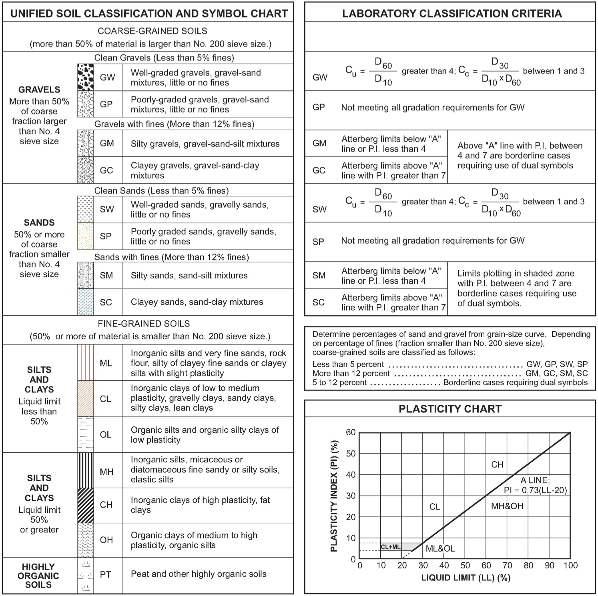

###########################################################
Soil Correlations and Approximations Employed in this Study
###########################################################

Automating capacity calculations posed several challenges. When either performing hand calculations or using standard commercial software applications, the geotechnical engineer is responsible for preparing the load test record for analysis by reducing boring logs, lab test results and other relevant data to a generalized soil profile with average geotechnical properties per layer. Moving from a *one-at-a-time* analysis to batch processing hundreds of load test records required writing algorithms that could reliably substitute a lot of the engineer's manual pre-processing.

All the algorithms were eventually compiled in an installable Python module called ``edafos``. The source code is available at `<https://github.com/nickmachairas/edafos>`_. Being open source, this project can be adopted and extended by interested users confortable with Python programming. Being modular, this project can be used to support other applications. ``edafos`` is running all geotechnical analysis and capacity calculations for the *NYU Pile Capacity* web application presented in :ref:`Chapter 2 <nyu_pile_capacity>`.

A key issue with the available load test records is missing values of geotechnical properties. And while it might seem too simple, soil property approximations were crucial in calculating in-situ stresses and pile capacities.

************
Correlations
************

Olson
=====

Most of the values of total unit weight (TUW, a.k.a. moist unit weight), :math:`\gamma_t`, in Prof. Roy Olson's database were assumed. If water content, :math:`w`, was known, it was used to calculate :math:`\gamma_t`, with an assumed specific gravity, :math:`G_s`, of 2.72. In this case, :math:`\gamma_t` is given by :eq:`olson_gamma_t`.

.. math::
   :label: olson_gamma_t

   \gamma_t = \bigg( \dfrac{1 + w}{1 + w G_s} \bigg) \; G_s \gamma_w

Prof. Olson used cases in which water contents were measured to calculate total unit weights for all soils and then performed correlations of those values of total unit weight with whatever other properties were available, meaning undrained shear strength, :math:`s_u`, for cohesive soils, and SPT-N values for all soils, and used these other properties to estimate total unit weight for cases in which water contents were not defined. These correlations were often poor but they gave a consistent basis for estimating :math:`\gamma_t`. The correlations are shown below for cohesive and cohesionless soils.

.. rubric:: Cohesive Soils

Values for undrained shear strength may come from the following:

- Field vane shearing strength (:math:`s_{u.FV}`)
- Shearing strength from Torvane, penetrometer, etc (:math:`s_{u.MS}`)
- Shearing strength from triaxial tests (:math:`s_{u.QT}`)
- Unconfined shearing strength (:math:`s_{u.UU}`)

Priority for choosing a value for :math:`s_u` if multiple are available is:

.. math:: s_{u.QT} > s_{u.UU} > s_{u.MS} > s_{u.FV}

But must adjust according to :eq:`olson_ss_cases`:

.. math::
   :label: olson_ss_cases

   s_u =
   \begin{cases}
   s_{u.QT} \\
   1.2 \times s_{u.UU} \\
   1.2 \times s_{u.MS} \\
   0.7 \times s_{u.FV}
   \end{cases}

Correlations were adjusted depending on the specific type of the cohesive soil. Different equations were produced for clays (CLAY) and silty clays (SICL), clayey silts (CLSI) and sandy clays (SACL). All cases are summarized in :eq:`olson_tuw_clay_cases` and :eq:`olson_tuw_sicl_cases`. :math:`s_u` must be provided in ksf and :math:`\gamma_t` is returned in pcf.

.. note::

   If both SS and N were undefined, TUW was set to 0 as code that values of EVSO cannot be defined.

For clay (``CLAY``):

.. math::
   :label: olson_tuw_clay_cases

   \gamma_t =
   \begin{cases}
   113.9 + 9.276 \ln{s_u} \textrm{ in pcf} & \textrm{if } s_u > 0 \textrm{ in ksf} \\
   107.5 + 5.116 \ln{N} \textrm{ in pcf} & \textrm{if } s_u \textrm{ undef. and } N > 0 \\
   \textrm{N/A} & \textrm{if both } s_u \textrm{ and } N \textrm{ are undefined}
   \end{cases}

For silt/clay (``SICL``), clay/silt (``CLSI``) and sand/clay (``SACL``):

.. math::
   :label: olson_tuw_sicl_cases

   \gamma_t =
   \begin{cases}
   113 + 22 s_u \textrm{ in pcf} & \textrm{if } 0.5 < s_u < 1.5 \textrm{ in ksf} \\
   113 + 9.276 \ln{N} \textrm{ in pcf} & \textrm{if } s_u > 0 \\
   \textrm{N/A} & \textrm{if both } s_u \textrm{ and } N \textrm{ are undefined}
   \end{cases}

.. .. math::
      :label: olson_tuw_clay_cases_alt

      \gamma_t =
      \begin{cases}
         \textrm{for} \quad \textrm{CLAY:} & \begin{cases}
            113.9 + 9.276 \ln(s_u) & \textrm{ if } \quad s_u > 0 \\
            107.5 + 5.116 \ln(N) & \textrm{ otherwise }
         \end{cases} \\ \\
         \textrm{for} \quad \textrm{SICL, CLSI, SACL:} & \begin{cases}
            113 + 22 \times s_u & \textrm{ if } \quad 0.5 < s_u < 1.5 \\
            113 + 9.276 \ln(N) & \textrm{ if } \quad N > 0
         \end{cases}
      \end{cases}

.. rubric:: Cohesionless Soils

Correlations for cohesionless soils depended on the soil type. :eq:`olson_tuw_sand_cases` summarises cases for sands (SAND), silty sands (SISA), sandy silts (SASI), silts (SILT), cobbles/gravels (CBGV), gravels (GRAV), sandy gravels (SAGV), gravely sands (GVSA), cobbles (COBB).

.. math::
   :label: olson_tuw_sand_cases

   \gamma_t =
   \begin{cases}
      126 \textrm{ pcf} & \textrm{for} \quad \textrm{SAND} \\
      125 + 0.15 N < 135 \textrm{ pcf} & \textrm{for} \quad \textrm{SISA, SASI, SILT} \\
      132 \textrm{ pcf} & \textrm{for} \quad \textrm{CBGV, GRAV, SAGV, GVSA, COBB}
   \end{cases}

.. rubric:: Olson Soil Classification to USCS

.. table:: Appendix: Olson Soil Classification to Unified Soil Classification System (USCS)
   :widths: 10 15 15 10 11 39
   :name: Olson-USCS-table

   +----------------------------------------------------+-----------------------------------------------------------------+
   | Olson                                              | USCS                                                            |
   +----------+-------------+--------------+------------+------------------+----------------------------------------------+
   | Symbol   | Description | Category     | Count [1]_ | Symbol           | Description                                  |
   +==========+=============+==============+============+==================+==============================================+
   | ``CLAY`` | Clay        | Cohesive     | 2305       | ``CL``           | Inorganic clays of low to medium             |
   |          |             |              |            |                  | plasticity, gravelly clays, sandy clays,     |
   |          |             |              |            |                  | silty clays, lean clays                      |
   +----------+-------------+--------------+------------+------------------+----------------------------------------------+
   | ``CLSA`` | Clay/Sand   | Cohesive     | 3          | ``SC``           | Clayey sands, sand-clay mixtures             |
   +----------+-------------+--------------+------------+------------------+----------------------------------------------+
   | ``CLSI`` | Clay/Silt   | Cohesive     | 20         | ``ML``           | Inorganic silts, and very fine sands, rock   |
   |          |             |              |            |                  | flour, silty or clayey fine sands or clayey  |
   |          |             |              |            |                  | silts with slight plasticity                 |
   +----------+-------------+--------------+------------+------------------+----------------------------------------------+
   | ``GRAV`` | Gravel      | Coarse       | 49         | ``GW`` or ``GP`` | Well/Poorly-graded gravels, gravel-sand      |
   |          |             |              |            |                  | mixtures, little or no fines                 |
   +----------+-------------+--------------+------------+------------------+----------------------------------------------+
   | ``GVSA`` | Gravel/Sand | Coarse       | 45         | ``GW`` or ``GP`` | Well/Poorly-graded gravels, gravel-sand      |
   |          |             |              |            |                  | mixtures, little or no fines                 |
   +----------+-------------+--------------+------------+------------------+----------------------------------------------+
   | ``MISA`` | Micaceous   | Cohesionless | 15         | ``MH``           | Inorganic silts, micaceous or diatomaceous   |
   |          | Sand        |              |            |                  | fine sandy or silty soils, elastic silts     |
   +----------+-------------+--------------+------------+------------------+----------------------------------------------+
   | ``MISS`` | Micaceous   | Cohesionless | 6          | ``MH``           | Inorganic silts, micaceous or diatomaceous   |
   |          | Sand/Silt   |              |            |                  | fine sandy or silty soils, elastic silts     |
   +----------+-------------+--------------+------------+------------------+----------------------------------------------+
   | ``PEAT`` | Peat        | Cohesive     | 1          | ``PT``           | Peat and other highly organic soils          |
   +----------+-------------+--------------+------------+------------------+----------------------------------------------+
   | ``SACL`` | Sand/Clay   | Cohesive     | 14         | ``SC``           | Clayey sands, sand-clay mixtures             |
   +----------+-------------+--------------+------------+------------------+----------------------------------------------+
   | ``SAGV`` | Sand/Gravel | Coarse       | 67         | ``GW`` or ``GP`` | Well/Poorly-graded gravels, gravel-sand      |
   |          |             |              |            |                  | mixtures, little or no fines                 |
   +----------+-------------+--------------+------------+------------------+----------------------------------------------+
   | ``SAND`` | Sand        | Cohesionless | 1780       | ``SW`` or ``SP`` | Well/Poorly-graded sands, gravelly sands,    |
   |          |             |              |            |                  | little or no fines                           |
   +----------+-------------+--------------+------------+------------------+----------------------------------------------+
   | ``SASI`` | Sand/Silt   | Cohesionless | 319        | ``SM``           | Silty sands, sand-silt mixtures              |
   +----------+-------------+--------------+------------+------------------+----------------------------------------------+
   | ``SHEL`` |             | Coarse       | 2          | ``GW`` or ``GP`` | Well/Poorly-graded gravels, gravel-sand      |
   |          |             |              |            |                  | mixtures, little or no fines                 |
   +----------+-------------+--------------+------------+------------------+----------------------------------------------+
   | ``SICL`` | Silt/Clay   | Cohesive     | 39         | ``ML``           | Inorganic silts, and very fine sands, rock   |
   |          |             |              |            |                  | flour, silty or clayey fine sands or clayey  |
   |          |             |              |            |                  | silts with slight plasticity                 |
   +----------+-------------+--------------+------------+------------------+----------------------------------------------+
   | ``SILT`` | Silt        | Cohesionless | 198        | ``MH``           | Inorganic silts, micaceous or diatomaceous   |
   |          |             |              |            |                  | fine sandy or silty soils, elastic silts     |
   +----------+-------------+--------------+------------+------------------+----------------------------------------------+
   | ``SISA`` | Silt/Sand   | Cohesionless | 397        | ``SM``           | Silty sands, sand-silt mixtures              |
   +----------+-------------+--------------+------------+------------------+----------------------------------------------+

Hunt
====

Roy Hunt on his 1984 book, the "Geotechnical Engineering Investigation Manual" (:ref:`Hunt, 1984 <Hunt1984>`), offers typical values for common properties including relative density, :math:`D_r`, dry density, :math:`\gamma_{dry}`, void ratio, :math:`e`, and strength, :math:`\phi`, as related to gradation and SPT-N. For cohesionless soils these typical values are presented in :numref:`Hunt-cohesionless-table`.

For cohesive soils, common properties, including relationships between consistency, unconfined compressive strength, :math:`q_u`, saturated weight, :math:`\gamma_{sat}`, and SPT-N are given on :numref:`Hunt-cohesive-table`. Furthermore, typical properties of cohesive materials classified by geologic origin, including density, :math:`\gamma_{dry}`, natural moisture contents, :math:`w`, plasticity indices, :math:`PI` and strength parameters, :math:`s_u, c, \phi`, are given on :numref:`Hunt-cohesive-ext-table`.

.. table:: Appendix: Common Properties of Cohesionless Soils (after :ref:`Hunt, 1984 <Hunt1984>`)
   :widths: 20 15 8 6 14 13 14
   :name: Hunt-cohesionless-table

   +---------------------------+--------------+----------------+--------+-----------------------------+-------------+----------------+
   | Material                  | Compactness  | :math:`D_r`, % | N [2]_ | :math:`\gamma_{dry}` [3]_,  | Void Ratio, | Strength [4]_, |
   |                           |              |                |        | lbf/ft\ :sup:`3`            | :math:`e`   | :math:`\phi`   |
   +===========================+==============+================+========+=============================+=============+================+
   | **GW:** well-graded       | Dense        | 75             | 90     | 138                         | 0.22        | 40             |
   + gravels, gravel-          +--------------+----------------+--------+-----------------------------+-------------+----------------+
   | sand mixtures             | Medium dense | 50             | 55     | 130                         | 0.28        | 36             |
   +                           +--------------+----------------+--------+-----------------------------+-------------+----------------+
   |                           | Loose        | 25             | < 28   | 123                         | 0.36        | 32             |
   +---------------------------+--------------+----------------+--------+-----------------------------+-------------+----------------+
   | **GP:** poorly graded     | Dense        | 75             | 70     | 127                         | 0.33        | 38             |
   + gravels, gravel-          +--------------+----------------+--------+-----------------------------+-------------+----------------+
   | sand mixtures             | Medium dense | 50             | 50     | 120                         | 0.39        | 35             |
   +                           +--------------+----------------+--------+-----------------------------+-------------+----------------+
   |                           | Loose        | 25             | < 20   | 114                         | 0.47        | 32             |
   +---------------------------+--------------+----------------+--------+-----------------------------+-------------+----------------+
   | **SW:** well-graded       | Dense        | 75             | 65     | 118                         | 0.43        | 37             |
   + sands, gravelly           +--------------+----------------+--------+-----------------------------+-------------+----------------+
   | sands                     | Medium dense | 50             | 35     | 112                         | 0.49        | 34             |
   +                           +--------------+----------------+--------+-----------------------------+-------------+----------------+
   |                           | Loose        | 25             | < 15   | 106                         | 0.57        | 30             |
   +---------------------------+--------------+----------------+--------+-----------------------------+-------------+----------------+
   | **SP:** poorly graded     | Dense        | 75             | 50     | 110                         | 0.52        | 36             |
   + sands, gravelly           +--------------+----------------+--------+-----------------------------+-------------+----------------+
   | sands                     | Medium dense | 50             | 30     | 104                         | 0.60        | 33             |
   +                           +--------------+----------------+--------+-----------------------------+-------------+----------------+
   |                           | Loose        | 25             | < 10   | 99                          | 0.65        | 29             |
   +---------------------------+--------------+----------------+--------+-----------------------------+-------------+----------------+
   | **SM:** silty sands       | Dense        | 75             | 45     | 103                         | 0.62        | 35             |
   +                           +--------------+----------------+--------+-----------------------------+-------------+----------------+
   |                           | Medium dense | 50             | 25     | 97                          | 0.74        | 32             |
   +                           +--------------+----------------+--------+-----------------------------+-------------+----------------+
   |                           | Loose        | 25             | < 8    | 93                          | 0.80        | 29             |
   +---------------------------+--------------+----------------+--------+-----------------------------+-------------+----------------+
   | **ML:** inorganic silts,  | Dense        | 75             | 35     | 93                          | 0.80        | 33             |
   + very fine sands           +--------------+----------------+--------+-----------------------------+-------------+----------------+
   |                           | Medium dense | 50             | 20     | 88                          | 0.90        | 31             |
   +                           +--------------+----------------+--------+-----------------------------+-------------+----------------+
   |                           | Loose        | 25             | < 4    | 84                          | 1.00        | 27             |
   +---------------------------+--------------+----------------+--------+-----------------------------+-------------+----------------+

.. table:: Appendix: Common Properties of Cohesive Soils (after :ref:`Hunt, 1984 <Hunt1984>`)
   :widths: 18 10 30 17 25
   :name: Hunt-cohesive-table

   +---------------+---------+---------------------------+-----------------------------+------------------+
   | Consistency   | N       | Hand test                 | :math:`\gamma_{sat}` [5]_,  | Strength [6]_,   |
   |               |         |                           | lbf/ft\ :sup:`3`            | :math:`q_u`,     |
   |               |         |                           |                             | kip/ft\ :sup:`2` |
   +===============+=========+===========================+=============================+==================+
   | Hard          | > 30    | Difficult to indent       | > 140                       | > 8.2            |
   +---------------+---------+---------------------------+-----------------------------+------------------+
   | Very stiff    | 15 - 30 | Indented by thumbnail     | 130 - 140                   | 4.1 - 8.2        |
   +---------------+---------+---------------------------+-----------------------------+------------------+
   | Stiff         | 8 - 15  | Indented by thumb         | 120 - 130                   | 2.0 - 4.1        |
   +---------------+---------+---------------------------+-----------------------------+------------------+
   | Medium (firm) | 4 - 8   | Molded by strong pressure | 110 - 120                   | 1.0 - 2.0        |
   +---------------+---------+---------------------------+-----------------------------+------------------+
   | Soft          | 2 - 4   | Molded by slight pressure | 100 - 110                   | 0.5 - 1.0        |
   +---------------+---------+---------------------------+-----------------------------+------------------+
   | Very soft     | < 2     | Extrudes between fingers  | 90 - 100                    | 0.0 - 0.5        |
   +---------------+---------+---------------------------+-----------------------------+------------------+

.. table:: Appendix: Typical Properties of Formations of Cohesive Materials (after :ref:`Hunt, 1984 <Hunt1984>`)
   :name: Hunt-cohesive-ext-table

   +-----------------------+------+-----------------------+------------------------+--------------+-------+-------+------------------+-------------------+--------------------+-----------------------------+
   | Material              | Type | Location              | :math:`\gamma_{dry}`,  | :math:`w`, % | LI, % | PI, % | :math:`s_u`,     | :math:`\bar{c}`,  | :math:`\bar{\phi}` | Remarks                     |
   |                       |      |                       | lbf/ft\ :sup:`3`       |              |       |       | kip/ft\ :sup:`2` | kip/ft\ :sup:`2`  |                    |                             |
   +=======================+======+=======================+========================+==============+=======+=======+==================+===================+====================+=============================+
   | **CLAY SHALES (WEATHERED)**                                                                                                                                                                            |
   +-----------------------+------+-----------------------+------------------------+--------------+-------+-------+------------------+-------------------+--------------------+-----------------------------+
   | Carlisle (Cret.)      | CH   | Nebraska              | 92                     | 18           |       |       |                  | 1.024             | 45                 | :math:`\phi`                |
   +-----------------------+------+-----------------------+------------------------+--------------+-------+-------+------------------+-------------------+--------------------+ extremely                   +
   | Bearpaw (Cret.)       | CH   | Montana               | 90                     | 32           | 130   | 90    |                  | 0.717             | 15                 | variable                    |
   +-----------------------+------+-----------------------+------------------------+--------------+-------+-------+------------------+-------------------+--------------------+                             +
   | Pierre (Cret.)        | CH   | South Dakota          | 92                     | 28           |       |       |                  | 1.843             | 12                 |                             |
   +-----------------------+------+-----------------------+------------------------+--------------+-------+-------+------------------+-------------------+--------------------+-----------------------------+
   | Cucaracha (Cret.)     | CH   | Panama Canal          |                        | 12           | 80    | 45    |                  |                   |                    | :math:`\phi_r = 10^\circ`   |
   +-----------------------+------+-----------------------+------------------------+--------------+-------+-------+------------------+-------------------+--------------------+-----------------------------+
   | Pepper (Cret.)        | CH   | Waco, Texas           |                        | 17           | 80    | 58    |                  | 0.819             | 17                 | :math:`\phi_r = 7^\circ`    |
   +-----------------------+------+-----------------------+------------------------+--------------+-------+-------+------------------+-------------------+--------------------+-----------------------------+
   | Bear Paw (Cret.)      | CH   | Saskatchewan          |                        | 32           | 115   | 92    |                  | 0.819             | 20                 | :math:`\phi_r = 8^\circ`    |
   +-----------------------+------+-----------------------+------------------------+--------------+-------+-------+------------------+-------------------+--------------------+-----------------------------+
   | Modelo (Tert.)        | CH   | Los Angeles           | 90                     | 29           | 66    | 31    |                  | 3.277             | 22                 | Intact specimen             |
   +-----------------------+------+-----------------------+------------------------+--------------+-------+-------+------------------+-------------------+--------------------+-----------------------------+
   | Modelo (Tert.)        | CH   | Los Angeles           | 90                     | 29           | 66    | 31    |                  | 0.655             | 27                 | Shear zone                  |
   +-----------------------+------+-----------------------+------------------------+--------------+-------+-------+------------------+-------------------+--------------------+-----------------------------+
   | Martinez (Tert.)      | CH   | Los Angeles           | 104                    | 22           | 62    | 38    |                  | 0.512             | 26                 | Shear zone                  |
   +-----------------------+------+-----------------------+------------------------+--------------+-------+-------+------------------+-------------------+--------------------+-----------------------------+
   | (Eocene)              | CH   | Menlo Park, Calif.    | 103                    | 30           | 60    | 50    |                  | Free swell 100%; P = 20.5 kip/ft\ :sup:`2`                           |
   +-----------------------+------+-----------------------+------------------------+--------------+-------+-------+------------------+----------------------------------------------------------------------+
   | **RESIDUAL SOILS**                                                                                                                                                                                     |
   +-----------------------+------+-----------------------+------------------------+--------------+-------+-------+------------------+-------------------+--------------------+-----------------------------+
   | Gneiss                | CL   | Brazil; buried        | 81                     | 38           | 40    | 16    |                  | 0.000             | 40                 | :math:`e_0 = 1.23`          |
   +-----------------------+------+-----------------------+------------------------+--------------+-------+-------+------------------+-------------------+--------------------+-----------------------------+
   | Gneiss                | ML   | Brazil; slopes        | 84                     | 22           | 40    | 8     |                  | 0.799             | 19                 | :math:`c, \phi`: unsoaked   |
   +-----------------------+------+-----------------------+------------------------+--------------+-------+-------+------------------+-------------------+--------------------+                             +
   | Gneiss                | ML   | Brazil; slopes        | 84                     |              | 40    | 8     |                  | 0.573             | 21                 |                             |
   +-----------------------+------+-----------------------+------------------------+--------------+-------+-------+------------------+-------------------+--------------------+-----------------------------+
   | **COLLUVIUM**                                                                                                                                                                                          |
   +-----------------------+------+-----------------------+------------------------+--------------+-------+-------+------------------+-------------------+--------------------+-----------------------------+
   | From shales           | CL   | West Virginia         |                        | 28           | 48    | 25    |                  | 0.573             | 28                 | :math:`\phi_r = 16^\circ`   |
   +-----------------------+------+-----------------------+------------------------+--------------+-------+-------+------------------+-------------------+--------------------+-----------------------------+
   | From gneiss           | CL   | Brazil                | 69                     | 26           | 40    | 16    |                  | 0.410             | 31                 | :math:`\phi_r = 12^\circ`   |
   +-----------------------+------+-----------------------+------------------------+--------------+-------+-------+------------------+-------------------+--------------------+-----------------------------+
   | **ALLUVIUM**                                                                                                                                                                                           |
   +-----------------------+------+-----------------------+------------------------+--------------+-------+-------+------------------+-------------------+--------------------+-----------------------------+
   | Black swamp           | OH   | Louisiana             | 36                     | 140          | 120   | 85    | 0.307            |                   |                    |                             |
   +-----------------------+------+-----------------------+------------------------+--------------+-------+-------+------------------+-------------------+--------------------+-----------------------------+
   | Black swamp           | OH   | Louisiana             | 62                     | 60           | 85    | 50    | 0.205            |                   |                    |                             |
   +-----------------------+------+-----------------------+------------------------+--------------+-------+-------+------------------+-------------------+--------------------+-----------------------------+
   | Black swamp           | MH   | Georgia               | 60                     | 54           | 61    | 22    | 0.614            |                   |                    | :math:`e_0 = 1.7`           |
   +-----------------------+------+-----------------------+------------------------+--------------+-------+-------+------------------+-------------------+--------------------+-----------------------------+
   | Lacustrine            | CL   | Great Salt Lake       | 49                     | 50           | 45    | 20    | 0.696            |                   |                    |                             |
   +-----------------------+------+-----------------------+------------------------+--------------+-------+-------+------------------+-------------------+--------------------+-----------------------------+
   | Lacustrine            | CL   | Canada                | 69                     | 62           | 33    | 15    | 0.512            |                   |                    |                             |
   +-----------------------+------+-----------------------+------------------------+--------------+-------+-------+------------------+-------------------+--------------------+-----------------------------+
   | Lacustrine (volcanic) | CH   | Mexico City           | 18                     | 300          | 410   | 260   | 0.819            |                   |                    | :math:`e_0 = 7`,            |
   |                       |      |                       |                        |              |       |       |                  |                   |                    | :math:`S_t = 13`            |
   +-----------------------+------+-----------------------+------------------------+--------------+-------+-------+------------------+-------------------+--------------------+-----------------------------+
   | Estuarine             | CH   | Thames River          | 49                     | 90           | 115   | 85    | 0.307            |                   |                    |                             |
   +-----------------------+------+-----------------------+------------------------+--------------+-------+-------+------------------+-------------------+--------------------+-----------------------------+
   | Estuarine             | CH   | Lake Maricaibo        |                        | 65           | 73    | 50    | 0.512            |                   |                    |                             |
   +-----------------------+------+-----------------------+------------------------+--------------+-------+-------+------------------+-------------------+--------------------+-----------------------------+
   | Estuarine             | CH   | Bangkok               |                        | 130          | 118   | 75    | 0.102            |                   |                    |                             |
   +-----------------------+------+-----------------------+------------------------+--------------+-------+-------+------------------+-------------------+--------------------+-----------------------------+
   | Estuarine             | MH   | Maine                 |                        | 80           | 60    | 30    | 0.410            |                   |                    |                             |
   +-----------------------+------+-----------------------+------------------------+--------------+-------+-------+------------------+-------------------+--------------------+-----------------------------+
   | **MARINE SOILS (OTHER THAN ESTUARINE)**                                                                                                                                                                |
   +-----------------------+------+-----------------------+------------------------+--------------+-------+-------+------------------+-------------------+--------------------+-----------------------------+
   | Offshore              | MH   | Santa Barbara, Calif. | 52                     | 80           | 83    | 44    | 0.307            |                   |                    | :math:`e_0 = 2.28`          |
   +-----------------------+------+-----------------------+------------------------+--------------+-------+-------+------------------+-------------------+--------------------+-----------------------------+
   | Offshore              | CH   | New Jersey            |                        | 65           | 95    | 60    | 1.331            |                   |                    |                             |
   +-----------------------+------+-----------------------+------------------------+--------------+-------+-------+------------------+-------------------+--------------------+-----------------------------+
   | Offshore              | CH   | San Diego             | 36                     | 125          | 111   | 64    | 0.205            |                   |                    | Depth = 6.56 ft             |
   +-----------------------+------+-----------------------+------------------------+--------------+-------+-------+------------------+-------------------+--------------------+-----------------------------+
   | Offshore              | CH   | Gulf of Maine         | 36                     | 163          | 124   | 78    | 0.102            |                   |                    |                             |
   +-----------------------+------+-----------------------+------------------------+--------------+-------+-------+------------------+-------------------+--------------------+-----------------------------+
   | Coastal Plain         | CH   | Texas (Beaumont)      | 87                     | 29           | 81    | 55    | 2.048            | 0.410             | 16                 | :math:`\phi_r = 14^\circ`,  |
   |                       |      |                       |                        |              |       |       |                  |                   |                    | :math:`e_0 = 0.8`           |
   +-----------------------+------+-----------------------+------------------------+--------------+-------+-------+------------------+-------------------+--------------------+-----------------------------+
   | Coastal Plain         | CH   | London                | 100                    | 25           | 80    | 55    | 4.096            |                   |                    |                             |
   +-----------------------+------+-----------------------+------------------------+--------------+-------+-------+------------------+-------------------+--------------------+-----------------------------+
   | **LOESS**                                                                                                                                                                                              |
   +-----------------------+------+-----------------------+------------------------+--------------+-------+-------+------------------+-------------------+--------------------+-----------------------------+
   | Silty                 | ML   | Nebraska-Kansas       | 77                     | 9            | 30    | 8     |                  | 1.229             | 32                 | Natural                     |
   |                       |      |                       |                        |              |       |       |                  |                   |                    | :math:`w` %                 |
   +-----------------------+------+-----------------------+------------------------+--------------+-------+-------+------------------+-------------------+--------------------+-----------------------------+
   | Silty                 | ML   | Nebraska-Kansas       | 77                     | (35)         | 30    | 8     |                  | 0.000             | 23                 | Prewetted                   |
   +-----------------------+------+-----------------------+------------------------+--------------+-------+-------+------------------+-------------------+--------------------+-----------------------------+
   | Clayey                | CL   | Nebraska-Kansas       | 78                     | 9            | 37    | 17    |                  | 4.096             | 30                 | Natural                     |
   |                       |      |                       |                        |              |       |       |                  |                   |                    | :math:`w` %                 |
   +-----------------------+------+-----------------------+------------------------+--------------+-------+-------+------------------+-------------------+--------------------+-----------------------------+
   | **GLACIAL SOILS**                                                                                                                                                                                      |
   +-----------------------+------+-----------------------+------------------------+--------------+-------+-------+------------------+-------------------+--------------------+-----------------------------+
   | Till                  | CL   | Chicago               | 132                    | 23           | 37    | 21    | 7.169            |                   |                    |                             |
   +-----------------------+------+-----------------------+------------------------+--------------+-------+-------+------------------+-------------------+--------------------+-----------------------------+
   | Lacustrine (varved)   | CL   | Chicago               | 106                    | 22           | 30    | 15    | 2.048            |                   |                    | :math:`e_0 = 0.6` (OC)      |
   +-----------------------+------+-----------------------+------------------------+--------------+-------+-------+------------------+-------------------+--------------------+-----------------------------+
   | Lacustrine (varved)   | CL   | Chicago               |                        | 24           | 30    | 13    | 0.205            |                   |                    | :math:`e_0 = 1.2` (NC)      |
   +-----------------------+------+-----------------------+------------------------+--------------+-------+-------+------------------+-------------------+--------------------+-----------------------------+
   | Lacustrine (varved)   | CH   | Chicago               | 74                     | 50           | 54    | 30    | 0.205            |                   |                    |                             |
   +-----------------------+------+-----------------------+------------------------+--------------+-------+-------+------------------+-------------------+--------------------+-----------------------------+
   | Lacustrine (varved)   | CH   | Ohio                  | 60                     | 46           | 58    | 31    | 1.229            |                   |                    | :math:`S_t = 4`             |
   +-----------------------+------+-----------------------+------------------------+--------------+-------+-------+------------------+-------------------+--------------------+-----------------------------+
   | Lacustrine (varved)   | CH   | Detroit               | 75                     | 46           | 55    | 30    | 1.639            |                   |                    | :math:`e_0 = 1.3` (clay)    |
   +-----------------------+------+-----------------------+------------------------+--------------+-------+-------+------------------+-------------------+--------------------+-----------------------------+
   | Lacustrine (varved)   | CH   | New York City         |                        | 46           | 62    | 34    | 2.048            |                   |                    | :math:`e_0 = 1.25` (clay)   |
   +-----------------------+------+-----------------------+------------------------+--------------+-------+-------+------------------+-------------------+--------------------+-----------------------------+
   | Lacustrine (varved)   | CL   | Boston                | 84                     | 38           | 50    | 26    | 1.639            |                   |                    | :math:`S_t = 3`             |
   +-----------------------+------+-----------------------+------------------------+--------------+-------+-------+------------------+-------------------+--------------------+-----------------------------+
   | Lacustrine (varved)   | CH   | Seattle               |                        | 30           | 55    | 22    |                  |                   | 30                 | :math:`\phi_r = 13^\circ`   |
   +-----------------------+------+-----------------------+------------------------+--------------+-------+-------+------------------+-------------------+--------------------+-----------------------------+
   | Marine [7]_           | CH   | Canada-Leda clay      | 56                     | 80           | 60    | 32    | 1.024            |                   |                    | :math:`S_t = 128`           |
   +-----------------------+------+-----------------------+------------------------+--------------+-------+-------+------------------+-------------------+--------------------+-----------------------------+
   | Marine [7]_           | CL   | Norway                | 84                     | 40           | 38    | 15    | 0.266            |                   |                    | :math:`S_t = 7`             |
   +-----------------------+------+-----------------------+------------------------+--------------+-------+-------+------------------+-------------------+--------------------+-----------------------------+
   | Marine [7]_           | CL   | Norway                | 81                     | 43           | 28    | 15    | 0.102            |                   |                    | :math:`S_t = 75`            |
   +-----------------------+------+-----------------------+------------------------+--------------+-------+-------+------------------+-------------------+--------------------+-----------------------------+

.. [1] Count in Olson 'APC' and 'CT' databases.
.. [2] :math:`N` is blows per foot of penetration in the SPT. Adjustments for
   gradation are after Burmister (1962).
.. [3] Density given is for :math:`G_s = 2.65` (quartz grains)
.. [4] Friction angle :math:`\phi` depends on mineral type, normal stress, and
   grain angularity as well as :math:`D_r` and gradation.
.. [5] :math:`\gamma_{sat} = \gamma_{dry} + \gamma_w \Big( \dfrac{e}{1+e} \Big)`
.. [6] Unconfined compressive strength, :math:`q_u`, is usually taken as equal
   to twice the cohesion, :math:`c`, or the undrained shear strength, :math:`s_u`.
   For the drained strength condition, most clays also have the additional strength
   parameter, :math:`\phi`, although for most normally consolidated clays,
   :math:`c = 0`. Typical values for :math:`s_u` and drained strength parameters
   are given in :numref:`Hunt-cohesive-ext-table`.
.. [7] Marine clays strongly leached.

*****************
Layer Delineation
*****************

Most of the design problems encountered in Soil Mechanics involve calculations with geotechnical properties of soil profiles that have been deduced from raw geotechnical data. Case in point, recommended step-by-step design procedures within the 2006 version of the *FHWA Driven Pile Foundation Manual* (:ref:`Hannigan et al., 2006a <Hannigan2006a>`) start by delineating the soil profile into layers using soil test data.

The process of delineating the soil profile into layers is easier said than done and is based on engineering judgement and experience. :numref:`spt_delineation_figure` shows the SPT N values collected during field tests for "North Abutment S-1" (after :ref:`Hannigan et al., 2006a <Hannigan2006a>`).

.. figure:: figures/FHWA_S-1_example_Nvals.png
   :width: 450 px
   :name: spt_delineation_figure

   Appendix: Delineating the soil profile into layers using the field SPT N Values for
   "North Abutment S-1" (after :ref:`Hannigan et al., 2006a <Hannigan2006a>`).

There is no standard process for layer delineation. In the left-hand side of :numref:`spt_delineation_figure`, the field SPT N values are plotted with depth. There is an obvious "jump" in the N values at a depth of about 48 feet. This is indicative of a change in soil conditions, hence, delineating in two layers at this interface is reasonable. However, the change at depth 23 ft. is not as apparent based on N values alone. In such cases the N values are corroborated with other information obtained during subsurface investigations such as sample color, texture and geotechnical properties.

.. note::

   The discussion in this section is not limited to field N values. The concept of varying soil conditions with depth extends to other geotechnical properties including internal angle of friction, :math:`\phi`, unit weight, :math:`\gamma`, undrained shear strength, :math:`s_u`, and more.

It is common practice that after layers have been delineated within a soil profile, the geotechnical properties for each layer are derived by averaging the available data for each layer. :numref:`spt_delineation_example_table` offers an example of this process for "North Abutment S-1".

.. table:: Appendix: Field and average N values (North Abutment S-1)
   :widths: auto
   :align: center
   :name: spt_delineation_example_table

   +------------+---------------+------------+-----------------+
   | Depth (ft) | Field N Value | Soil Layer | Average N Value |
   +============+===============+============+=================+
   | 1          | 4             | 1          | 6               |
   +------------+---------------+            +                 +
   | 6          | 4             |            |                 |
   +------------+---------------+            +                 +
   | 11         | 6             |            |                 |
   +------------+---------------+            +                 +
   | 16         | 6             |            |                 |
   +------------+---------------+            +                 +
   | 21         | 8             |            |                 |
   +------------+---------------+------------+-----------------+
   | 26         | 13            | 2          | 14              |
   +------------+---------------+            +                 +
   | 31         | 15            |            |                 |
   +------------+---------------+            +                 +
   | 36         | 11            |            |                 |
   +------------+---------------+            +                 +
   | 41         | 15            |            |                 |
   +------------+---------------+            +                 +
   | 46         | 18            |            |                 |
   +------------+---------------+------------+-----------------+
   | 51         | 40            | 3          | 43              |
   +------------+---------------+            +                 +
   | 56         | 39            |            |                 |
   +------------+---------------+            +                 +
   | 61         | 41            |            |                 |
   +------------+---------------+            +                 +
   | 66         | 43            |            |                 |
   +------------+---------------+            +                 +
   | 71         | 41            |            |                 |
   +------------+---------------+            +                 +
   | 76         | 44            |            |                 |
   +------------+---------------+            +                 +
   | 81         | 45            |            |                 |
   +------------+---------------+            +                 +
   | 86         | 48            |            |                 |
   +------------+---------------+            +                 +
   | 91         | 46            |            |                 |
   +------------+---------------+            +                 +
   | 96         | 47            |            |                 |
   +------------+---------------+------------+-----------------+

.. hint::

   Average N values must always be rounded to an integer number.

*******************
Soil Classification
*******************

   Appendix: Unified Soil Classification System, USCS (adopted from the California
   Department of Transportation, Caltrans).

.. table:: Appendix: Unified Soil Classification System (USCS)
   :name: uscs-table

   +-------------------+-------------+-----------------------------------------------+-------------------+
   | Soil Type         | USCS Symbol | Long Description                              | Short Description |
   +===================+=============+===============================================+===================+
   | **COARSE-GRAINED SOILS (COHESIONLESS)**                                                             |
   |                                                                                                     |
   | (more than 50% of material is larger than No. 200 sieve size)                                       |
   +-------------------+---------------------------------------------------------------------------------+
   | **GRAVELS**       | **Clean Gravels** (Less than 5% fines)                                          |
   +                   +-------------+-----------------------------------------------+-------------------+
   | More than 50%     | **GW**      | Well-graded gravels, gravel-sand              | Gravel (WG)       |
   | of coarse         |             | mixtures, little or no fines                  |                   |
   + fraction larger   +-------------+-----------------------------------------------+-------------------+
   | than No. 4        | **GP**      | Poorly-graded gravels, gravel-sand            | Gravel (PG)       |
   | sieve size        |             | mixtures, little or no fines                  |                   |
   +                   +-------------+-----------------------------------------------+-------------------+
   |                   | **Gravels with Fines** (More than 12% fines)                                    |
   +                   +-------------+-----------------------------------------------+-------------------+
   |                   | **GM**      | Silty gravels, gravel-sand-silt mixtures      | Silty gravel      |
   +                   +-------------+-----------------------------------------------+-------------------+
   |                   | **GC**      | Clayey gravels, gravel-sand-clay mixtures     | Clayey gravel     |
   +                   +-------------+-----------------------------------------------+-------------------+
   |                   | **Mixed Gravels**                                                               |
   +                   +-------------+-----------------------------------------------+-------------------+
   |                   | **GW-GM**   | Well-graded gravels, gravel-sand              | Gravel (WG,       |
   |                   |             | mixtures, *with* fines                        | w/ fines)         |
   +                   +-------------+-----------------------------------------------+-------------------+
   |                   | **GP-GM**   | Poorly-graded gravels, gravel-sand            | Gravel (PG,       |
   |                   |             | mixtures, *with* fines                        | w/ fines)         |
   +-------------------+-------------+-----------------------------------------------+-------------------+
   | **SANDS**         | **Clean Sands** (Less than 5% fines)                                            |
   +                   +-------------+-----------------------------------------------+-------------------+
   | 50% or more       | **SW**      | Well-graded sands, gravelly sands,            | Sand (WG)         |
   | of coarse         |             | little or no fines                            |                   |
   + fraction smaller  +-------------+-----------------------------------------------+-------------------+
   | than No. 4        | **SP**      | Poorly-graded sands, gravelly sands,          | Sand (PG)         |
   | sieve size        |             | little or no fines                            |                   |
   +                   +-------------+-----------------------------------------------+-------------------+
   |                   | **Sands with Fines** (More than 12% fines)                                      |
   +                   +-------------+-----------------------------------------------+-------------------+
   |                   | **SM**      | Silty sands, sand-silt mixtures               | Silty sand        |
   +                   +-------------+-----------------------------------------------+-------------------+
   |                   | **SC**      | Clayey sands, sand-clay mixtures              | Clayey sand       |
   +                   +-------------+-----------------------------------------------+-------------------+
   |                   | **Mixed Sands**                                                                 |
   +                   +-------------+-----------------------------------------------+-------------------+
   |                   | **SW-SM**   | Well-graded sands, gravelly sands,            | Sand (WG,         |
   |                   |             | *with* silt                                   | w/ silt)          |
   +                   +-------------+-----------------------------------------------+-------------------+
   |                   | **SW-SC**   | Well-graded sands, gravelly sands,            | Sand (WG,         |
   |                   |             | *with* clay                                   | w/ clay)          |
   +                   +-------------+-----------------------------------------------+-------------------+
   |                   | **SP-SM**   | Poorly-graded sands, gravelly sands,          | Sand (PG,         |
   |                   |             | *with* silt                                   | w/ silt)          |
   +                   +-------------+-----------------------------------------------+-------------------+
   |                   | **SP-SC**   | Poorly-graded sands, gravelly sands,          | Sand (PG,         |
   |                   |             | *with* clay                                   | w/ clay)          |
   +-------------------+-------------+-----------------------------------------------+-------------------+
   | **FINE-GRAINED SOILS (COHESIVE)**                                                                   |
   |                                                                                                     |
   | (50% or more of material is smaller than No. 200 sieve size)                                        |
   +-------------------+-------------+-----------------------------------------------+-------------------+
   | **SILTS AND       | **ML**      | Inorganic silts and very fine sands, rock     | Sandy/Clayey      |
   | CLAYS**           |             | flour, silty of clayey fine sands or clayey   | Silt (LP)         |
   |                   |             | silts with slight plasticity                  |                   |
   + Liquid limit      +-------------+-----------------------------------------------+-------------------+
   | less than 50%     | **CL**      | Inorganic clays of low to medium plasticity,  | Clay (LP)         |
   |                   |             | gravelly clays, sandy clays, silty clays,     |                   |
   |                   |             | lean clays                                    |                   |
   +                   +-------------+-----------------------------------------------+-------------------+
   |                   | **OL**      | Organic silts and organic silty clays of      | Organic           |
   |                   |             | low plasticity                                | silt/clay (LP)    |
   +                   +-------------+-----------------------------------------------+-------------------+
   |                   | **CL-ML**   |                                               | Silty Clay (LP)   |
   +                   +-------------+-----------------------------------------------+-------------------+
   |                   | **SM-ML**   |                                               | Sandy/Clayey      |
   |                   |             |                                               | Silt (LP)         |
   +-------------------+-------------+-----------------------------------------------+-------------------+
   | **SILTS AND       | **MH**      | Inorganic silts, micaceous or diatomaceous    | Sandy/Clayey      |
   | CLAYS**           |             | fine sandy or silty soils, elastic silts      | Silt (HP)         |
   +                   +-------------+-----------------------------------------------+-------------------+
   | Liquid limit      | **CH**      | Inorganic clays of high plasticity, fat clays | Clay (HP)         |
   + 50% or greater    +-------------+-----------------------------------------------+-------------------+
   |                   | **OH**      | Organic clays of medium to high plasticity,   | Organic           |
   |                   |             | organic silts                                 | silt/clay (HP)    |
   +                   +-------------+-----------------------------------------------+-------------------+
   |                   | **OL-OH**   |                                               |                   |
   +                   +-------------+-----------------------------------------------+-------------------+
   |                   | **CL-CH**   |                                               |                   |
   +-------------------+-------------+-----------------------------------------------+-------------------+
   | **HIGHLY ORGANIC  | **PT**      | Peat and other highly organic soils           | Peat              |
   | SOILS**           |             |                                               |                   |
   +-------------------+-------------+-----------------------------------------------+-------------------+
   | **ROCKS**                                                                                           |
   |                                                                                                     |
   | (not in USCS)                                                                                       |
   +-------------------+-------------+-----------------------------------------------+-------------------+
   |                   | **ROCK**    |                                               | Rock              |
   +-------------------+-------------+-----------------------------------------------+-------------------+

The USCS table is stored in and can be retrieved from the ``uscs_dict`` dictionary. An example is shown in :numref:`uscs_dict_example`.

.. code-block:: python
   :caption: USCS table in ``edafos``
   :name: uscs_dict_example

   # Import the `uscs_dict` dictionary
   In [1]: from edafos.data import uscs_dict

   # Query the `uscs_dict` dictionary
   In [2]: uscs_dict['GP']['long_desc']
   Out[2]: 'Poorly-graded gravels, gravel-sand mixtures, little or no fines'

   In [3]: uscs_dict['GP']['soil_type']
   Out[3]: 'cohesionless'

