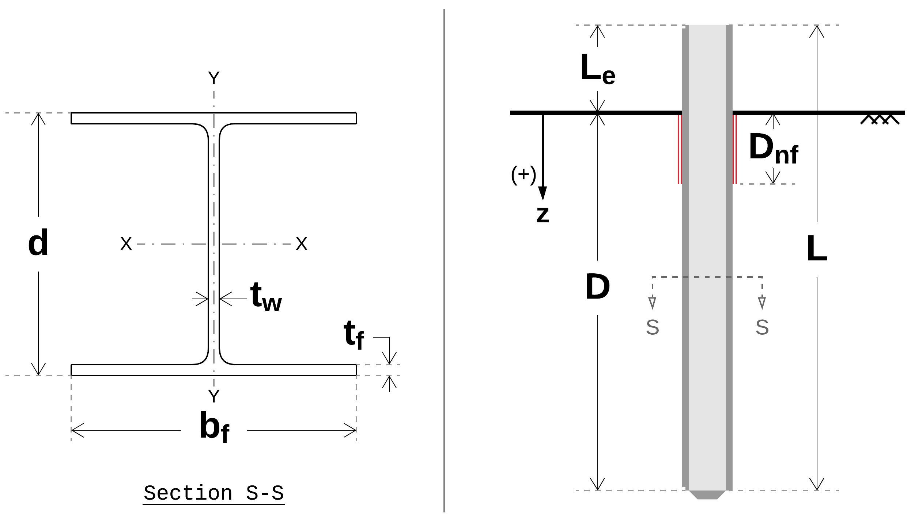
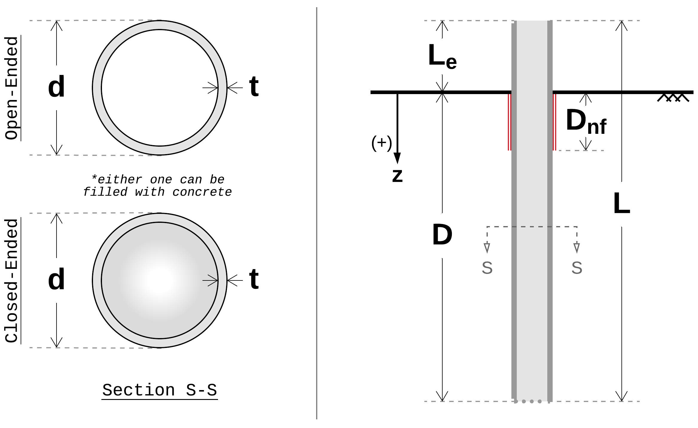
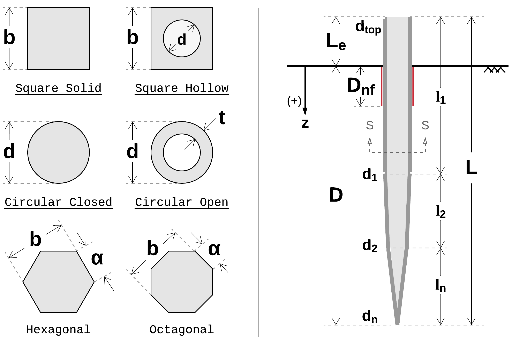
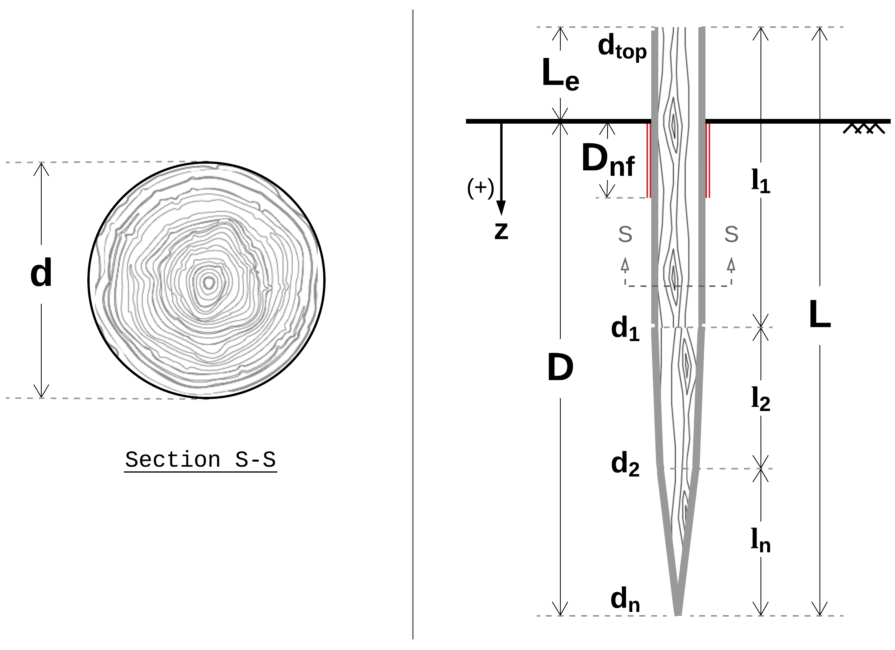
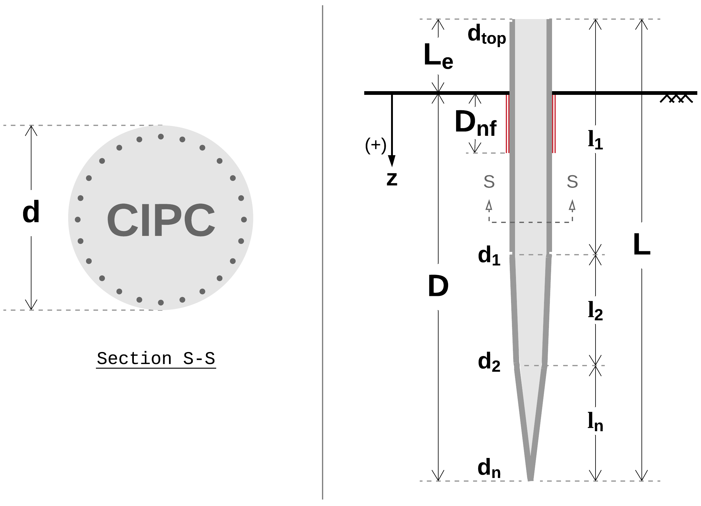
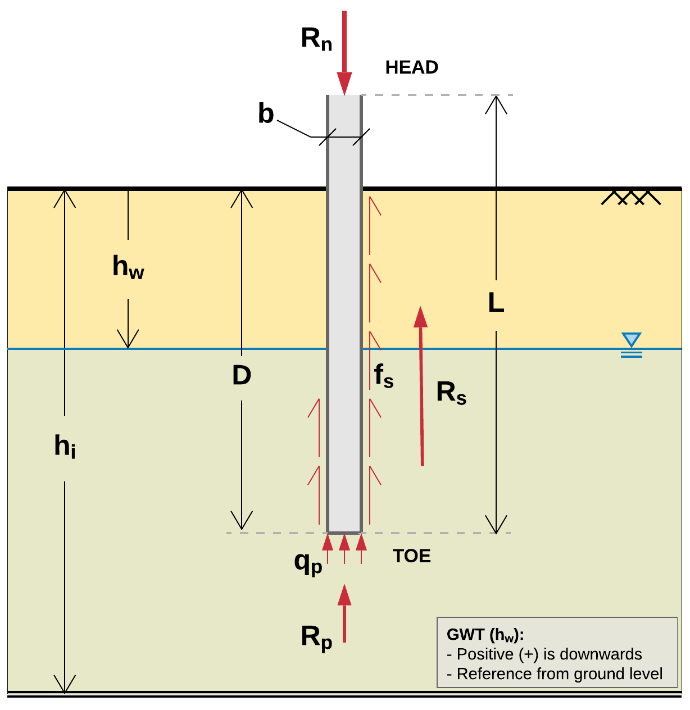

############################################
Pile Schematics, Notations and Abbreviations
############################################

***************
Pile Schematics
***************

Consolidating the various data sources presented the challenge of referring to the same pile features with different names and symbols. In an effort to standardize and facilitate analytical processes, the following schematics were produced showing all relevant symbols.

Steel H-Piles
=============

Schematic shown in :numref:`hpile_schematic`. Section details for english H-Piles are provided in :numref:`hpile_sections_table`.

   H-Pile Schematic

.. table:: Section details for English H-Piles
   :widths: auto
   :align: center
   :name: hpile_sections_table

   +----------+--------------+-----------+-------+---------------+-------------+--------------+---------------+
   |          | Area         | Perimeter | Depth | Web Thickness | Width       | Box Area     | Box Perimeter |
   |          +--------------+-----------+-------+---------------+-------------+--------------+---------------+
   | Section  | A            | P         | d     | t\ :sub:`w`   | b\ :sub:`f` | A\ :sub:`b`  | P\ :sub:`b`   |
   |          +--------------+-----------+-------+---------------+-------------+--------------+---------------+
   |          | in\ :sup:`2` | in        | in    | in            | in          | in\ :sup:`2` | in            |
   +==========+==============+===========+=======+===============+=============+==============+===============+
   | HP14x117 | 34.4         | 86.35     | 14.21 | 0.805         | 14.885      | 211.5        | 58.19         |
   +----------+--------------+-----------+-------+---------------+-------------+--------------+---------------+
   | HP14x102 | 30           | 85.75     | 14.01 | 0.705         | 14.785      | 207.1        | 57.59         |
   +----------+--------------+-----------+-------+---------------+-------------+--------------+---------------+
   | HP14x89  | 26.1         | 85.21     | 13.83 | 0.615         | 14.695      | 203.2        | 57.05         |
   +----------+--------------+-----------+-------+---------------+-------------+--------------+---------------+
   | HP14x73  | 21.4         | 84.55     | 13.61 | 0.505         | 14.585      | 198.5        | 56.39         |
   +----------+--------------+-----------+-------+---------------+-------------+--------------+---------------+
   | HP12x84  | 24.6         | 72.37     | 12.28 | 0.685         | 12.295      | 151.0        | 49.15         |
   +----------+--------------+-----------+-------+---------------+-------------+--------------+---------------+
   | HP12x74  | 21.8         | 71.91     | 12.13 | 0.605         | 12.215      | 148.2        | 48.69         |
   +----------+--------------+-----------+-------+---------------+-------------+--------------+---------------+
   | HP12x63  | 18.4         | 71.35     | 11.94 | 0.515         | 12.125      | 144.8        | 48.13         |
   +----------+--------------+-----------+-------+---------------+-------------+--------------+---------------+
   | HP12x53  | 15.5         | 70.87     | 11.78 | 0.435         | 12.045      | 141.9        | 47.65         |
   +----------+--------------+-----------+-------+---------------+-------------+--------------+---------------+
   | HP10x57  | 16.8         | 59.75     | 9.99  | 0.565         | 10.225      | 102.1        | 40.43         |
   +----------+--------------+-----------+-------+---------------+-------------+--------------+---------------+
   | HP10x42  | 12.4         | 58.87     | 9.7   | 0.415         | 10.075      | 97.73        | 39.55         |
   +----------+--------------+-----------+-------+---------------+-------------+--------------+---------------+
   | HP8x36   | 10.6         | 47.77     | 8.02  | 0.445         | 8.155       | 65.40        | 32.35         |
   +----------+--------------+-----------+-------+---------------+-------------+--------------+---------------+

Pipe Piles (Open and Closed Ended)
==================================

Schematic shown in :numref:`pipe_pile_schematic`.

   Pipe Pile Schematic

Concrete Piles (All Sections)
=============================

Schematic shown in :numref:`concrete_pile_schematic`.

   Driven Concrete Pile Schematic

.. math::
   :label: concrete_pile_alpha_eq

   \alpha = b \tan \dfrac{\pi}{n}

Timber Piles
============

Schematic shown in :numref:`timber_pile_schematic`.

   Timber Pile Schematic

Cast-in-place Concrete Piles
============================

Schematic shown in :numref:`cipc_pile_schematic`.

   Cast-in-place Concrete Pile Schematic

***************************
Notations and Abbreviations
***************************

Various notation styles are encountered across literature. This document uses symbols adopted from :ref:`Hannigan et al., 2016a <Hannigan2016a>` and :ref:`Fellenius, 1999 <Fellenius1999>`. :numref:`notations_figure` presents a quick reference to the most commonly used symbols. See below for the complete list.

.. TODO: update figure with soil properties and pile x-areas

   Typical profile view with embedded pile and associated symbols

----

.. TODO: sort alphabetically (or by pile/soil?)

.. |gwt| replace:: :math:`h_w`
.. |layer_height| replace:: :math:`h_i`
.. |pile_diameter| replace:: :math:`b`
.. |pile_length| replace:: :math:`L`
.. |pile_emb_length| replace:: :math:`D`
.. |pile_xarea| replace:: :math:`A`
.. |pile_xarea_toe| replace:: :math:`A_p`
.. |pile_xarea_plug| replace:: :math:`A_{pp}`
.. |pile_area_side| replace:: :math:`A_s`
.. |pile_area_interior| replace:: :math:`A_{si}`
.. |pile_area_exterior| replace:: :math:`A_{so}`
.. |nominal_resistance| replace:: :math:`R_n`
.. |nominal_shaft| replace:: :math:`R_s`
.. |nominal_toe| replace:: :math:`R_p`
.. |unit_shaft| replace:: :math:`f_s`
.. |unit_shaft_interior| replace:: :math:`f_{si}`
.. |unit_shaft_exterior| replace:: :math:`f_{so}`
.. |unit_toe| replace:: :math:`q_p`
.. |spt_uncorr| replace:: :math:`N`
.. |spt_1| replace:: :math:`N_1`
.. |spt_60| replace:: :math:`N_{60}`
.. |spt_160| replace:: :math:`(N_1)_{60}`
.. |Q_c| replace:: :math:`Q_c`
.. |Q_m| replace:: :math:`Q_m`
.. |Q_p| replace:: :math:`Q_p`
.. |modulus| replace:: :math:`E`

:|gwt|: Depth to groundwater table (feet/meters)
:|layer_height|: Soil layer height (feet/meters)
:|pile_diameter|: Pile diameter/side (inches/centimeters)
:|pile_length|: Pile length, total (feet/meters)
:|pile_emb_length|: Pile length, embedded (feet/meters)
:|pile_xarea|: Pile cross sectional area (sq.in/sq.cm)
:|pile_xarea_toe|: Pile cross sectional area, toe (sq.in/sq.cm)
:|pile_xarea_plug|: Pile cross sectional area, plugged (sq.in/sq.cm)
:|pile_area_side|: Pile shaft surface area (sq.ft/sq.m)
:|pile_area_interior|: Pile shaft surface area, interior (sq.ft/sq.m)
:|pile_area_exterior|: Pile shaft surface area, exterior (sq.ft/sq.m)
:|nominal_resistance|: Nominal resistance, total (tons/MN)
:|nominal_shaft|: Nominal shaft resistance (tons/MN)
:|nominal_toe|: Nominal toe resistance (tons/MN)
:|unit_shaft|: Unit shaft resistance, adhesion (...)
:|unit_shaft_interior|: Unit shaft resistance, interior (...)
:|unit_shaft_exterior|: Unit shaft resistance, exterior (...)
:|unit_toe|: Unit toe resistance (...)
:|spt_uncorr|: Uncorrected field SPT resistance value
:|spt_1|: SPT N value corrected for overburden stress
:|spt_60|: SPT N value corrected for 60% energy transfer
:|spt_160|: SPT N value corrected for energy and overburden stress
:|Q_c|: Pile calculated load (capacity), often referred to as nominal resistance, :math:`R_n` (tons/MN)
:|Q_m|: Pile measured (aka interpreted) capacity as obtained from static load tests (tons/MN)
:|Q_p|: Pile predicted capacity obtained from statistical and predictive models (tons/MN)
:|modulus|: Elastic modulus of material, Young's modulus (...)
