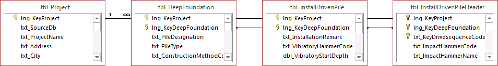

.. note::

   All information in this section comes from :ref:`Petek et al., 2016 <Petek2016>`
   and :ref:`Shannon & Wilson, 2015 <ShannonWilson2015>`.

.. hint::

   The units based on which values were stored in relevant columns had to be
   determined from stored data, there was no mention in existing documentation.

Project Table
=============

**Name:**
  ``tbl_Project``

**Description:**
  Project descriptive data, e.g. project name, data provider, consultant etc.

.. csv-table:: Appendix: FHWA DFLTD v.2 *tbl_Project* Table Attributes
   :file: tables/dfltd_v2/tbl_Project.csv
   :header-rows: 1
   :widths: 15, 7, 3, 4, 15
   :align: center

Exploration Tables
==================

**Name:**
  ``tbl_Exploration``

**Description:**
  Exploration general descriptive data, e.g. exploration type, location, date, predominant soil unit, etc.

.. figure:: tables/dfltd_v2/tbl_Exploration.png
   :target: tables/dfltd_v2/tbl_Exploration.png
   :align: center
   :alt: tbl_Exploration.png

   Appendix: DFLTD v.2 *tbl_Exploration* Table Relationships

.. csv-table:: Appendix: FHWA DFLTD v.2 *tbl_Exploration* Table Attributes
   :file: tables/dfltd_v2/tbl_Exploration.csv
   :header-rows: 1
   :widths: 15, 7, 3, 4, 15
   :align: center

**Name:**
  ``tbl_ExplorationBoring``

**Description:**
  Soil or rock boring data by depth, e.g. blow counts, USCS designation, etc.

.. figure:: tables/dfltd_v2/tbl_ExplorationBoring.png
   :target: tables/dfltd_v2/tbl_ExplorationBoring.png
   :align: center
   :alt: tbl_ExplorationBoring.png

   Appendix: DFLTD v.2 *tbl_ExplorationBoring* Table Relationships

.. csv-table:: Appendix: FHWA DFLTD v.2 *tbl_ExplorationBoring* Table Attributes
   :file: tables/dfltd_v2/tbl_ExplorationBoring.csv
   :header-rows: 1
   :widths: 15, 7, 3, 4, 15
   :align: center

**Name:**
  ``tbl_ExplorationPressuremeter``

**Description:**
  Pressuremeter data by depth, measurements, and interpreted results.

.. figure:: tables/dfltd_v2/tbl_ExplorationPressuremeter.png
   :target: tables/dfltd_v2/tbl_ExplorationPressuremeter.png
   :align: center
   :alt: tbl_ExplorationPressuremeter.png

   Appendix: DFLTD v.2 *tbl_ExplorationPressuremeter* Table Relationships

.. csv-table:: Appendix: FHWA DFLTD v.2 *tbl_ExplorationPressuremeter* Table Attributes
   :file: tables/dfltd_v2/tbl_ExplorationPressuremeter.csv
   :header-rows: 1
   :widths: 15, 7, 3, 4, 15
   :align: center

**Name:**
  ``tbl_ExplorationVaneField``

**Description:**
  Field vane shear test data by depth, measurements, and interpreted results.

   Appendix: DFLTD v.2 *tbl_ExplorationVaneField* Table Relationships

.. csv-table:: Appendix: FHWA DFLTD v.2 *tbl_ExplorationVaneField* Table Attributes
   :file: tables/dfltd_v2/tbl_ExplorationVaneField.csv
   :header-rows: 1
   :widths: 15, 7, 3, 4, 15
   :align: center

**Name:**
  ``tbl_ExplorationVaneStepBlade``

**Description:**
  Step blade vane shear test data by depth, measurements, and interpreted results.

.. figure:: tables/dfltd_v2/tbl_ExplorationVaneStepBlade.png
   :target: tables/dfltd_v2/tbl_ExplorationVaneStepBlade.png
   :align: center
   :alt: tbl_ExplorationVaneStepBlade.png

   Appendix: DFLTD v.2 *tbl_ExplorationVaneStepBlade* Table Relationships

.. csv-table:: Appendix: FHWA DFLTD v.2 *tbl_ExplorationVaneStepBlade* Table Attributes
   :file: tables/dfltd_v2/tbl_ExplorationVaneStepBlade.csv
   :header-rows: 1
   :widths: 15, 7, 3, 4, 15
   :align: center

.. warning::

   Table ``tbl_ExplorationGroundwaterMonitoring`` is empty.

**Name:**
  ``tbl_ExplorationGroundwaterMonitoring``

**Description:**
  Groundwater measurements from a monitoring well or VWP, including date-time, depth to water.

   Appendix: DFLTD v.2 *tbl_ExplorationGroundwaterMonitoring* Table Relationships

.. csv-table:: Appendix: FHWA DFLTD v.2 *tbl_ExplorationGroundwaterMonitoring* Table Attributes
   :file: tables/dfltd_v2/tbl_ExplorationGroundwaterMonitoring.csv
   :header-rows: 1
   :widths: 15, 7, 3, 4, 15
   :align: center

.. warning::

   Table ``tbl_ExplorationDynamicMeasurements`` is empty.

**Name:**
  ``tbl_ExplorationDynamicMeasurements``

**Description:**
  Shear and compression wave velocity data by depth, measurements and interpreted results.

.. figure:: tables/dfltd_v2/tbl_ExplorationDynamicMeasurements.png
   :target: tables/dfltd_v2/tbl_ExplorationDynamicMeasurements.png
   :align: center
   :alt: tbl_ExplorationDynamicMeasurements.png

   Appendix: DFLTD v.2 *tbl_ExplorationDynamicMeasurements* Table Relationships

.. csv-table:: Appendix: FHWA DFLTD v.2 *tbl_ExplorationDynamicMeasurements* Table Attributes
   :file: tables/dfltd_v2/tbl_ExplorationDynamicMeasurements.csv
   :header-rows: 1
   :widths: 15, 7, 3, 4, 15
   :align: center

**Name:**
  ``tbl_ExplorationLabResults``

**Description:**
  Laboratory test results by depth.

.. figure:: tables/dfltd_v2/tbl_ExplorationLabResults.png
   :target: tables/dfltd_v2/tbl_ExplorationLabResults.png
   :align: center
   :alt: tbl_ExplorationLabResults.png

   Appendix: DFLTD v.2 *tbl_ExplorationLabResults* Table Relationships

.. csv-table:: Appendix: FHWA DFLTD v.2 *tbl_ExplorationLabResults* Table Attributes
   :file: tables/dfltd_v2/tbl_ExplorationLabResults.csv
   :header-rows: 1
   :widths: 15, 7, 3, 4, 15
   :align: center

**Name:**
  ``tbl_ExplorationSoilLayerBoring``

**Description:**
  Interpreted soil layering at exploration location.

   Appendix: DFLTD v.2 *tbl_ExplorationSoilLayerBoring* Table Relationships

.. csv-table:: Appendix: FHWA DFLTD v.2 *tbl_ExplorationSoilLayerBoring* Table Attributes
   :file: tables/dfltd_v2/tbl_ExplorationSoilLayerBoring.csv
   :header-rows: 1
   :widths: 15, 7, 3, 4, 15
   :align: center

.. warning::

   Table ``tbl_ExplorationSoilLayerCPT`` is missing description and in MS Access.

**Name:**
  ``tbl_ExplorationSoilLayerCPT``

**Description:**
  Interpreted soil layering at exploration location.

.. csv-table:: Appendix: FHWA DFLTD v.2 *tbl_ExplorationSoilLayerCPT* Table Attributes
   :file: tables/dfltd_v2/tbl_ExplorationSoilLayerCPT.csv
   :header-rows: 1
   :widths: 15, 7, 3, 4, 15
   :align: center

**Name:**
  ``tbl_ExplorationCPT``

**Description:**
  Cone penetrometer data by depth, e.g. measured tip resistance, interpreted soil behavior type, etc.

.. figure:: tables/dfltd_v2/tbl_ExplorationCPT.png
   :target: tables/dfltd_v2/tbl_ExplorationCPT.png
   :align: center
   :alt: tbl_ExplorationCPT.png

   Appendix: DFLTD v.2 *tbl_ExplorationCPT* Table Relationships

.. csv-table:: Appendix: FHWA DFLTD v.2 *tbl_ExplorationCPT* Table Attributes
   :file: tables/dfltd_v2/tbl_ExplorationCPT.csv
   :header-rows: 1
   :widths: 15, 7, 3, 4, 15
   :align: center

**Name:**
  ``tbl_ExplorationDilatometer``

**Description:**
  Dilatometer data by depth, measurements and interpreted results.

.. figure:: tables/dfltd_v2/tbl_ExplorationDilatometer.png
   :target: tables/dfltd_v2/tbl_ExplorationDilatometer.png
   :align: center
   :alt: tbl_ExplorationDilatometer.png

   Appendix: DFLTD v.2 *tbl_ExplorationDilatometer* Table Relationships

.. csv-table:: Appendix: FHWA DFLTD v.2 *tbl_ExplorationDilatometer* Table Attributes
   :file: tables/dfltd_v2/tbl_ExplorationDilatometer.csv
   :header-rows: 1
   :widths: 15, 7, 3, 4, 15
   :align: center

Deep Foundation Tables
======================

**Name:**
  ``tbl_DeepFoundation``

**Description:**
  Deep foundation general descriptive data, e.g. type, length, location, etc.

.. figure:: tables/dfltd_v2/tbl_DeepFoundation.png
   :target: tables/dfltd_v2/tbl_DeepFoundation.png
   :align: center
   :alt: tbl_DeepFoundation.png

   Appendix: DFLTD v.2 *tbl_DeepFoundation* Table Relationships

.. csv-table:: Appendix: FHWA DFLTD v.2 *tbl_DeepFoundation* Table Attributes
   :file: tables/dfltd_v2/tbl_DeepFoundation.csv
   :header-rows: 1
   :widths: 15, 7, 3, 4, 15
   :align: center

**Name:**
  ``tbl_DeepFoundationDistToExploration``

**Description:**
  Distance from deep foundation element to each site exploration.

.. figure:: tables/dfltd_v2/tbl_DeepFoundationDistToExploration.png
   :target: tables/dfltd_v2/tbl_DeepFoundationDistToExploration.png
   :align: center
   :alt: tbl_DeepFoundationDistToExploration.png

   Appendix: DFLTD v.2 *tbl_DeepFoundationDistToExploration* Table Relationships

.. csv-table:: Appendix: FHWA DFLTD v.2 *tbl_DeepFoundationDistToExploration* Table Attributes
   :file: tables/dfltd_v2/tbl_DeepFoundationDistToExploration.csv
   :header-rows: 1
   :widths: 15, 7, 3, 4, 15
   :align: center

**Name:**
  ``tbl_DeepFoundationSoilLayer``

**Description:**
  Interpreted soil layering at deep foundation location.

.. figure:: tables/dfltd_v2/tbl_DeepFoundationSoilLayer.png
   :target: tables/dfltd_v2/tbl_DeepFoundationSoilLayer.png
   :align: center
   :alt: tbl_DeepFoundationSoilLayer.png

   Appendix: DFLTD v.2 *tbl_DeepFoundationSoilLayer* Table Relationships

.. csv-table:: Appendix: FHWA DFLTD v.2 *tbl_DeepFoundationSoilLayer* Table Attributes
   :file: tables/dfltd_v2/tbl_DeepFoundationSoilLayer.csv
   :header-rows: 1
   :widths: 15, 7, 3, 4, 15
   :align: center

**Name:**
  ``tbl_DescriptionAugerCast``

**Description:**
  Auger cast pile descriptive data, e.g. diameter, reinforcement, etc.

.. figure:: tables/dfltd_v2/tbl_DescriptionAugerCast.png
   :target: tables/dfltd_v2/tbl_DescriptionAugerCast.png
   :align: center
   :alt: tbl_DescriptionAugerCast.png

   Appendix: DFLTD v.2 *tbl_DescriptionAugerCast* Table Relationships

.. csv-table:: Appendix: FHWA DFLTD v.2 *tbl_DescriptionAugerCast* Table Attributes
   :file: tables/dfltd_v2/tbl_DescriptionAugerCast.csv
   :header-rows: 1
   :widths: 15, 7, 3, 4, 15
   :align: center

**Name:**
  ``tbl_DescriptionCylinderConcrete``

**Description:**
  Concrete cylinder pile descriptive data, e.g. diameter, prestress pressure, etc.

.. figure:: tables/dfltd_v2/tbl_DescriptionCylinderConcrete.png
   :target: tables/dfltd_v2/tbl_DescriptionCylinderConcrete.png
   :align: center
   :alt: tbl_DescriptionCylinderConcrete.png

   Appendix: DFLTD v.2 *tbl_DescriptionCylinderConcrete* Table Relationships

.. note:: Properties for pile types "CC", "RC", "SC"

.. csv-table:: Appendix: FHWA DFLTD v.2 *tbl_DescriptionCylinderConcrete* Table Attributes
   :file: tables/dfltd_v2/tbl_DescriptionCylinderConcrete.csv
   :header-rows: 1
   :widths: 15, 7, 3, 4, 15
   :align: center

**Name:**
  ``tbl_DescriptionDrilledShaft``

**Description:**
  Drilled shaft descriptive data, e.g. diameter, casing length, etc.

.. figure:: tables/dfltd_v2/tbl_DescriptionDrilledShaft.png
   :target: tables/dfltd_v2/tbl_DescriptionDrilledShaft.png
   :align: center
   :alt: tbl_DescriptionDrilledShaft.png

   Appendix: DFLTD v.2 *tbl_DescriptionDrilledShaft* Table Relationships

.. note:: Properties for pile types "MI", "BC", "AC", "FC", "SP"

.. csv-table:: Appendix: FHWA DFLTD v.2 *tbl_DescriptionDrilledShaft* Table Attributes
   :file: tables/dfltd_v2/tbl_DescriptionDrilledShaft.csv
   :header-rows: 1
   :widths: 15, 7, 3, 4, 15
   :align: center

**Name:**
  ``tbl_DescriptionHPile``

**Description:**
  H pile descriptive data, e.g. area, flange width, etc.

.. figure:: tables/dfltd_v2/tbl_DescriptionHPile.png
   :target: tables/dfltd_v2/tbl_DescriptionHPile.png
   :align: center
   :alt: tbl_DescriptionHPile.png

   Appendix: DFLTD v.2 *tbl_DescriptionHPile* Table Relationships

.. csv-table:: Appendix: FHWA DFLTD v.2 *tbl_DescriptionHPile* Table Attributes
   :file: tables/dfltd_v2/tbl_DescriptionHPile.csv
   :header-rows: 1
   :widths: 15, 7, 3, 4, 15
   :align: center

**Name:**
  ``tbl_DescriptionMonotube``

**Description:**
  Monotube pile descriptive data, e.g. diameter (butt and tip), gauge, etc.

   Appendix: DFLTD v.2 *tbl_DescriptionMonotube* Table Relationships

.. csv-table:: Appendix: FHWA DFLTD v.2 *tbl_DescriptionMonotube* Table Attributes
   :file: tables/dfltd_v2/tbl_DescriptionMonotube.csv
   :header-rows: 1
   :widths: 15, 7, 3, 4, 15
   :align: center

**Name:**
  ``tbl_DescriptionPolyconcrete``

**Description:**
  Concrete pile (square, octagonal) descriptive data, e.g. number of sides, side length, etc.

   Appendix: DFLTD v.2 *tbl_DescriptionPolyconcrete* Table Relationships

.. note:: Properties for pile types "OC", "SC"

.. csv-table:: Appendix: FHWA DFLTD v.2 *tbl_DescriptionPolyconcrete* Table Attributes
   :file: tables/dfltd_v2/tbl_DescriptionPolyconcrete.csv
   :header-rows: 1
   :widths: 15, 7, 3, 4, 15
   :align: center

**Name:**
  ``tbl_DescriptionSteelPipe``

**Description:**
  Steel pipe pile descriptive data, e.g. wall thickness, concrete filled (Y/N), etc.

   Appendix: DFLTD v.2 *tbl_DescriptionSteelPipe* Table Relationships

.. csv-table:: Appendix: FHWA DFLTD v.2 *tbl_DescriptionSteelPipe* Table Attributes
   :file: tables/dfltd_v2/tbl_DescriptionSteelPipe.csv
   :header-rows: 1
   :widths: 15, 7, 3, 4, 15
   :align: center

**Name:**
  ``tbl_DescriptionStepTaper``

**Description:**
  Step taper pile descriptive data, e.g. diameter, concrete filled (Y/N), etc.

.. figure:: tables/dfltd_v2/tbl_DescriptionStepTaper.png
   :target: tables/dfltd_v2/tbl_DescriptionStepTaper.png
   :align: center
   :alt: tbl_DescriptionStepTaper.png

   Appendix: DFLTD v.2 *tbl_DescriptionStepTaper* Table Relationships

.. csv-table:: Appendix: FHWA DFLTD v.2 *tbl_DescriptionStepTaper* Table Attributes
   :file: tables/dfltd_v2/tbl_DescriptionStepTaper.csv
   :header-rows: 1
   :widths: 15, 7, 3, 4, 15
   :align: center

**Name:**
  ``tbl_DescriptionTimber``

**Description:**
  Timber pile descriptive data, e.g. diameter (butt and tip), wood type, etc.

   Appendix: DFLTD v.2 *tbl_DescriptionTimber* Table Relationships

.. csv-table:: Appendix: FHWA DFLTD v.2 *tbl_DescriptionTimber* Table Attributes
   :file: tables/dfltd_v2/tbl_DescriptionTimber.csv
   :header-rows: 1
   :widths: 15, 7, 3, 4, 15
   :align: center

Deep Foundation Installation Tables
===================================

**Name:**
  ``tbl_InstallAugerCast``

**Description:**
  Auger cast pile installation summary data, e.g. total concrete volume, time, etc.

.. figure:: tables/dfltd_v2/tbl_InstallAugerCast.png
   :target: tables/dfltd_v2/tbl_InstallAugerCast.png
   :align: center
   :alt: tbl_InstallAugerCast.png

   Appendix: DFLTD v.2 *tbl_InstallAugerCast* Table Relationships

.. csv-table:: Appendix: FHWA DFLTD v.2 *tbl_InstallAugerCast* Table Attributes
   :file: tables/dfltd_v2/tbl_InstallAugerCast.csv
   :header-rows: 1
   :widths: 15, 7, 3, 4, 15
   :align: center

.. warning::

   Table ``tbl_InstallAugerCastConcreteVolume`` is empty.

**Name:**
  ``tbl_InstallAugerCastConcreteVolume``

**Description:**
  Auger cast pile installation detail, concrete volume by depth.

.. figure:: tables/dfltd_v2/tbl_InstallAugerCastConcreteVolume.png
   :target: tables/dfltd_v2/tbl_InstallAugerCastConcreteVolume.png
   :align: center
   :alt: tbl_InstallAugerCastConcreteVolume.png

   Appendix: DFLTD v.2 *tbl_InstallAugerCastConcreteVolume* Table Relationships

.. csv-table:: Appendix: FHWA DFLTD v.2 *tbl_InstallAugerCastConcreteVolume* Table Attributes
   :file: tables/dfltd_v2/tbl_InstallAugerCastConcreteVolume.csv
   :header-rows: 1
   :widths: 15, 7, 3, 4, 15
   :align: center

**Name:**
  ``tbl_InstallDrilledShaft``

**Description:**
  Drilled shaft installation summary data, e.g. concrete placement method, concrete volume, etc.

   Appendix: DFLTD v.2 *tbl_InstallDrilledShaft* Table Relationships

.. csv-table:: Appendix: FHWA DFLTD v.2 *tbl_InstallDrilledShaft* Table Attributes
   :file: tables/dfltd_v2/tbl_InstallDrilledShaft.csv
   :header-rows: 1
   :widths: 15, 7, 3, 4, 15
   :align: center

**Name:**
  ``tbl_InstallDrilledShaftCaliper``

**Description:**
  Osterberg load test caliper measurements by depth.

.. figure:: tables/dfltd_v2/tbl_InstallDrilledShaftCaliper.png
   :target: tables/dfltd_v2/tbl_InstallDrilledShaftCaliper.png
   :align: center
   :alt: tbl_InstallDrilledShaftCaliper.png

   Appendix: DFLTD v.2 *tbl_InstallDrilledShaftCaliper* Table Relationships

.. csv-table:: Appendix: FHWA DFLTD v.2 *tbl_InstallDrilledShaftCaliper* Table Attributes
   :file: tables/dfltd_v2/tbl_InstallDrilledShaftCaliper.csv
   :header-rows: 1
   :widths: 15, 7, 3, 4, 15
   :align: center

**Name:**
  ``tbl_InstallDrilledShaftConcreteVolume``

**Description:**
  Drilled shaft installation detail, concrete volume by depth.

   Appendix: DFLTD v.2 *tbl_InstallDrilledShaftConcreteVolume* Table Relationships

.. csv-table:: Appendix: FHWA DFLTD v.2 *tbl_InstallDrilledShaftConcreteVolume* Table Attributes
   :file: tables/dfltd_v2/tbl_InstallDrilledShaftConcreteVolume.csv
   :header-rows: 1
   :widths: 15, 7, 3, 4, 15
   :align: center

**Name:**
  ``tbl_InstallDrivenPile``

**Description:**
  Driven pile installation summary data, e.g. hammer type(s), final blows and set, etc.

   Appendix: DFLTD v.2 *tbl_InstallDrivenPile* Table Relationships

.. csv-table:: Appendix: FHWA DFLTD v.2 *tbl_InstallDrivenPile* Table Attributes
   :file: tables/dfltd_v2/tbl_InstallDrivenPile.csv
   :header-rows: 1
   :widths: 15, 7, 3, 4, 15
   :align: center

**Name:**
  ``tbl_InstallDrivenPileHeader``

**Description:**
  N/A

   Appendix: DFLTD v.2 *tbl_InstallDrivenPileHeader* Table Relationships

.. csv-table:: Appendix: FHWA DFLTD v.2 *tbl_InstallDrivenPileHeader* Table Attributes
   :file: tables/dfltd_v2/tbl_InstallDrivenPileHeader.csv
   :header-rows: 1
   :widths: 15, 7, 3, 4, 15
   :align: center

**Name:**
  ``tbl_InstallDrivenPileDriveRecord``

**Description:**
  Driven pile installation detail, e.g. driving resistance hammer blows and set, PDA data, etc.

   Appendix: DFLTD v.2 *tbl_InstallDrivenPileDriveRecord* Table Relationships

.. csv-table:: Appendix: FHWA DFLTD v.2 *tbl_InstallDrivenPileDriveRecord* Table Attributes
   :file: tables/dfltd_v2/tbl_InstallDrivenPileDriveRecord.csv
   :header-rows: 1
   :widths: 15, 7, 3, 4, 15
   :align: center

**Name:**
  ``tbl_InstallDrivenPilePlug``

**Description:**
  N/A

.. csv-table:: Appendix: FHWA DFLTD v.2 *tbl_InstallDrivenPilePlug* Table Attributes
   :file: tables/dfltd_v2/tbl_InstallDrivenPilePlug.csv
   :header-rows: 1
   :widths: 15, 7, 3, 4, 15
   :align: center

**Name:**
  ``tbl_DeepFoundationDynamicTest``

**Description:**
  N/A

   Appendix: DFLTD v.2 *tbl_DeepFoundationDynamicTest* Table Relationships

.. csv-table:: Appendix: FHWA DFLTD v.2 *tbl_DeepFoundationDynamicTest* Table Attributes
   :file: tables/dfltd_v2/tbl_DeepFoundationDynamicTest.csv
   :header-rows: 1
   :widths: 15, 7, 3, 4, 15
   :align: center

**Name:**
  ``tbl_Capwap``

**Description:**
  CAPWAP analysis summary data per blow number.

   Appendix: DFLTD v.2 *tbl_Capwap* Table Relationships

.. csv-table:: Appendix: FHWA DFLTD v.2 *tbl_Capwap* Table Attributes
   :file: tables/dfltd_v2/tbl_Capwap.csv
   :header-rows: 1
   :widths: 15, 7, 3, 4, 15
   :align: center

**Name:**
  ``tbl_CapwapDetail``

**Description:**
  CAPWAP analysis details at each analysis depth.

.. figure:: tables/dfltd_v2/tbl_CapwapDetail.png
   :target: tables/dfltd_v2/tbl_CapwapDetail.png
   :align: center
   :alt: tbl_CapwapDetail.png

   Appendix: DFLTD v.2 *tbl_CapwapDetail* Table Relationships

.. csv-table:: Appendix: FHWA DFLTD v.2 *tbl_CapwapDetail* Table Attributes
   :file: tables/dfltd_v2/tbl_CapwapDetail.csv
   :header-rows: 1
   :widths: 15, 7, 3, 4, 15
   :align: center

Load Test Tables
================

**Name:**
  ``tbl_LoadTest``

**Description:**
  Load test general descriptive data, e.g. test type, date, etc.

.. figure:: tables/dfltd_v2/tbl_LoadTest.png
   :target: tables/dfltd_v2/tbl_LoadTest.png
   :align: center
   :alt: tbl_LoadTest.png

   Appendix: DFLTD v.2 *tbl_LoadTest* Table Relationships

.. csv-table:: Appendix: FHWA DFLTD v.2 *tbl_LoadTest* Table Attributes
   :file: tables/dfltd_v2/tbl_LoadTest.csv
   :header-rows: 1
   :widths: 15, 7, 3, 4, 15
   :align: center

**Name:**
  ``tbl_LoadTestStatic``

**Description:**
  Static load test force displacement data by load number and time.

.. figure:: tables/dfltd_v2/tbl_LoadTestStatic.png
   :target: tables/dfltd_v2/tbl_LoadTestStatic.png
   :align: center
   :alt: tbl_LoadTestStatic.png

   Appendix: DFLTD v.2 *tbl_LoadTestStatic* Table Relationships

.. csv-table:: Appendix: FHWA DFLTD v.2 *tbl_LoadTestStatic* Table Attributes
   :file: tables/dfltd_v2/tbl_LoadTestStatic.csv
   :header-rows: 1
   :widths: 15, 7, 3, 4, 15
   :align: center

**Name:**
  ``tbl_LoadTestStaticInclinometer``

**Description:**
  Static load test inclinometer measurements, depth and inclination.

   Appendix: DFLTD v.2 *tbl_LoadTestStaticInclinometer* Table Relationships

.. csv-table:: Appendix: FHWA DFLTD v.2 *tbl_LoadTestStaticInclinometer* Table Attributes
   :file: tables/dfltd_v2/tbl_LoadTestStaticInclinometer.csv
   :header-rows: 1
   :widths: 15, 7, 3, 4, 15
   :align: center

**Name:**
  ``tbl_LoadTestStatnamic``

**Description:**
  Statnamic load test force displacement and force distribution data by load
  number and time, including derived results from Middendorp and SUP methods.

   Appendix: DFLTD v.2 *tbl_LoadTestStatnamic* Table Relationships

.. csv-table:: Appendix: FHWA DFLTD v.2 *tbl_LoadTestStatnamic* Table Attributes
   :file: tables/dfltd_v2/tbl_LoadTestStatnamic.csv
   :header-rows: 1
   :widths: 15, 7, 3, 4, 15
   :align: center

**Name:**
  ``tbl_LoadTestOsterberg``

**Description:**
  Osterberg load test force displacement data by load number and time.

.. figure:: tables/dfltd_v2/tbl_LoadTestOsterberg.png
   :target: tables/dfltd_v2/tbl_LoadTestOsterberg.png
   :align: center
   :alt: tbl_LoadTestOsterberg.png

   Appendix: DFLTD v.2 *tbl_LoadTestOsterberg* Table Relationships

.. csv-table:: Appendix: FHWA DFLTD v.2 *tbl_LoadTestOsterberg* Table Attributes
   :file: tables/dfltd_v2/tbl_LoadTestOsterberg.csv
   :header-rows: 1
   :widths: 15, 7, 3, 4, 15
   :align: center

**Name:**
  ``tbl_LoadTestSegmentBase``

**Description:**
  Segment base resistance results.

   Appendix: DFLTD v.2 *tbl_LoadTestSegmentBase* Table Relationships

.. csv-table:: Appendix: FHWA DFLTD v.2 *tbl_LoadTestSegmentBase* Table Attributes
   :file: tables/dfltd_v2/tbl_LoadTestSegmentBase.csv
   :header-rows: 1
   :widths: 15, 7, 3, 4, 15
   :align: center

**Name:**
  ``tbl_LoadTestSegment``

**Description:**
  Segment definition for load transfer data (side and base resistance) from all test types.

.. figure:: tables/dfltd_v2/tbl_LoadTestSegment.png
   :target: tables/dfltd_v2/tbl_LoadTestSegment.png
   :align: center
   :alt: tbl_LoadTestSegment.png

   Appendix: DFLTD v.2 *tbl_LoadTestSegment* Table Relationships

.. csv-table:: Appendix: FHWA DFLTD v.2 *tbl_LoadTestSegment* Table Attributes
   :file: tables/dfltd_v2/tbl_LoadTestSegment.csv
   :header-rows: 1
   :widths: 15, 7, 3, 4, 15
   :align: center

**Name:**
  ``tbl_LoadTestSegmentSide``

**Description:**
  Segment side resistance results.

   Appendix: DFLTD v.2 *tbl_LoadTestSegmentSide* Table Relationships

.. csv-table:: Appendix: FHWA DFLTD v.2 *tbl_LoadTestSegmentSide* Table Attributes
   :file: tables/dfltd_v2/tbl_LoadTestSegmentSide.csv
   :header-rows: 1
   :widths: 15, 7, 3, 4, 15
   :align: center

**Name:**
  ``tbl_LoadTestForceDistributionGage``

**Description:**
  N/A

   Appendix: DFLTD v.2 *tbl_LoadTestForceDistributionGage* Table Relationships

.. csv-table:: Appendix: FHWA DFLTD v.2 *tbl_LoadTestForceDistributionGage* Table Attributes
   :file: tables/dfltd_v2/tbl_LoadTestForceDistributionGage.csv
   :header-rows: 1
   :widths: 15, 7, 3, 4, 15
   :align: center

**Name:**
  ``tbl_LoadTestForceDistributionData``

**Description:**
  N/A

.. figure:: tables/dfltd_v2/tbl_LoadTestForceDistributionData.png
   :target: tables/dfltd_v2/tbl_LoadTestForceDistributionData.png
   :align: center
   :alt: tbl_LoadTestForceDistributionData.png

   Appendix: DFLTD v.2 *tbl_LoadTestForceDistributionData* Table Relationships

.. csv-table:: Appendix: FHWA DFLTD v.2 *tbl_LoadTestForceDistributionData* Table Attributes
   :file: tables/dfltd_v2/tbl_LoadTestForceDistributionData.csv
   :header-rows: 1
   :widths: 15, 7, 3, 4, 15
   :align: center

**Name:**
  ``tbl_LoadTestNominalResistance``

**Description:**
  Load test nominal resistance for one or more failure criteria, e.g. failure load, displacement, etc.

   Appendix: DFLTD v.2 *tbl_LoadTestNominalResistance* Table Relationships

.. csv-table:: Appendix: FHWA DFLTD v.2 *tbl_LoadTestNominalResistance* Table Attributes
   :file: tables/dfltd_v2/tbl_LoadTestNominalResistance.csv
   :header-rows: 1
   :widths: 15, 7, 3, 4, 15
   :align: center

Attachments Table
=================

**Name:**
  ``tbl_Attachments``

**Description:**
  N/A

.. csv-table:: Appendix: FHWA DFLTD v.2 *tbl_Attachments* Table Attributes
   :file: tables/dfltd_v2/tbl_Attachments.csv
   :header-rows: 1
   :widths: 15, 7, 3, 4, 15
   :align: center

