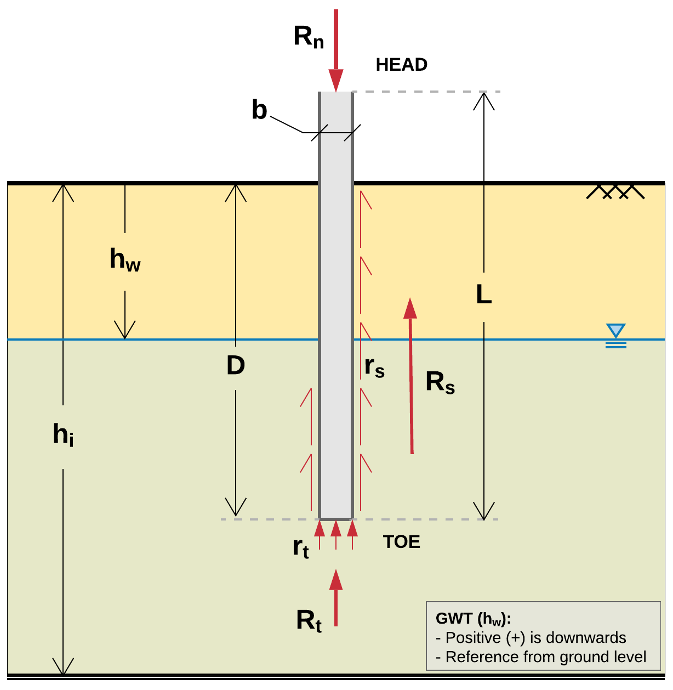

###########################
Notations and Abbreviations
###########################

Various notation styles are encountered across literature. This document uses symbols adopted from :ref:`Hannigan et al., 2016a <Hannigan2016a>` and :ref:`Fellenius, 1999 <Fellenius1999>`. :numref:`notations_figure` presents a quick reference to the most commonly used symbols. See below for the complete list.

.. TODO: update figure with soil properties and pile x-areas

   Typical profile view with embedded pile and associated symbols

----

.. TODO: sort alphabetically (or by pile/soil?)

.. |gwt| replace:: :math:`h_w`
.. |layer_height| replace:: :math:`h_i`
.. |pile_diameter| replace:: :math:`b`
.. |pile_length| replace:: :math:`L`
.. |pile_emb_length| replace:: :math:`D`
.. |pile_xarea| replace:: :math:`A`
.. |pile_xarea_toe| replace:: :math:`A_p`
.. |pile_xarea_plug| replace:: :math:`A_{pp}`
.. |pile_area_side| replace:: :math:`A_s`
.. |pile_area_interior| replace:: :math:`A_{si}`
.. |pile_area_exterior| replace:: :math:`A_{so}`
.. |nominal_resistance| replace:: :math:`R_n`
.. |nominal_shaft| replace:: :math:`R_s`
.. |nominal_toe| replace:: :math:`R_t`
.. |unit_shaft| replace:: :math:`r_s`
.. |unit_toe| replace:: :math:`r_t`
.. |spt_uncorr| replace:: :math:`N`
.. |spt_1| replace:: :math:`N_1`
.. |spt_60| replace:: :math:`N_{60}`
.. |spt_160| replace:: :math:`(N_1)_{60}`
.. |Q_c| replace:: :math:`Q_c`
.. |Q_m| replace:: :math:`Q_m`
.. |Q_p| replace:: :math:`Q_p`
.. |modulus| replace:: :math:`E`

:|gwt|: Depth to groundwater table (feet/meters)
:|layer_height|: Soil layer height (feet/meters)
:|pile_diameter|: Pile diameter/side (inches/centimeters)
:|pile_length|: Pile length, total (feet/meters)
:|pile_emb_length|: Pile length, embedded (feet/meters)
:|pile_xarea|: Pile cross sectional area (sq.in/sq.cm)
:|pile_xarea_toe|: Pile cross sectional area, toe (sq.in/sq.cm)
:|pile_xarea_plug|: Pile cross sectional area, plugged (sq.in/sq.cm)
:|pile_area_side|: Pile shaft surface area (sq.ft/sq.m)
:|pile_area_interior|: Pile shaft surface area, interior (sq.ft/sq.m)
:|pile_area_exterior|: Pile shaft surface area, exterior (sq.ft/sq.m)
:|nominal_resistance|: Nominal resistance, total (tons/MN)
:|nominal_shaft|: Nominal shaft resistance (tons/MN)
:|nominal_toe|: Nominal toe resistance (tons/MN)
:|unit_shaft|: Unit shaft resistance (...)
:|unit_toe|: Unit toe resistance (...)
:|spt_uncorr|: Uncorrected field SPT resistance value
:|spt_1|: SPT N value corrected for overburden stress
:|spt_60|: SPT N value corrected for 60% energy transfer
:|spt_160|: SPT N value corrected for energy and overburden stress
:|Q_c|: Pile calculated load (capacity), often referred to as nominal resistance, :math:`R_n` (tons/MN)
:|Q_m|: Pile measured (aka interpreted) capacity as obtained from static load tests (tons/MN)
:|Q_p|: Pile predicted capacity obtained from statistical and predictive models (tons/MN)
:|modulus|: Elastic modulus of material, Young's modulus (...)
