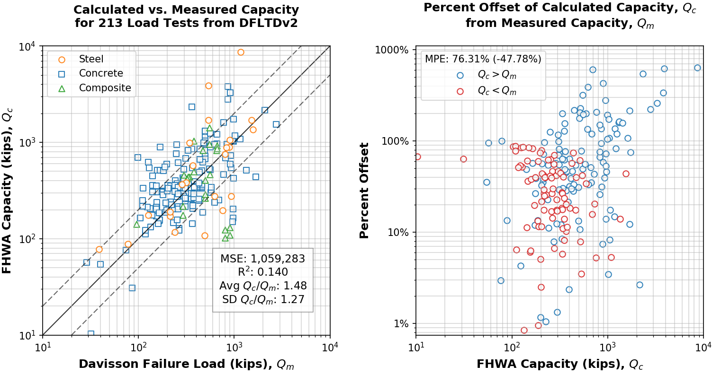
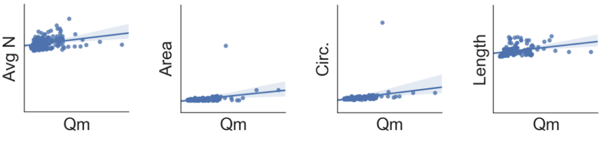
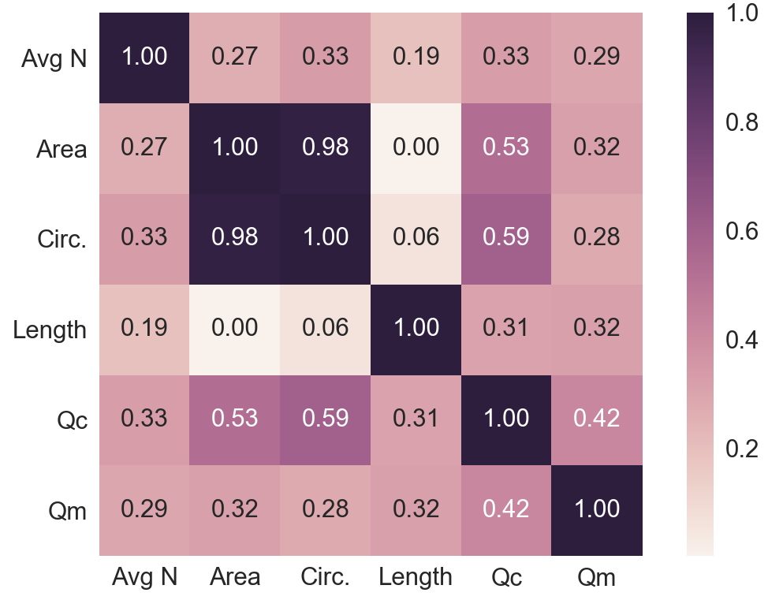
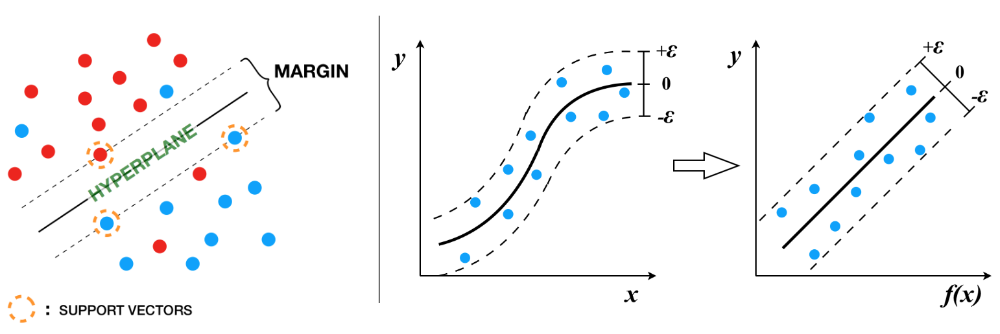
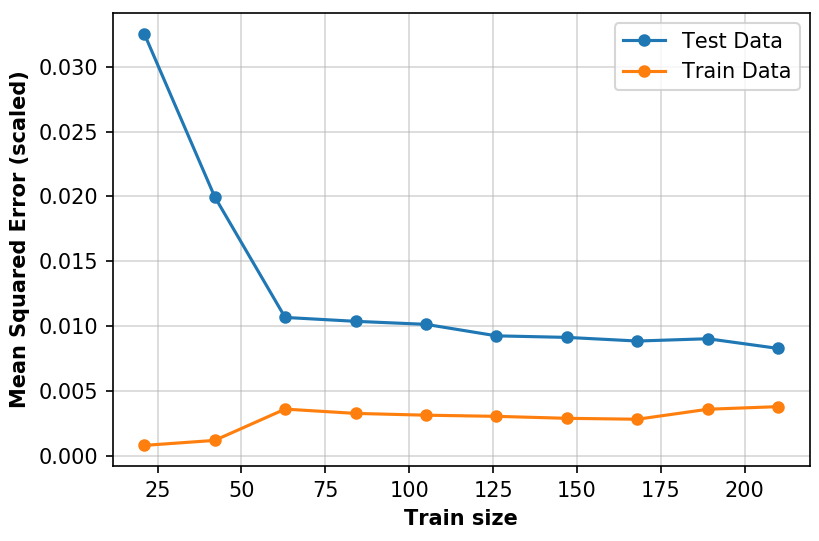
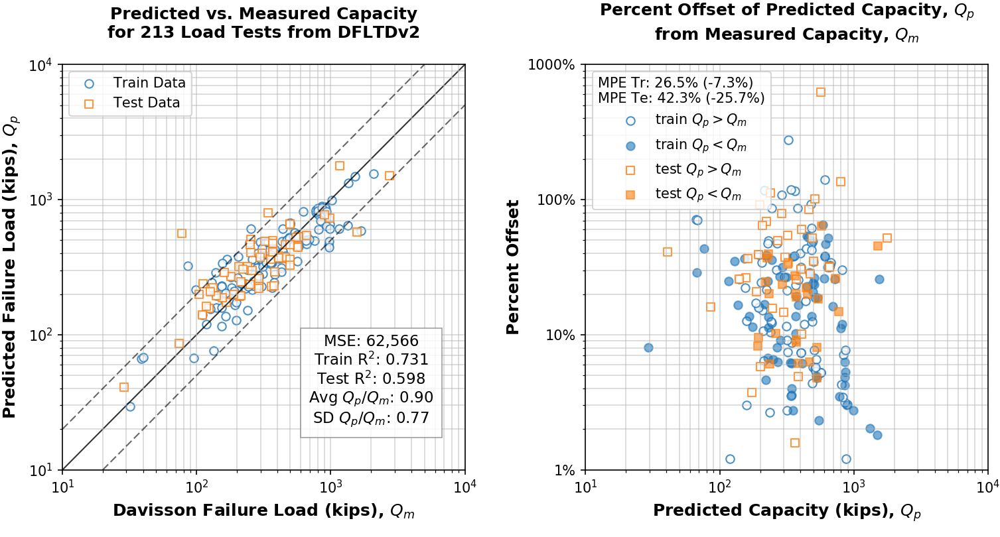
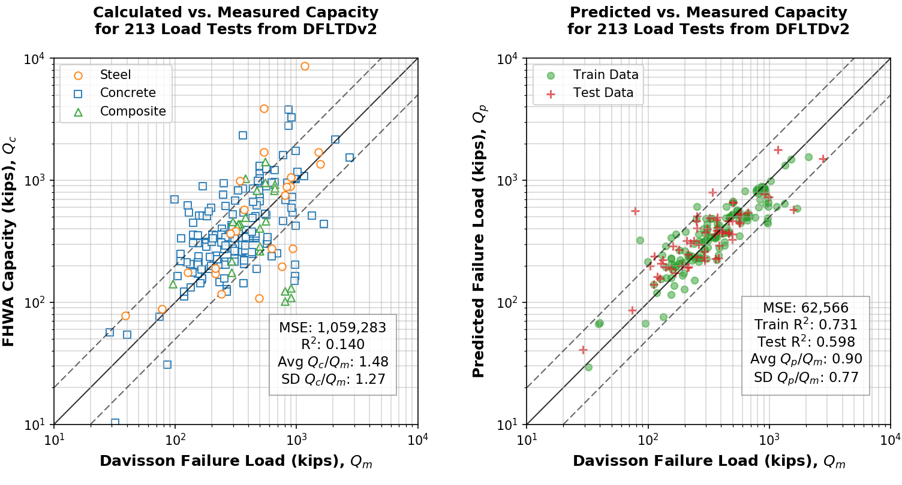

#################################################################
An Investigation of Pile Design Utilizing Advanced Data Analytics
#################################################################

.. rubric:: Nikolaos Machairas and Magued G. Iskander

.. rubric:: Abstract

This study explores the use of state-of-the-art data analytics techniques for predicting the axial load capacity of piles. A *Support Vector Machine* algorithm was developed. 213 load tests obtained from FHWA’s Deep Foundation Load Test Database (DFLTD) v.2 were used to evaluate the performance of the developed approach against the FHWA design method. The scope was limited to impact­driven, un-tapered, steel and concrete piles, loaded in compression, using a static load test. The results of the predictive analysis show an improvement over the capacities obtained by the FHWA pile design method. Perhaps more remarkably, the predictive model outperformed the FHWA pile design method by relying only on seven readily available features as compared to a laborious and error-prone design methodology. This study demonstrates the potential of machine learning in geotechnical engineering as an alternative to conventional design approaches. The methodology is also demonstrated with an online capacity computation tool.

************
Introduction
************

Single pile design is typically conducted using ultimate capacities, or nominal resistances, obtained from either calculated or interpreted methods (or both in combination) for Allowable Stress Design (ASD) or Load & Resistance Factor Design (LRFD), respectively. Determination of the ultimate capacity of driven piles using calculated methods is conducted by following a series of steps in a design process, starting with data and properties gathered from a geotechnical investigation such as those recommended by FHWA (:ref:`Hannigan et al., 2016a <Hannigan2016a>`; :ref:`Hannigan et al., 2016b <Hannigan2016b>`), along with pile selection. Capacities computed using FHWA recommendations are based on methods originally developed by Nordlund (:ref:`1979 <Nordlund1979>`) for sand and Tomlinson (:ref:`1994 <Tomlinson1994>`) for clays. Interpreted pile capacity calculations occur using load­-settlement curve data generated during a physical axial static load test of a driven pile, using a method originally developed by Davisson (:ref:`1972 <Davisson1972>`). Interpreted pile capacity is commonly referred to as *measured capacity*, a term that is adopted in this study.

For the past 30+ years, engineers and researchers have been independently collecting pile load tests and relevant subsurface data while organizing this information into structurally dissimilar repositories. Use of these databases for comparison between calculated and interpreted capacities for large data sets provides insight of suitability of use of current design methods under varying pile and soil conditions.  These comparisons have generally demonstrated that all methods in current use for calculating the ultimate capacity of single piles have large margins of error (i.e. :ref:`Machairas et al., 2018 <Machairas2018>`; :ref:`Olson and Shantz, 2004 <Olson2004>`; :ref:`Briaud et al., 1987 <Briaud1987>`; :ref:`Dennis and Olson, 1983a <Dennis1983a>`; :ref:`Dennis and Olson, 1983b <Dennis1983b>`).

Meanwhile, in recent years, scientists aided by state-of-the-art data analytics techniques have been transforming their respective industries, producing remarkable predictions and insights. In this study, we explore and adapt analytical predictive methodologies for the design of driven piles using Machine Learning algorithms. In particular, the effectiveness of a predictive methodology based on *Support Vector Machines* is evaluated against federal guidance for the design of pile foundations.

******************
Load Test Database
******************

This study makes use of the FHWA Deep Foundation Load Test Database (DFLTD v.2) released in February 2017 (Petek 2016). One of the most important updates in DFLTD v.2 was organizing data in a relational schema. This was a major limitation of the first version where data retrieval was programmatic and non­relational. The industry standard for interaction with *Relational Database Management Systems* (RDBMS) is the *Structured Query Language* (SQL). Having a relational backend, DFLTD v.2 can be queried using SQL. Microsoft offers basic functionality to do so within MS Access, therefore DFLTD v.2 was migrated to a RDBMS hosted on Microsoft Windows Server 2012. Microsoft SQL Server Migration Assistant v6.0 for Access was used to ensure compatibility across both platforms. Multiple random checks ensured that data transfer was successful. The authors also developed software to batch process the available information.

The ability to run complex SQL queries was crucial in filtering out the load test cases within DFLTD v.2 for which it would be impossible to calculate pile capacity due to missing values. Given that there is limited information on the relative position of explorations to pile foundations, a sensible approach is to analyze for all combinations. As a result, the number of unique combinations of project/exploration/foundation/test cases was 3,116. The scope of the study was limited to impact­-driven, un­tapered, steel and concrete piles, loaded in compression, using a static load test. Several rounds of filtering and inspection for missing data and quality issues, limited the number of applicable test records to 213 (:ref:`Machairas et al., 2018 <Machairas2018>`).

***************************************
Baseline Performance of the FHWA Method
***************************************

FHWA design method was selected as a basis for comparing the performance of Machine Learning Algorithms against this well established design method. Additionally, FHWA method was selected due to its popularity and wide adoption by the geotechnical consulting community. This pairing also ensures the use of data and design methodologies provided solely by the Federal Highway Administration, hence, adding more credibility to the results.

To batch process all available load tests it was necessary to develop a suite of algorithms in the Python programming language that could reproduce the Nordlund and Tomlinson design methods exactly as they are outlined within the FHWA design manual. The biggest difficulty leading to narrowing down the DFLTD v.2 to 213 cases, was finding records that had enough information on soil conditions to calculate the strength and stress conditions along the pile. In the case where certain geotechnical properties were missing, the authors only used approximation methods described within the FHWA design manual (Hannigan et al. 2006). This applies mainly to missing total unit weights, undrained shear strengths and angles of internal friction, for which FHWA suggests using empirical correlations, published by Bowles (:ref:`1977 <Bowles1977>`). Bowles correlations are based on the older Standard Penetration Test (SPT) hammers which may not be as reliable for newer data. The age of the data in DFLTD v.2 is not reported.

The FHWA suggests using the Davisson (:ref:`1972 <Davisson1972>`) failure criterion for interpreting the pile capacity from a static load test. Davisson’s criterion defines the pile settlement, :math:`\Delta`, corresponding to the failure load, :math:`P`, as follows:

.. math::
   :label: ifcee_davisson

   \Delta = \dfrac{PL}{AE} + 0.15 + \dfrac{b}{120}

Where, :math:`L` is the pile length, :math:`A` is the pile cross sectional area, :math:`E` is the pile's elastic modulus and :math:`b` is the diameter or side length of the pile. Note that for piles with diameter larger than 24 inches, the Davisson Criterion is sometimes adjusted to :math:`\Delta = PL/AE + b/30`, but :eq:`ifcee_davisson` was universally employed since fewer than 7% of tests were larger than 24 inches in diameter, and the adjustment is not uniformly adopted for driven piles.

This method was also programmatically translated to allow for automatic detection of the interpreted failure load. The algorithm detects all loading/unloading cycles of a given static test and can apply the Davisson criterion on all cycles keeping as a final solution the greatest of all interpreted failure loads. Several pre-solved cases were used to validate the results produced by the algorithms returning capacities that were within 5% of the published solutions.

   Results of baseline analysis with the FHWA design method. Absolute MPE with real-value MPE in parentheses (RHS legend)

The results of the algorithmic analysis on the 213 cases curated from DFLTD v.2 are shown in Figure 1. Measured (i.e. Davisson interpreted) capacity (:math:`Q_m`) is plotted against the capacity computed using the FHWA method (:math:`Q_c`) on a log-log scale. As a reference to the spread of the values, 1:½, 1:1 and 1:2 (:math:`Q_c : Q_m`) lines were added on the left plot. Mean squared error (MSE) was 1,059,283 kips, coefficient of determination (R\ :sup:`2`) was 0.14 and the average ratio of calculated to measured capacity (:math:`Q_c / Q_m`) was found to be 1.48 but with high standard deviation at 1.27. While it cannot be used solely as an indicator of model performance, an R\ :sup:`2` score of 0.14 (or 14%) is considered poor since the model yields errors that are roughly 7.5% smaller than those of a constant-only model (by taking the average of :math:`Q_c` and :math:`Q_m`). The plot on the right of :numref:`ifcee_paper_fig1`, shows the difference of :math:`Q_c` from :math:`Q_m` as a percentage, with overestimation of capacity shown in blue, while under-estimation of capacity shown in red. The average of this absolute difference (mean percentage error, MPE) was 76%.

***********************************************************
Advanced Data Analytics for the Prediction of Pile Capacity
***********************************************************

This study was performed in Python using several open-source packages, namely `scikit-learn` for all machine learning algorithms (:ref:`Pedregosa et al., 2011 <Pedregosa2011>`; :ref:`Buitinck et al., 2013 <Buitinck2013>`). The steps implemented in the analysis are as follows:

1. Select predictive features and apply feature preprocessing to allow use in predictive models.
2. Evaluate the predicted capacity (:math:`Q_p`) from predictive models against the interpreted failure load (:math:`Q_m`) from static tests. Visualize and compute the mean squared error (MSE) and coefficient of determination (R\ :sup:`2`).
3. With interpreted failure load (Qm) from static tests taken as reference, compare calculated capacity (:math:`Q_c`) and predicted capacity (:math:`Q_p`), mainly by MSE and R\ :sup:`2`.

Feature Selection and Preprocessing
===================================

In the selection of the predictive model’s features, there are two main components that must be described: the pile foundation and the strength of the soil. Relative relationships between the features are determined during model training which drastically simplifies the process of initial feature selection. When describing the strength of the soil, the options are limited. The only consistently available piece of information for all cases is the SPT-N value. For simplicity, the average :math:`N` value across the length of the pile was calculated and assigned for each case. This oversimplification is not ideal, but it was employed because the quality of the available soils data does not justify the additional computational effort of using a layered system. In any case, the adopted approach should yield a worst condition scenario for the performance of the data analytics techniques in predicting pile capacity.

When selecting the features for the pile foundation, there is more information available. It was important to consider the Davisson criterion (:eq:`ifcee_davisson`) defining the failure load which is also the feature on which the predictive model relies. All of the parameters employed in :eq:`ifcee_davisson`, except for :math:`P` which is the model’s dependent variable, are valid and can be used in the predictive model. There is no rule as to which of these parameters to use as features other than trial and error. Through an iterative process is was found that the predictive model is more effective by turning the elastic modulus, :math:`E`, into a categorical variable with three classes, *steel*, *concrete* and *composite*. Pile circumference was found to have a greater effect than pile diameter and was used instead. Pile length, :math:`L`, and cross sectional area, :math:`A`, were important and were implemented. Hammer size is typically neglected in pile capacity interpretation from static load tests and it was not considered as a feature. Finally, the condition of whether the pile was open ended or closed ended was also used. Thus, the selected features were:

1. Soil type (sand, clay, mixed) - categorical
2. Average N count - numerical
3. Pile material (steel, concrete, composite) - categorical
4. Pile end (open/closed) - categorical
5. Cross sectional area - numerical
6. Circumference - numerical
7. Length - numerical

The relationships and correlations among the aforementioned numerical features is shown in :numref:`ifcee_paper_fig2` and :numref:`ifcee_paper_fig3` with the aid of Python’s `seaborn` statistical data visualization package (:ref:`Waskom et al., 2018 <Waskom2018>`). Note that categorical variables cannot be plotted. A positive, albeit not strong, correlation between all features and the interpreted failure load (aka. measured capacity, :math:`Q_m`) is evident (:numref:`ifcee_paper_fig3`). This is not indicative of the performance of the predictive model, especially since the categorical variables are not shown and they might have a strong impact in the model. However, this figure along with :numref:`ifcee_paper_fig2` offer insights as to which model parameters will most likely perform best.

   Pairwise relationship plot among selected features (includes regression line with 95% confidence interval shown with a shaded region)

The next step is feature pre-processing. When the model contains categorical variables with string labels, these must be converted to dummy/indicator variables. This process is commonly known as one-hot encoding because the final product of label conversion resembles a binary group of 1-0 bits (aka one-hot). :numref:`ifcee_paper_table` shows the first rows of the data frame after one-hot encoding. Most linear regression predictive models do not require the features to be scaled. But many nonlinear models require the features to be scaled between 0 and 1 before training. For the models described below, the features were scaled accordingly.

   Pearson product-moment correlation coefficients between selected features

.. table:: DataFrame after one-hot encoding (values not scaled, showing first 2 rows only)
   :widths: auto
   :align: center
   :name: ifcee_paper_table

   +--------+--------+--------+--------+--------+---------+-------+------+------+------+--------+
   | soil_C | soil_M | soil_S | p_comp | p_conc | p_steel | avg_N | open | area | circ | length |
   +========+========+========+========+========+=========+=======+======+======+======+========+
   | 1      | 0      | 0      | 0      | 0      | 1       | 15    | 0    | 11.9 | 33.8 | 18.5   |
   +--------+--------+--------+--------+--------+---------+-------+------+------+------+--------+
   | 0      | 1      | 0      | 1      | 0      | 0       | 50    | 0    | 16.1 | 44.0 | 22.5   |
   +--------+--------+--------+--------+--------+---------+-------+------+------+------+--------+
   | ...    |        |        |        |        |         |       |      |      |      |        |
   +--------+--------+--------+--------+--------+---------+-------+------+------+------+--------+

Analysis with a Support Vector Regression Model
===============================================

Predicting failure load, a continuous variable, from a series of features implies that this is fundamentally a regression analysis type problem rather than a classification-type problem. Moreover, :numref:`ifcee_paper_fig2` and :numref:`ifcee_paper_fig3` hinted at the non-linearity of the fit by showing spread out, inconsistent and non-linear relationships between the explanatory features and response variable.

Several models were explored before a satisfactory one was found. First, a *multiple linear regression* model was evaluated which yielded 0.56 and -7.33 average R\ :sup:`2` scores from multiple train and test data split combinations, respectively. The negative R\ :sup:`2` score on the test data denotes a model that does not follow the trend of the data and performs worse than the constant-only model. Another model with polynomial features produced even worse scores while a *ridge regression* model with optimal parameters by cross-validation performed slightly better than the multiple linear regression model but still had to be rejected.

Finally, a *support vector regressor* (SVR) was evaluated and found satisfactory. SVR is an extension of the *support vector machine* (SVM). SVMs are highly versatile, powerful and thus widely used predictive algorithms, within the data science community, with excellent performance in both classification and regression problems. SVMs are *maximum margin classification algorithms* (:ref:`Raschka, 2015 <Raschka2015>`).

At the beginning of the optimization process available tests are divided into a training set and a test set. The training set was selected after some trials ranging from 60:40 to 75:25 as a random 70% of the available 213 load tests. Every one of these tests had 11 independent variables; 4 numerical features plus 3 categorical features with 3 classes. Thus, there are 1,937 parameters (149 training load tests x 13 features) to optimize. Each one of the independent variables is evaluated against the value of the load for the given load test. SVM performs nonlinear mapping of the data in a high dimensional feature space where linear regression is performed, piecemeal, using functions known as *kernels*. A loss function controlled by an additional :math:`\epsilon` parameter is also introduced. Points outside a region defined by :math:`\epsilon` contribute to the cost up to a degree, as the deviations are linearly penalized (:ref:`Smola and Schölkopf, 2004 <Smola2004>`). The optimization process sets weights to these variables, with some being zero in order to compute a capacity. These weights are obtained by optimization techniques based on the basic principle of finding the maximum margin, by the use of *Lagrange multipliers*. In the end, the model is represented by a combination of the training points rather than a function of the parameters and weights. The process is repeated over 1,000 times, and the model scores are averaged. As shown in :numref:`ifcee_paper_fig4`, the hyperplane (or regression fit for the SV regressor) is obtained by maximizing the distance between the points closest to the hyperplane. This distance is the margin and the points closest to the hyperplane are called support vectors. In most cases, including this study, the optimal solution is non-linear and regression happens at a high dimensional feature space.

   Schematic of SVM maximum margin optimization (LHS), transformation to a higher dimensional feature space where cost-dependent regression can occur (RHS)

Given two features, :math:`x`, :math:`x_i`, the regression function (:ref:`Gunn, 1998 <Gunn1998>`) in its simplified form is given by :eq:`ifcee_eq2`, with constraints as shown in :eq:`ifcee_eq3`.

.. math::
   :label: ifcee_eq2

   f(x) = \sum_{i=1}^{l} (\bar{\alpha_i} - \bar{\alpha_i^*}) K (x_i,x)

.. math::
   :label: ifcee_eq3

   \sum_{i=1}^{l} (\alpha_i - \alpha_i^*) = 0 \textrm{ where } 0 \leq \alpha_i, \alpha_i^* \leq C, i=1,...,l

:math:`\alpha`, :math:`\alpha^*` are the *Lagrange multipliers* and :math:`K` is the kernel function.

In this analysis the (Gaussian) radial basis function (rbf) was found to provide the best fit and is given by :eq:`ifcee_eq4`.

.. math::
   :label: ifcee_eq4

   K(\mathbf{x,x'}) = exp(-\gamma \lVert \mathbf{x-x'} \rVert^2)

The practical takeout out of :eq:`ifcee_eq2`, :eq:`ifcee_eq3` and :eq:`ifcee_eq4` is the importance of :math:`C`, a *soft margin* function cost parameter controlling intentional misclassification of samples (aka. trade error for stability) and :math:`\gamma`, the free parameter of the radial basis function. Larger :math:`C` leads to smaller-margin hyperplane optimization while smaller :math:`C`, leads to wider-margin hyperplane with the risk/cost of misclassifying samples. And for :math:`\gamma`, large values lead to high bias and low variance while low :math:`\gamma` values lead to low bias and high variance. There are practically no restrictions on the ranges of :math:`C` and :math:`\gamma` but they cannot be negative.

The :math:`C` and :math:`\gamma` parameters of the SVR function were tuned by exhaustive grid search. Grid search is a brute-force exhaustive search paradigm implemented by an algorithm that is supplied with ranges of possible values for C and :math:`\gamma`, evaluates the performance of all combinations from these ranges on different train/test split combinations and returns the optimal set of values (:ref:`Raschka, 2015 <Raschka2015>`). In this study, the best score was obtained with :math:`C` = 16.2377 and :math:`\gamma` = 0.3393. Finally, the default value for :math:`\epsilon` is 0.1 but 0.01 is also frequently used. Several iterations revealed small improvement when :math:`\epsilon` = 0.01, so :math:`\epsilon` = 0.01 was adopted.

   Learning curves for the implemented support vector algorithm

Improvement with train size is evident in the so called learning curve shown in :numref:`ifcee_paper_fig5`. Note that the MSE on the y-axis, the dependent variable is scaled. As mentioned earlier, non-linear models require that all features are scaled, therefore in this analysis all parameters were scaled between 0 and 1. Lastly, :numref:`ifcee_paper_fig6` shows the results of the predictions obtained by the support vector regressor.

   Results of predicted capacity compared to measured capacity. Absolute MPE with real-value MPE in parentheses (RHS legend)

****************************************
Comparison of SVM & Traditional Approach
****************************************

The results of the predictive analysis show a marginal improvement over the capacities obtained by the FHWA pile design method. Mean squared error was reduced by a factor of 17 to 62,566 kips and mean percentage error (MPE) was improved by almost a factor of 2 from -47.78% to -25.7%, and the mean absolute percent error reduced from 76.3% to 42.3%. Test R\ :sup:`2` score of the predictive model is 0.6 (or 60%), meaning that the model yields errors that are 45% smaller than those of a constant-only model, on average. This constitutes an improvement on errors by a factor of 9. And perhaps more remarkably, the predictive model outperformed the FHWA pile design method by relying only on seven readily available and easily obtainable features as compared to a laborious and error-prone (if performed manually) design methodology. The low, in absolute terms, R\ :sup:`2` score and high MPE of the predictive model can only be attributed to poor data quality since further experimentation with curated data from Olson and Shantz (:ref:`2004 <Olson2004>`) pile load test database, produced near perfect scores.

In addition to the terms :math:`C`, :math:`\gamma`, and :math:`\epsilon` the obtained solution consists of training coefficients for the support vectors in our training set. This along with the non-linearity of the solution makes it difficult to provide a simple equation that would allow an interested reader to obtain a predicted capacity for a given condition. Therefore, an online tool has been developed which returns the predicted capacity given the seven requisite input parameters. The tool is accessible at `<https://github.com/NYUGeo/ifcee2018-predict>`_.

   Side-by-side comparison of calculated and predicted capacity

***********
Conclusions
***********

Scientists using artificial intelligence and machine learning tools and methodologies are revolutionizing one field after another. This study has proved the value of both relational pile load test databases and machine learning in predicting pile capacity. The capacities predicted were superior to those computed using the FHWA method and this was performed by using only seven parameters (pile material, cross section area, circumference, length, and end condition; Soil type and average SPT N-value). The procedure has been implemented in an online tool. The importance of good quality geotechnical and pile load test data was also made apparent. Given that site investigations and pile load testing information are being rapidly modernized and digitized, it is certain that advanced analytical methodologies will play a central role in the future, providing new insights and solutions by efficiently analyzing the wealth of new data.

